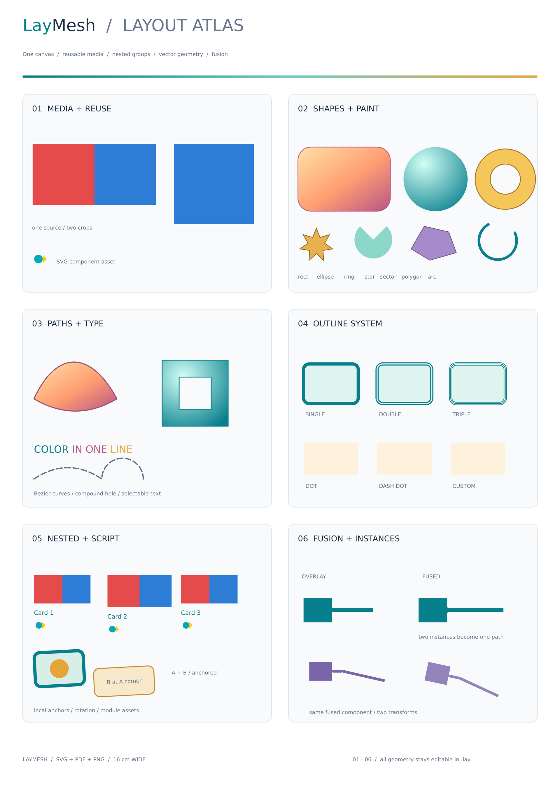
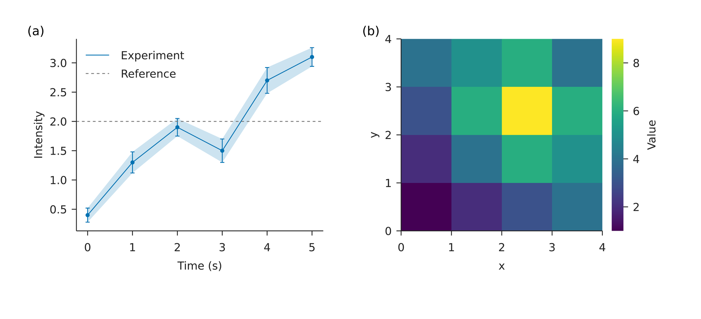

# LayMesh

**用可读的代码，绘制数据并排出尺寸精确、可以重复生成的科研图。** 在一个 `.lay` 文件中组合原生图表、图片、矢量形状、文字与公式，将同一布局导出为 SVG、PDF 或指定 DPI 的 PNG。

[在线文档](https://muxkin.github.io/LayMesh/) · [English](README.en.md) · [功能画廊](docs/sections/examples.zh-CN.md) · [安装说明](docs/topics/install.zh-CN.md)



[展示图源码](examples/showcase.lay) · [科研绘图示例](docs/gallery/plots.zh-CN.md)

## 安装

需要 **Python 3.10+**。当前版本 **`0.3.0a2`**（Rust 引擎 `0.3.0-alpha.2`）已发布到 [PyPI](https://pypi.org/project/laymesh/0.3.0a2/)，属于 alpha 预发布版本：

```sh
python -m pip install --pre laymesh
python -m laymesh --version
```

平台 wheel 内置 Rust 绘图程序和公式字体，安装后即可使用 CLI、Python API 与 Jupyter Magic。使用时无需编译 Rust，也不会下载引擎或字体。也可安装[本地构建的 wheel](release/README.zh-CN.md)。

| 可选功能 | 安装命令 |
| --- | --- |
| NumPy / pandas 数据绑定 | `python -m pip install --pre "laymesh[data]"` |
| 导入 Matplotlib Figure | `python -m pip install --pre "laymesh[plot]"` |
| 两者都需要 | `python -m pip install --pre "laymesh[data,plot]"` |

构建目标为 Windows x64、macOS 14+ 的 Intel / Apple Silicon、Linux x64 / arm64。本次发布的 Linux wheel 要求 glibc 2.35+。五个平台已通过 Python 3.10、3.13、3.14 安装与使用检查，详见[发布说明](release/README.zh-CN.md)。正文使用系统或用户提供的字体；缺字会警告并显示方框。跨机器复现时请随图提供使用的字体文件。

## 第一张图

把下面的完整源码保存为 `figure.lay`。几何尺寸默认使用 mm，字体和线宽默认使用 pt；也可显式写 `mm/cm/in/pt/px`。

```lay
page = canvas(size=(120 mm, 90 mm), background="#ffffff")
p = plot(size=(110 mm, 80 mm),
         x=axis(label="Time (s)"), y=axis(label="Signal"))
p.line(x=[0, 1, 2, 3], y=[1, 3, 2, 4], label="Experiment")
p.legend(position="top_left")
page.add(p, offset=(5 mm, 5 mm))
```

```sh
laymesh validate figure.lay
laymesh inspect figure.lay --json
laymesh render figure.lay -o figure.svg
laymesh render figure.lay -o figure.pdf
laymesh render figure.lay -o figure.png --dpi 300
```

`python -m laymesh` 与 `laymesh` 命令等价，适合命令未加入 PATH 的环境。`--dpi` 只改变 PNG 像素数量，保留页面物理尺寸。`.lay` 是独立的受限语言，不执行任意 Python 或 JavaScript 代码。

## Python 与 Jupyter

使用 Python API 渲染刚保存的文件：

```python
from laymesh import render_file

result = render_file("figure.lay", output="figure.pdf")
print(result.output)
```

`render_source(source, namespace=..., save_source=...)` 可接收字符串源码，绑定数组、字典、DataFrame 或 Matplotlib Figure，并保存布局与数据资源，供 CLI 独立重渲染。完整示例见[Python API](docs/topics/python-reference.zh-CN.md)、[原生数据绑定](docs/topics/python-data.zh-CN.md)和[保存源码](docs/topics/save-source.zh-CN.md)。

在 Notebook 所用环境中安装 LayMesh，然后先运行一个注册单元格：

```python
%load_ext laymesh.ipython
values = [1, 3, 2, 4]
```

再在单独的单元格中绘图、预览和导出：

```text
%%laymesh -o notebook.pdf --save-source notebook.lay
page = canvas(size=(120 mm, 90 mm))
p = plot(size=(110 mm, 80 mm))
p.line(x=[0, 1, 2, 3], y={{values}})
page.add(p, offset=(5 mm, 5 mm))
```

`{{values}}` 读取 Python 变量。保留 `notebook.lay` 及生成的 `notebook.assets/` 后，可直接运行 `laymesh render notebook.lay -o notebook.svg`。[Notebook 指南](docs/topics/notebook.zh-CN.md)说明行 Magic、警告控制和其他参数。

## 能力与示例

| 能力 | 用法与完整示例 |
| --- | --- |
| 精确拼版 | 物理单位、九点锚点、裁剪、旋转、透明度与分组：[基础拼版](examples/basic.lay) |
| 科研图表 | 折线、散点、误差、柱图、统计、热图与等高线：[原生绘图](docs/sections/plotting.zh-CN.md) |
| 多面板与坐标系 | 命名轴、断轴、共享颜色标尺、极坐标与雷达图：[直角坐标](docs/cartesian-plots.zh-CN.md) · [极坐标](docs/polar-plots.zh-CN.md) |
| 配色与数据组织 | 字典循环、多组数据与 87 种配色预设：[字典绘图](examples/plot/dictionary-series.lay) · [配色](docs/topics/cmaps.zh-CN.md) |
| 矢量与排版 | 路径、渐变、空心轮廓融合、文字与公式：[矢量图](examples/vector.lay) · [文字与公式](examples/typography.lay) |
| 复用与编辑 | 函数、本地模块、LCSS 样式、网页及 VS Code 补全：[语言参考](docs/language-reference.zh-CN.md) · [编辑器](docs/topics/editors.zh-CN.md) |



图表在首次放入页面前完成图层和装饰设置；多面板使用显式定位。布局以单页为单位，固定绘图区保持指定物理尺寸，装饰空间不足会警告。PNG/JPEG/SVG 和单页 8 位 TIFF 可作为图片素材；SVG 接受安全子集。公式由原生 RaTeX 排版，无需 TeX 安装。具体支持范围见[功能覆盖清单](docs/topics/feature-map.zh-CN.md)。

## 文档与开发

[入门](docs/sections/start.zh-CN.md) · [语言参考](docs/language-reference.zh-CN.md) · [API](docs/api-reference.zh-CN.md) · [架构](docs/architecture.zh-CN.md) · [示例与历史执行结果](docs/examples-and-results.zh-CN.md)

源码开发需要 **Rust 1.93.1**；构建与发布脚本需要 Python 3.11+。在仓库根目录运行：

```sh
cargo build --release --locked -p laymesh-cli
python -m pip install -e './python[data,plot]'
python -m laymesh render examples/basic.lay -o basic.pdf
cargo test --workspace --locked
python -m unittest discover -s python/tests -v
```

无需 Python 时，可直接调用 `target/release/laymesh`（Windows 为 `laymesh.exe`）。[发布流程](release/README.zh-CN.md)包含 wheel 构建、包审计、隔离安装验证及 PyPI Trusted Publishing 配置。[文档站构建](site/README.md)使用 `python scripts/build-docs.py`，由 GitHub Pages 工作流发布。

LayMesh 使用 [MIT 许可证](LICENSE)。原生依赖、公式字体和配色数据保留各自许可，详见[第三方声明](release/THIRD_PARTY_NOTICES.md)。
