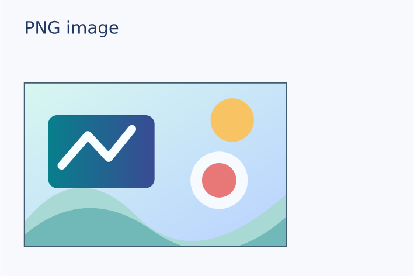
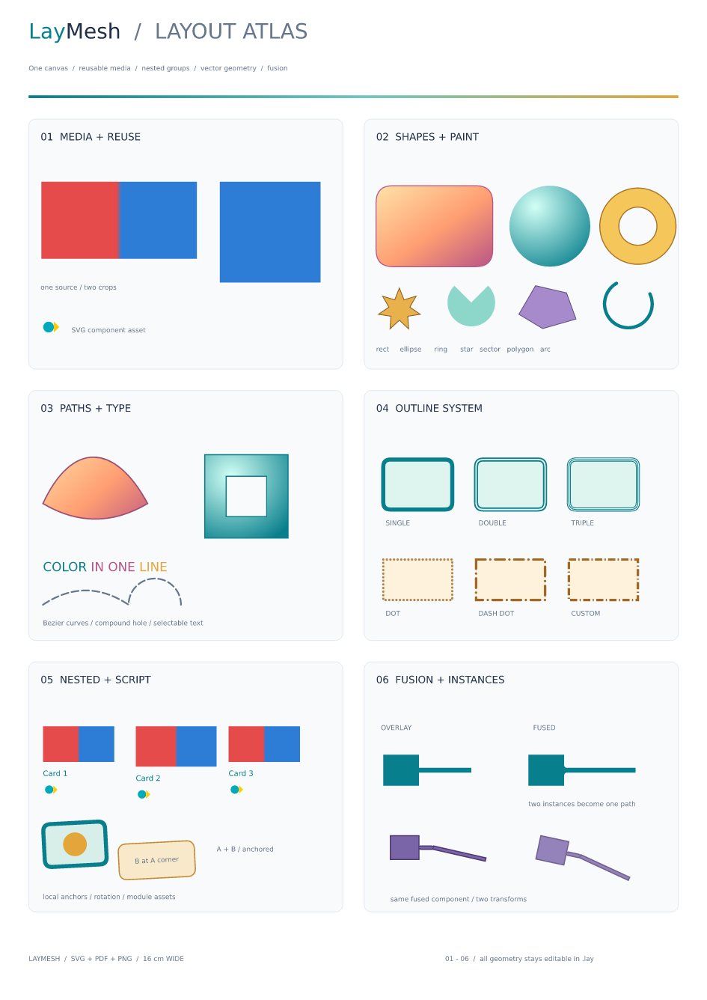
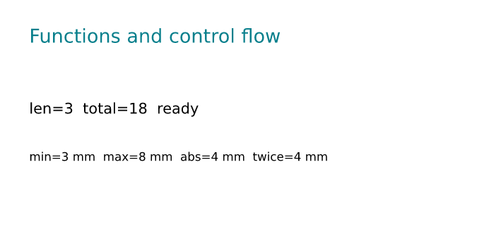
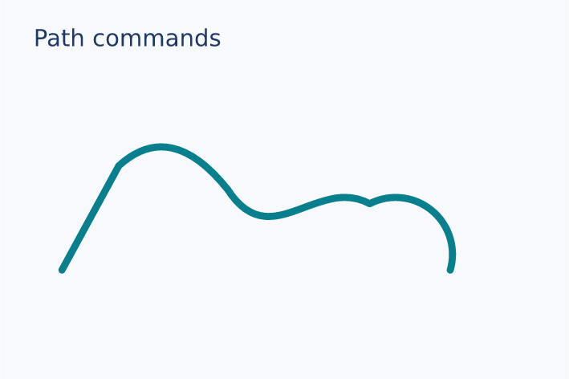
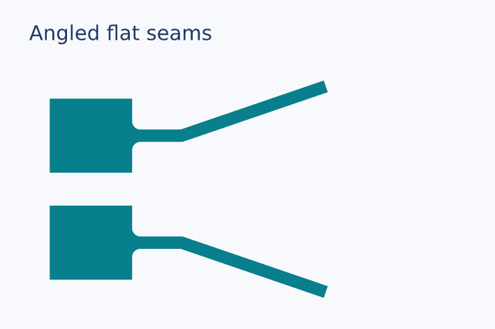
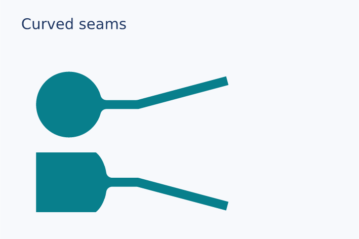
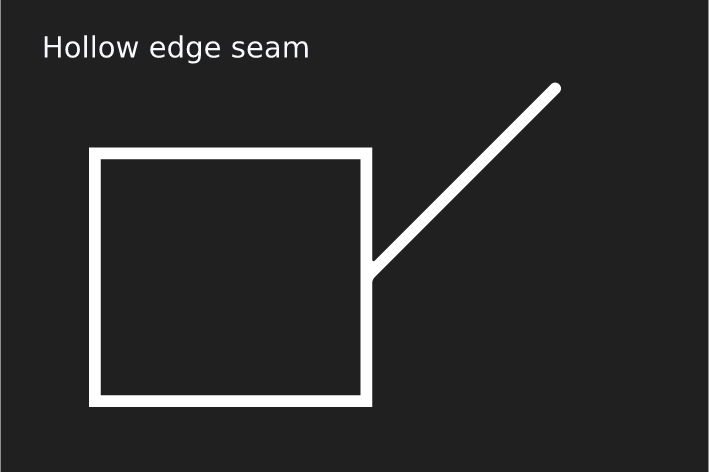
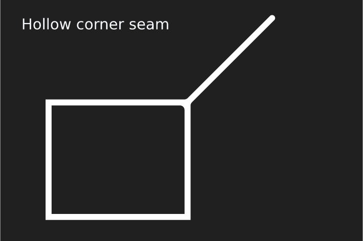
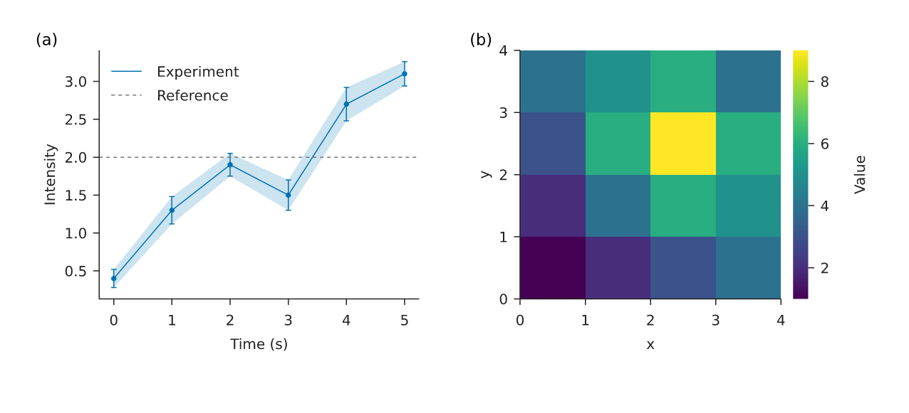

# 示例代码与实际执行结果

> 历史 Node 基线记录（`codex/node-baseline`）。当前 Rust 安装、字体政策与命令见[安装说明](topics/install.zh-CN.md)和[架构](architecture.zh-CN.md)。

本页记录 **2026-09-26** 在本地 Linux 环境中对仓库 v0.2.0 源码的重新运行。命令均从仓库根目录执行；`npm test` 会自行构建。环境为 Node.js `v24.13.1`、npm `11.19.1`、Python `3.13.11`。以下数值是**本地观察值**；Windows/Ubuntu 远端 CI 结果不在本页推断。

## 1. 先看图，再改代码

[分类画廊](gallery/README.zh-CN.md)按[插图与图像](gallery/images.zh-CN.md)、[定位与图层](gallery/positioning.zh-CN.md)、[容器与组件](gallery/containers.zh-CN.md)、[形状与绘制](gallery/shapes.zh-CN.md)、[文字与公式](gallery/typography.zh-CN.md)、[脚本与计算](gallery/scripting.zh-CN.md)列出 44 份单项示例；[Notebook 输出](gallery/notebook.zh-CN.md)和[综合应用](gallery/comprehensive.zh-CN.md)独立浏览。以下保留各综合示例的尺寸与 CLI 证据。



| 示例源码 | 涵盖的函数/功能 | 可查看的实际输出 | 本次 `validate` 结果 |
| --- | --- | --- | --- |
| [hello.lay](../examples/hello.lay) | 教程首图：`canvas/rect/text/add` 和中心锚点 | [PNG 预览](../examples/hello-preview.png) | 160 × 100 mm，3 个顶层实例 |
| [basic.lay](../examples/basic.lay) | `canvas`、`image`、`text`、`rect`、`ellipse`、`arrow`、`group`、两次独立裁剪与锚点 | [PNG 预览](../examples/basic-preview.png) | 180 × 120 mm，7 个顶层实例 |
| [functions.lay](../examples/functions.lay) | `range/len/append/str/abs/min/max`、自定义函数、`for/while/if`、单位运算 | [PNG 预览](../examples/functions-preview.png) | 120 × 55 mm，3 个顶层实例 |
| [scripted.lay](../examples/scripted.lay) | `import/export`、函数默认参数、循环、嵌套组、模块相对素材 | [PNG 预览](../examples/scripted-preview.png) | 180 × 90 mm，3 个顶层实例 |
| [vector.lay](../examples/vector.lay) | `path/move_to/cubic_to/close`、`ring/star/polyline/sector`、两种渐变、虚线、`fuse` | [PNG 预览](../examples/vector-preview.png) | 180 × 120 mm，9 个顶层实例 |
| [outlines.lay](../examples/outlines.lay) | `outline` 的单/双/三线、预设及自定义虚线、透明度 | [PNG 预览](../examples/outlines-preview.png) | 180 × 110 mm，13 个顶层实例 |
| [typography.lay](../examples/typography.lay) | `text/spans/span/formula`、混合字体颜色、自动换行、行内/独立公式 | [PNG 预览](../examples/typography-preview.png) · [PDF](../examples/typography.pdf) | 160 × 100 mm，8 个顶层实例 |
| [showcase.lay](../examples/showcase.lay) | `polygon/quad_to/arc_to/arc`、复合图形、所有主要能力组合 | [PNG 预览](../examples/showcase-preview.png) · [SVG](../examples/showcase.svg) · [PDF](../examples/showcase.pdf) · [1200 DPI PNG](../examples/showcase-1200dpi.png) | 160 × 226.262626… mm，1 个顶层组 |

上表的矢量命令由 vector/showcase 及 `tests/vector.test.mjs` 中的路径断言共同覆盖；它们的参数和语义逐项列在[语言参考](language-reference.zh-CN.md#矢量构造函数)。图片展示的是实际渲染文件，预览经过降采样以便在网页快速打开。

八份综合示例的图片均直接放在各自代码下方，见[综合应用画廊](gallery/comprehensive.zh-CN.md)。以下是完整图版的实际输出：



## 2. CLI 的标准输出

编译后可逐个验证：

```sh
npm run build
for f in examples/hello.lay examples/basic.lay examples/functions.lay examples/scripted.lay examples/vector.lay examples/outlines.lay examples/typography.lay examples/showcase.lay; do
  node packages/cli/dist/main.js validate "$f"
done
```

本次输出（展示图的小数位由运行时直接打印）：

```text
有效：examples/hello.lay（160 × 100 mm，3 个顶层实例）
有效：examples/basic.lay（180 × 120 mm，7 个顶层实例）
有效：examples/functions.lay（120 × 55 mm，3 个顶层实例）
有效：examples/scripted.lay（180 × 90 mm，3 个顶层实例）
有效：examples/vector.lay（180 × 120 mm，9 个顶层实例）
有效：examples/outlines.lay（180 × 110 mm，13 个顶层实例）
有效：examples/typography.lay（160 × 100 mm，8 个顶层实例）
有效：examples/showcase.lay（160 × 226.26262626262627 mm，1 个顶层实例）
```

导出示例：

```sh
node packages/cli/dist/main.js render examples/basic.lay -o basic.svg
node packages/cli/dist/main.js render examples/basic.lay -o basic.pdf
node packages/cli/dist/main.js render examples/basic.lay -o basic.png --dpi 300
```

三次调用分别打印 `已导出：basic.svg`、`已导出：basic.pdf` 和 `已导出：basic.png`（指定其他路径时打印该路径）。本次实际导出到临时目录，并用 `sharp`、`pdfinfo`、`pdftotext` 检查文件内容。检查结果：

| 文件/案例 | 实际结果 | 验证点 |
| --- | --- | --- |
| basic SVG | 根节点 `width="180mm" height="120mm" viewBox="0 0 180 120"` | 物理页面与内部坐标 |
| basic PDF | 1 页，`510.236 × 340.157 pt` | `180 × 120 mm × 72/25.4` |
| basic PNG，300 DPI | `2126 × 1417 px`，元数据 `300 DPI` | 两个方向各自取整；修正箭头后的 SHA-256 `371aabf049894afd265537e6c02538025dcc43384119266fdf2be97f43d9135c` |
| typography PNG，150 DPI | `945 × 591 px`，元数据 `150 DPI` | 布局宽高仍为 160 × 100 mm |
| showcase PNG，150 DPI | `945 × 1336 px`，元数据 `150 DPI` | 物理长宽比 |
| showcase PNG，1200 DPI | `7559 × 10690 px`，元数据 `1200 DPI` | 高分辨率印刷导出 |

本次将展示图重新渲染并保存到仓库中的[交付文件](../examples/showcase-1200dpi.png)，其修正接缝后的 SHA-256 为 `34e191d363496f12c22933a526eedc078e5b097f5d0bd3e29ab4bcc3555f2fe5`。

可以这样核对本机文件：

```sh
pdfinfo basic.pdf | rg 'Pages:|Page size:'
pdftotext examples/typography.pdf -
```

PDF 页尺寸还包括：`scripted.pdf` 为 `510.236 × 255.118 pt`，`vector.pdf` 为 `510.236 × 340.157 pt`，`outlines.pdf` 为 `510.236 × 311.811 pt`，`typography.pdf` 为 `453.543 × 283.465 pt`。这些文件在本次临时输出目录重新生成后检查；仓库中的 [typography.pdf](../examples/typography.pdf) 也已按当前源码重新生成。

## 3. 函数和内容的可观察结果

[functions.lay](../examples/functions.lay) 先用 `append([2,4],6)` 得到三个元素，再用 `for`、`range(3)` 与 `while` 计算 `total=18`。`min/max/abs` 返回带 mm 单位的量，`twice(2 mm)` 返回 `4 mm`。运行：

```sh
node packages/cli/dist/main.js render examples/functions.lay -o functions.pdf
pdftotext functions.pdf -
```

本次 PDF 的可提取文本：

```text
Functions and control flow
len=3 total=18 ready
min=3 mm max=8 mm abs=4 mm twice=4 mm
```

这份结果对应下方的实际渲染图：



150 DPI 的文件尺寸为 `709 × 325 px`。`text`、字体、路径、边框和组件的结果也可从下列 PDF 文本核对：

```text
scripted.pdf:    Card 1 | Card 2 | Card 3
outlines.pdf:    SINGLE | DOUBLE | TRIPLE | CUSTOM
typography.pdf:  文字排版 / Typography
                 行内公式：\frac{a+b}{\sqrt{x}} 与文字共用基线。
                 \int_0^1 x^2\,dx = \frac{1}{3}
```

`pdftotext` 能提取普通文字及公式的原始 LaTeX 源码；公式在 SVG 中的可见部分仍是路径。[typography.pdf](../examples/typography.pdf)可直接打开检查版面与文字选择表现。

## 4. Node API 的执行结果

以下代码在 `npm run build` 后从仓库根目录运行，覆盖每个公开处理函数：

```js
import { parse, compileFile } from '@laymesh/core';
import { renderSvg, renderPdf, renderPng } from '@laymesh/render';
import { readFile } from 'node:fs/promises';

const ast = parse(await readFile('examples/basic.lay', 'utf8'), 'examples/basic.lay');
const scene = await compileFile('examples/basic.lay');
const [svg, pdf, png] = await Promise.all([
  renderSvg(scene), renderPdf(scene), renderPng(scene, 300)
]);
console.log('statements:', ast.length);
console.log('scene:', scene.width, scene.height,
            scene.nodes.length, scene.warnings.length);
console.log('formats:', svg.startsWith('<svg'),
            pdf.subarray(0, 4).toString(), png.subarray(1, 4).toString());
```

使用 `node --input-type=module` 执行的本次输出：

```text
statements: 17
scene: 180 120 7 0
formats: true %PDF PNG
```

`parse` 返回 17 个顶层语句；`compileFile` 完成语义编译后得到 7 个顶层实例和 0 条警告。渲染器都成功返回了相应格式数据。具体调用契约见[API 参考](api-reference.zh-CN.md)。

## 5. Python 桥接的执行结果

在 CLI 已构建、`laymesh` 包可导入的环境中运行：

```python
from laymesh import render_source

r = render_source(
    r"""page=canvas(size=(20 mm,10 mm))
box=rect(size=(5 mm, 5 mm),fill="#087f8c")
page.add(box,target=page.top_left)
"""
)
print('preview:', r.preview_svg.startswith('<svg'))
print('output:', r.output)
print('saved_source:', r.saved_source)
```

本次通过 `PYTHONPATH=python python3` 执行后输出：

```text
preview: True
output: None
saved_source: None
```

这说明无 `output` 时仍会产生 SVG 预览，且没有持久文件。带 Matplotlib Figure、PNG 回退和 `%laymesh/%%laymesh` 的场景由 Python 测试覆盖；两种 Figure 的[实际输出与素材](gallery/notebook.zh-CN.md)也已保存。操作步骤见[Notebook 指南](python-jupyter.zh-CN.md)。

## 6. 自动测试与错误边界

```sh
npm test
python3 -m unittest discover -s python/tests -v
```

本次结果：Node 验收测试 **41 通过、0 失败**；Python 测试 **9 通过、0 失败**。Node 测试覆盖位图和安全 SVG 输入、单位/布局、模块、组、路径融合、边框、字体/公式、定位诊断及箭头与圆角接缝回归；Python 测试覆盖变量、Figure 矢量/栅格回退、源码保护和 Magic 预览。一项 Python Figure 测试按预期发出 `W_PLOT_BOUNDS`，提示图内容超出原 Figure 画布；该测试仍通过。

一个可重复的失败路径是检查不存在的布局：`node packages/cli/dist/main.js validate /tmp/no-such-layout.lay`，退出状态为 **1**，stderr 形如：

```text
/tmp/no-such-layout.lay:1:1: E_FILE: 无法读取布局文件：/tmp/no-such-layout.lay
```

非法单位、缺失资源、不支持的 SVG/TIFF、超限循环和融合错误也在 `tests/*.test.mjs` 中有非零退出或 `LayError` 断言。Windows 和 Ubuntu 的 [CI 工作流](../.github/workflows/acceptance.yml)已配置；本地未运行 Windows，不能把本地通过写成远端平台已通过。

## 7. 分类画廊的逐项验收

运行 `node scripts/build-gallery.mjs --check` 会对[六个类别的 44 份 `.lay` 源码](gallery/README.zh-CN.md)逐一执行 CLI `validate` 与 **150 DPI PNG 导出**，读取实际 PNG 并核对物理画布与像素尺寸，再检查分类页内容。此次 44/44 成功，全部为 **120 × 80 mm、709 × 472 px**，均无编译或渲染警告。每项的代码、图片、命令和原样 `validate` 输出记录在相应分类页，便于逐条核对。



运行 `python scripts/build-notebook-gallery.py --check` 实际调用桥接层：折线图保存 `.svg` 素材，无回退提示；热图保存 `.png` 素材，提示 `Matplotlib 图 fig 已改用 240 DPI PNG`。两者的最终页面均为 150 DPI、709 × 472 px；图表回退素材采用 240 DPI。[两份图片和完整提示](gallery/notebook.zh-CN.md)可直接查看。

对[SVG 输入](../examples/gallery/images/svg.lay)、[路径命令](../examples/gallery/shapes/path-commands.lay)、[独立公式](../examples/gallery/typography/display-formula.lay)、[彩色文字段](../examples/gallery/typography/spans.lay)和[Notebook 折线图](../examples/gallery/notebook/vector.lay)另做 SVG/PDF 抽查：`pdfimages -list` 对这些 PDF 均未列出图像对象；`pdftotext` 从公式 PDF 提取 `\int_0^1 x^2\,dx=\frac{1}{3}`，从彩色文字段 PDF 提取 `COLOR IN ONE LINE`。公式 PDF 的 `pdfinfo` 为单页 **340.157 × 226.772 pt**，对应 120 × 80 mm。图片和文字的实际版面已目视检查。

`python scripts/check-gallery-docs.py` 检查 **18 页 Markdown、94 个内嵌图片、44 个单项条目及 10 个补充示例**的本地路径及图片位置；本次未发现断链或内部 Scene 版本号。仓库保留的是源码和生成脚本，正式发布尚未执行。

## 8. 箭头和圆角接缝修复复核

箭头线身现在停在箭头头部底边，短箭头只绘制头部，`end` 锚点仍位于尖端。圆角融合使用局部圆弧，不再产生探针补片造成的不对称接缝。[箭头示例](gallery/shapes.zh-CN.md#line-arrow)和[融合示例](gallery/shapes.zh-CN.md#fuse)下方的图片已重新生成；后者的矩形中点与线条起点同时对齐在 45.5 mm。

新回归测试覆盖水平、斜向、反向、短箭头、虚线和复合边框、参与融合的箭头，以及对齐、斜向、零间隙圆角和远处孔洞保留。对两个画廊示例分别导出 SVG、PDF、PNG，并目视对照 PDF 栅格化结果与 PNG；`pdfimages -list` 均未列出位图对象。图库检查现在比较重新渲染图与仓库预览的像素，不会让尺寸相同的旧图蒙混通过。

追加检查了矩形、椭圆、外凸和内凹贝塞尔曲线，线条分别向上、水平和向下倾斜。12 组融合的 PNG 均保持单一连通区域，线身未断开；对应 SVG 与 PDF 仍是矢量路径。内凹曲线的外接框锚点若未触及实际轮廓，现会在融合语句返回 `E_FUSE`，避免圆角运算把空隙误补成细颈；省略 `points` 时可使用最近可见轮廓点。以下两张图由[平面接线源码](../examples/gallery/shapes/fuse-angled.lay)和[曲线接线源码](../examples/gallery/shapes/fuse-curved.lay)实际导出，完整代码与命令见[形状画廊](gallery/shapes.zh-CN.md)。





另外按空心矩形的右边中点和右上角两种接法检查了 `round`、`miter`、`bevel`。发现圆角融合的布尔结果带有偶奇填充规则，旧输出丢失该规则后会把右边中点接线的内孔填实；现已把该规则保留为融合路径的默认填充规则。两种接法均保持内孔、边框与斜线连通，源码和命令见[形状画廊](gallery/shapes.zh-CN.md#fuse-outline-edge)。





## 9. 双语站点与原生绘图复核（2026-09-27）

上面第 6、7 节的测试数量属于 2026-09-26 的历史运行。本次新增[中英文原生绘图参考](plotting.zh-CN.md)、[性能实测](benchmarks/native-plots.md)与双语文档站后，重新运行验收：**Node 50/50、Python 12/12**。`npm run gallery:check` 对 44 份聚焦源码重新执行校验和 150 DPI 渲染，并逐像素比较仓库图片；Notebook 的 SVG 素材和热图 PNG 回退也通过。`python scripts/check-gallery-docs.py` 检查 **42 页 Markdown、196 张内嵌图片**及两种语言的 44 个聚焦条目和 10 个补充示例。`npm run docs:build && npm run docs:check` 检查 **42 页静态 HTML、248 处图片引用**及所有站内链接、页内锚点和语言切换。

对[原生图表示例源码](../examples/plot/scientific.lay)执行 `validate`，实际输出为 `有效：examples/plot/scientific.lay（180 × 82 mm，4 个顶层实例）`。以 180 DPI 重新导出的 PNG 为 **1276 × 581 px**，与仓库预览逐像素且逐字节相同。另导出 SVG 和 PDF；`pdfinfo` 报告单页 **510.236 × 232.441 pt**，`pdftotext` 可提取 `Experiment`、`Reference`、`Intensity`、`Value`、`Time (s)` 等标签。PDF 中默认热图的数据层是一张 **4 × 4** 栅格图，坐标轴、文字和其他图层保留矢量；需要逐格矢量热图时可使用 `mode="vector"`。

```sh
npm run laymesh -- validate examples/plot/scientific.lay
npm run laymesh -- render examples/plot/scientific.lay -o scientific.png --dpi 180
npm run laymesh -- render examples/plot/scientific.lay -o scientific.pdf
```



在 390 px 宽度的浏览器中检查了中文与英文绘图页、英文性能页：图片加载成功，无水平溢出，绘图页语言切换抵达对应语言页面。回归测试还覆盖原生图表的缺失值、对数轴、尺寸重排、独立重渲染、裁剪、散点透明度及最近邻热图的像素颜色。[基准原始数据与方法](benchmarks/native-plots.md)比较原生绘图、独立 Matplotlib 与 Figure 桥接三种流程；数据支持减少桥接开销，不支持全面快于 Matplotlib 的结论。本次只构建与预览，未执行正式发布。

## 10. 固定绘图区与数据标注（2026-09-28）

新增 `plot_area=box(offset=(left,top), size=(width,height))`、放置实例的 `data(x=...,y=...)`、九个 `plot_` 绘图区锚点，以及线和箭头的 `anchor="start"/"end"`。[独立单图示例](../examples/plot/annotations.lay)固定 **88 × 55 mm** 绘图区，左上角位于页面 **(26,20) mm**，峰值箭头、阈值文字和标题均可分别修改。已导出并检查 PNG、SVG、PDF；PDF 为 **135 × 100 mm** 单页，普通文字可提取，无栅格图像对象。

本次 `npm test` **57/57**、Python `unittest` **12/12** 通过。新增 7 项测试覆盖外框变化时的数据区和标签位置、字体与刻度修改、自动范围与对数映射、轴范围变化后的标注、旋转后的锚点及箭头端点、组缩放和定位错误。原有 `scientific.lay` 的 180 DPI PNG 与既有预览逐字节相同；44 个画廊示例及 Matplotlib 桥接回归通过。文档站检查 **42 页、250 处图片引用**，本次没有重新测量性能。

同日将可继续绘制的空间不足、标签重叠和外框溢出改为 `W_PLOT_LAYOUT`，保留设置并继续输出；留白警告包含各侧约需补充的 mm 数。无法计算的非正绘图区和非法数据仍报错。追加验证后 Node **61/61** 通过，覆盖重复放置的缓存警告、CLI 成功退出及三格式导出、拥挤文字完整保留和自动刻度收敛后的警告。Python 桥接实测可显示 warning 并生成 SVG 预览和 PDF；`scientific` 与 `annotations` 的 PNG 仍与原预览逐字节一致。


## 11. 科研样式与排版精度（2026-10-02）

新增显式次刻度、刻度方向和长度、刻度文字开关、主次网格、完整轴框、刻度与标签独立字号，以及多列、物理坐标定位、可透明背景的图例。详细参数见[原生绘图参考](plotting.zh-CN.md#科研样式与精确排版)。多面板继续由使用者明确指定绘图区尺寸和放置锚点；没有自动对齐或跨面板尺寸调整。图例不参与自动留白，固定绘图区空间不足时保留几何并提示。

[可编辑示例](../examples/plot/publication.lay)导出 PDF、SVG 和 PNG；两个绘图区均为 **64 × 45 mm**，页面左上角坐标分别为 **(20,26) mm**、**(115,26) mm**，无布局警告。检查 PDF 与 PNG 的渲染外观、PDF 文字提取，并修复了透明图例背景在 PDF 中残留路径、被后续描边绘出的后端问题。

本次 `npm test` **67/67** 通过。新增 6 项回归测试覆盖线性/对数主次刻度、网格裁剪和绘制顺序、固定双面板与数据标注坐标、多列图例及重复放置警告、隐藏刻度、参数诊断和透明元素的 PDF 像素一致性。Python `unittest` **12/12** 通过；旧 `scientific` 与 `annotations` 的 SVG 与修改前逐字节一致。文档站构建和检查通过 **42 页、252 处图片引用**。本次未重测性能。

## 12. 标记、科学标签与色标（2026-10-02）

新增 `diamond/triangle_down`、透明内部与独立描边，以及折线／误差棒的可选标记；数据与图例共用标记几何，误差棒图例显示实际方向的杆线与端帽。轴、图层和色标标签可直接使用文字／公式素材；支持逐刻度上标科学计数法、统一倍率及其物理位移。色标支持四侧、手动物理坐标、横竖方向、独立长度／厚度和显式刻度。新 Scene 使用 schema 5，渲染器通过 schema 4 实心点批量兼容测试。完整参数见[绘图参考](plotting.zh-CN.md)。

三份新增可编辑示例均导出 SVG、180 DPI PNG、PDF，且无布局警告：[黑白标记](../examples/plot/markers.lay)、[科学标签](../examples/plot/scientific-labels.lay)、[四侧色标](../examples/plot/colorbars.lay)。目视检查了 SVG/PNG 和 PDF 栅格化结果，确认空心标记、公式上下标、混合标签、横竖色带和组合图例完整显示；PDF 能提取普通文字及 `I-I_0`、`E(t)`、统一倍率等公式源码。

目视检查还定位到已有 MathJax 适配器只读取第一个行内 SVG 的问题，导致 `I-I_0` 或 `E=mc^2` 在运算符后截断。现将公式作为完整素材测量和输出，新增回归测试，并更新[行内公式画廊](gallery/typography.zh-CN.md#inline-formula)的预览。

最终 `npm test` **82/82**、Python `unittest` **13/13** 通过。验证覆盖固定绘图区和相邻面板坐标、原始数值数据锚点、重复放置、旋转与组缩放、标记外框与透明度的 PNG/PDF 像素、图例顺序及方向、相对字体路径、素材宽度／换行、负数／零／指数进位、极大／极小数、显式倍率、色标颜色归一化和空间不足警告。已有 `scientific/annotations/publication` 三例的 SVG 和 180 DPI PNG 与修改前逐字节一致，PDF 的 180 DPI 渲染像素也一致。

44 个聚焦画廊及 Notebook 桥接检查通过；文档检查覆盖 **42 页 Markdown、206 张内嵌图片**，静态站点构建与校验通过 **42 页、258 处图片引用**。多面板继续手动定位，固定布局只警告、不调整；本轮色标仍仅绑定本图热图，颜色归一化保持线性。本次没有重测性能，也不以旧基准推断新增功能的性能。

## 13. 轴标题与倍率独立微调（2026-10-02）

新增 `axis(label_offset=(dx,dy))`，与已有 `exponent_offset` 独立控制轴标题和倍率。横轴短标题与右侧倍率默认共用刻度下方一行；实测边界碰撞时，标题才下移到倍率下方 **1.2 mm**。默认位置确定后再施加偏移，手动重叠或空间不足时保留设置并警告。偏移沿图表局部物理坐标，随图表旋转及所在组缩放。色标规则和手动多面板定位保持原有行为；页面、图表外框、留白／固定绘图区的三层尺寸模型见[绘图参考](plotting.zh-CN.md)。

`npm test` **89/89**、Python `unittest` **13/13** 通过。新增 7 项 Node 检查覆盖短标题、长／换行标题、公式上下标、两轴标题与倍率的独立正负偏移、重复放置的重叠警告、自动与固定留白、固定绘图区、相邻面板、原始值／对数数据锚点、旋转、组缩放及三格式导出。Python 检查复现带偏移的原生图表源码保存与重渲染。

[科学标签示例](../examples/plot/scientific-labels.lay)已更新 SVG、180 DPI PNG 和 PDF，并目视检查 SVG 生成的 PNG 及 PDF 栅格化结果。右图标题向下 0.5 mm、倍率向上 0.5 mm；两个绘图区仍为 **76 × 52 mm**，页面坐标仍为 **(30,32) mm** 和 **(134,32) mm**，没有布局警告。普通文字和公式源码可从 PDF 提取。其余五例 `scientific/annotations/publication/markers/colorbars` 的 SVG、180 DPI PNG 与本轮修改前逐字节相同，PDF 在 180 DPI 下的渲染像素完全相同。本轮未重测性能。

44 个聚焦画廊示例和 Notebook 桥接检查通过；Markdown 检查覆盖 **42 页、206 张内嵌图片**，静态站点构建与检查通过 **42 页、258 处图片引用**。

## 14. 多轴、独立断轴、统计和共享装饰（2026-10-02）

本轮完成命名轴及锚点、独立断区及物理段长、反向/symlog/分类刻度、柱/阶梯/面积/直方图/箱线/小提琴/ECDF、非均匀热图与规则网格等高线、逐点样式、五种共享颜色归一化、独立图例/色标，以及 `inspect --json`。固定绘图区和手动面板定位保留。

Node **114/114**、Python **14/14**，画廊扩展到 **48** 例。六份旧绘图的 SVG/PNG 文件和 PDF 渲染像素保持一致。五份新示例均导出三格式并目视检查。完整数值、几何、兼容性验收及新测的耗时/峰值内存/文件体积见[本轮记录](benchmarks/cartesian-plots.zh-CN.md)，接口见[二维绘图参考](cartesian-plots.zh-CN.md)。
