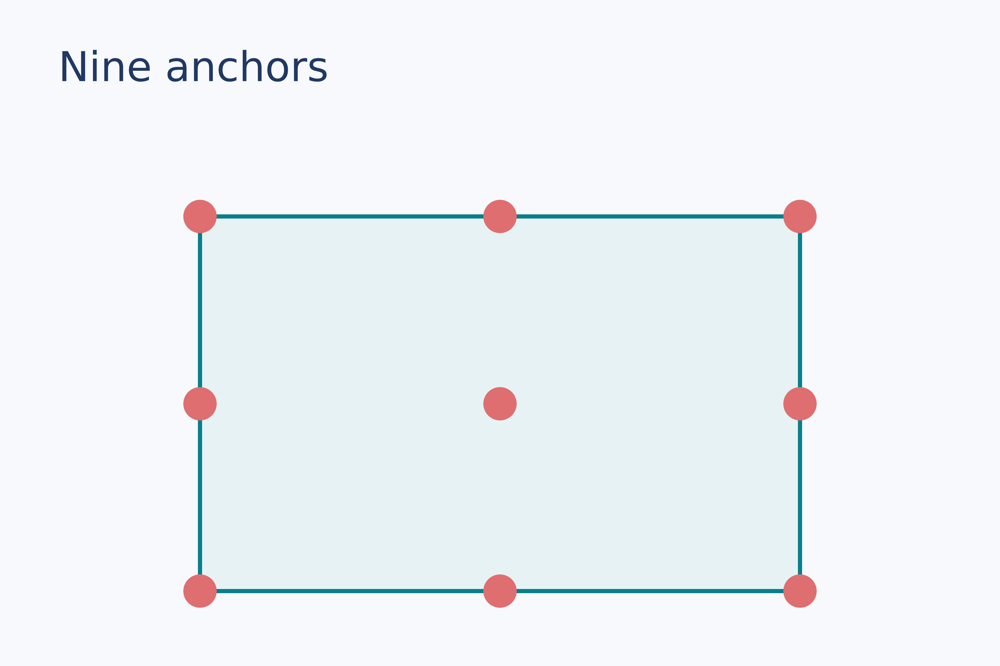
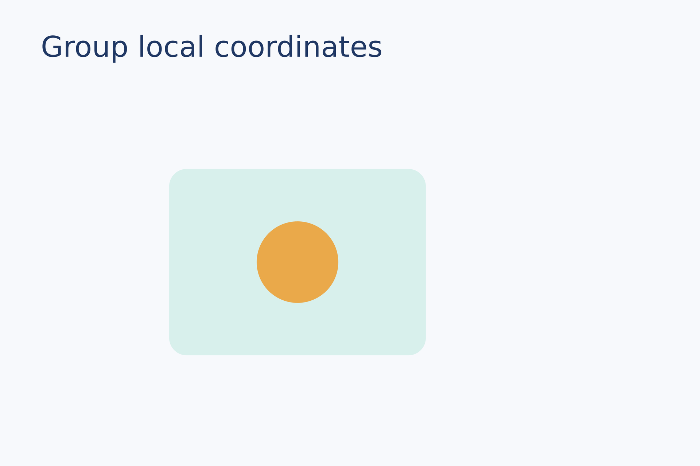

# LayMesh 分类画廊

每个条目依次给出说明、关键代码、紧接代码的实际渲染图片、完整源码、复现命令和本机实测结果。图片与源码均保存在仓库中。

## 按能力浏览

### [插图与图像](images.zh-CN.md) · 10 例

输入格式、复用、裁剪与图片框适配。所有素材由仓库内的合成图生成，不依赖外部下载。

[PNG 位图](images.zh-CN.md#png) · [JPEG 位图](images.zh-CN.md#jpeg) · [SVG 矢量素材](images.zh-CN.md#svg) · [8 位灰度 TIFF](images.zh-CN.md#tiff-gray) · [8 位 RGB TIFF](images.zh-CN.md#tiff-rgb) · [同一素材重复放置](images.zh-CN.md#reuse) · [独立裁剪](images.zh-CN.md#crop) · [contain 完整显示](images.zh-CN.md#fit-contain) · [cover 填满并裁切](images.zh-CN.md#fit-cover) · [stretch 拉伸](images.zh-CN.md#fit-stretch)

### [定位与图层](positioning.zh-CN.md) · 6 例

以实例锚点建立关系，再用旋转、透明度和调用顺序决定最终画面。

[九点锚点](positioning.zh-CN.md#anchors) · [相对定位链](positioning.zh-CN.md#relative) · [尺寸改变带动定位](positioning.zh-CN.md#dependent-size) · [旋转](positioning.zh-CN.md#rotation) · [透明度](positioning.zh-CN.md#opacity) · [绘制顺序](positioning.zh-CN.md#drawing-order)

### [容器与组件](containers.zh-CN.md) · 4 例

使用局部坐标组织多个对象，并通过组和本地模块复用布局。

[组内坐标](containers.zh-CN.md#group-local) · [嵌套与缩放](containers.zh-CN.md#group-nested) · [同一组放置两次](containers.zh-CN.md#group-reuse) · [本地模块组件](containers.zh-CN.md#module-import)

### [形状与绘制](shapes.zh-CN.md) · 17 例

从基础图形到路径、填充、虚线、复合边框和轮廓融合。

[圆角矩形](shapes.zh-CN.md#rect) · [椭圆](shapes.zh-CN.md#ellipse) · [线与箭头](shapes.zh-CN.md#line-arrow) · [多边形与折线](shapes.zh-CN.md#polygon-polyline) · [圆弧与扇形](shapes.zh-CN.md#arc-sector) · [星形与环形](shapes.zh-CN.md#star-ring) · [路径命令](shapes.zh-CN.md#path-commands) · [偶奇填充孔洞](shapes.zh-CN.md#evenodd-hole) · [线性渐变](shapes.zh-CN.md#linear-gradient) · [径向渐变](shapes.zh-CN.md#radial-gradient) · [自定义虚线](shapes.zh-CN.md#dashes) · [可复用边框](shapes.zh-CN.md#outlines) · [实例轮廓融合](shapes.zh-CN.md#fuse) · [斜线接入平面边界](shapes.zh-CN.md#fuse-angled) · [斜线接入曲线边界](shapes.zh-CN.md#fuse-curved) · [空心矩形右边接斜线](shapes.zh-CN.md#fuse-outline-edge) · [空心矩形右上角接斜线](shapes.zh-CN.md#fuse-outline-corner)

### [文字与公式](typography.zh-CN.md) · 5 例

文字、换行、彩色文字段和两种公式排版形式。

[字体名称与回退](typography.zh-CN.md#font) · [宽度、换行和对齐](typography.zh-CN.md#wrap-align) · [彩色文字段](typography.zh-CN.md#spans) · [行内公式](typography.zh-CN.md#inline-formula) · [独立公式](typography.zh-CN.md#display-formula)

### [脚本与计算](scripting.zh-CN.md) · 2 例

限定在 .lay 语言中的变量、单位、函数和流程控制。

[单位与内置函数](scripting.zh-CN.md#units-builtins) · [函数与循环](scripting.zh-CN.md#control-flow)

### [科研数据绘图](plots.zh-CN.md) · 10 例

直角坐标、极坐标与雷达图；物理绘图区保持固定，所有面板和共享装饰手动定位。

[多轴与独立断口](plots.zh-CN.md#multi-axes-breaks) · [基础图层与描述统计](plots.zh-CN.md#statistics) · [共享颜色与独立色标](plots.zh-CN.md#shared-colors) · [手动局部放大图](plots.zh-CN.md#inset) · [方向曲线、跨零度与负半径](plots.zh-CN.md#polar-directions) · [极坐标误差带与端帽](plots.zh-CN.md#polar-errors) · [角度直方图与扇环堆叠](plots.zh-CN.md#polar-rose) · [极坐标热图与周期等高线](plots.zh-CN.md#polar-field) · [原始量纲雷达图](plots.zh-CN.md#radar) · [Python 极坐标数据与缺失区域](plots.zh-CN.md#polar-data)

## 更多示例

[原生科研绘图与实际图片](../plotting.zh-CN.md) · [Matplotlib 与 Notebook 的实际输出](notebook.zh-CN.md) · [八份综合应用示例](comprehensive.zh-CN.md) · [执行结果与测试证据](../examples-and-results.zh-CN.md)
