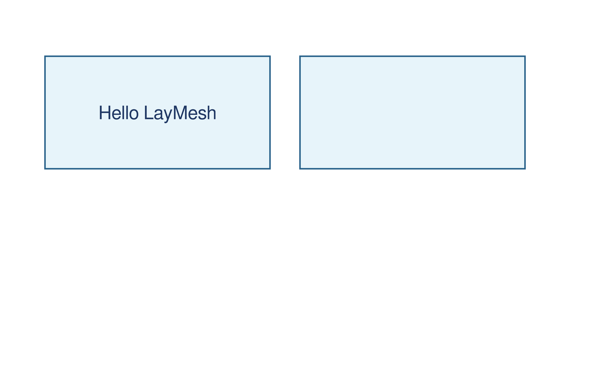
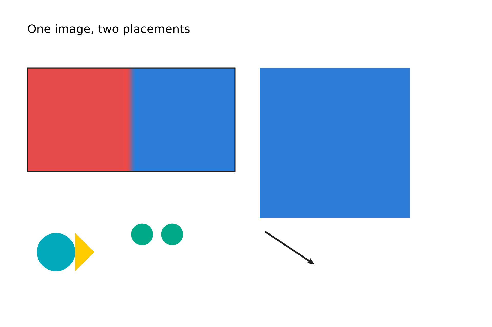
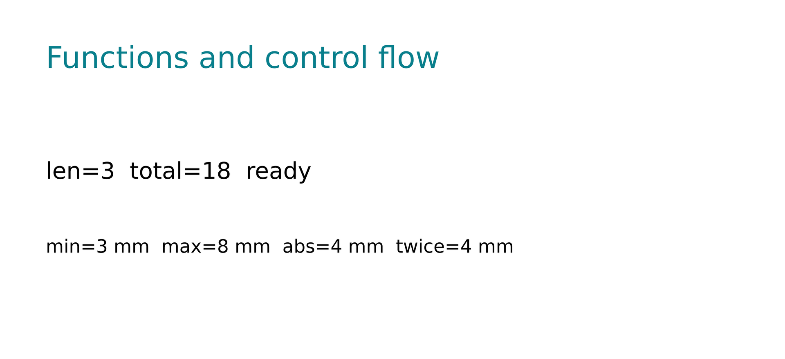
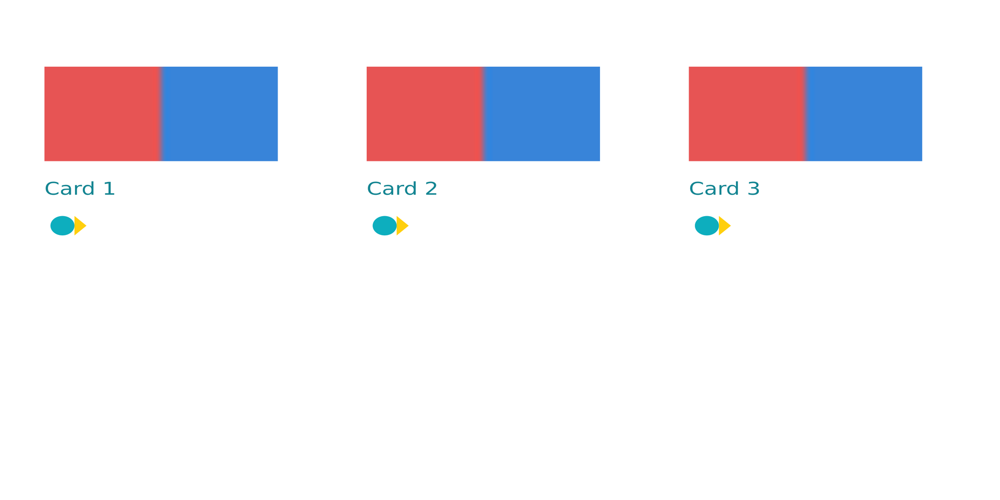
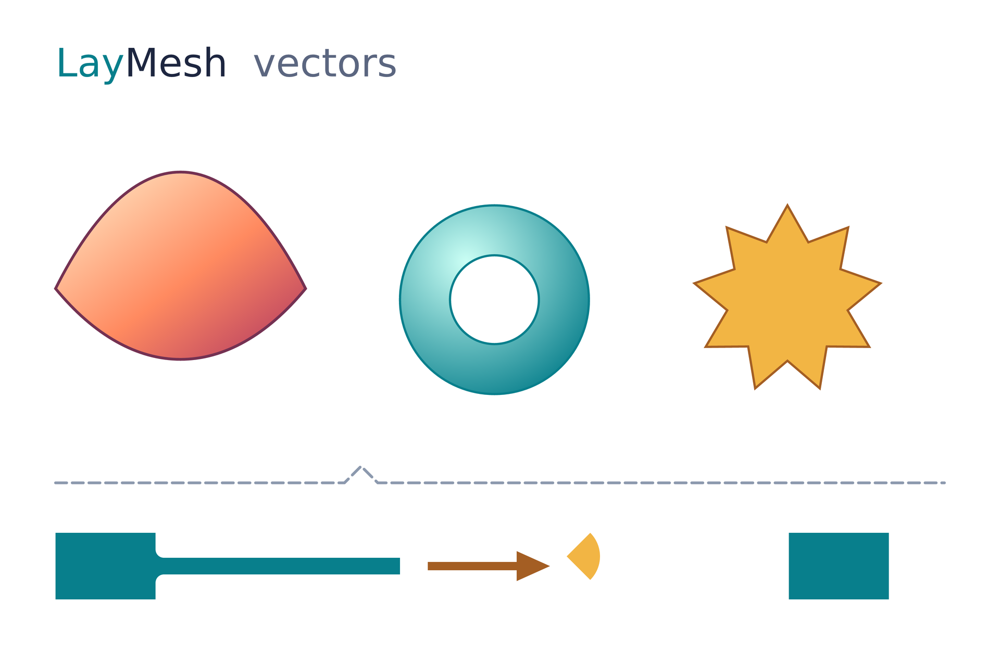
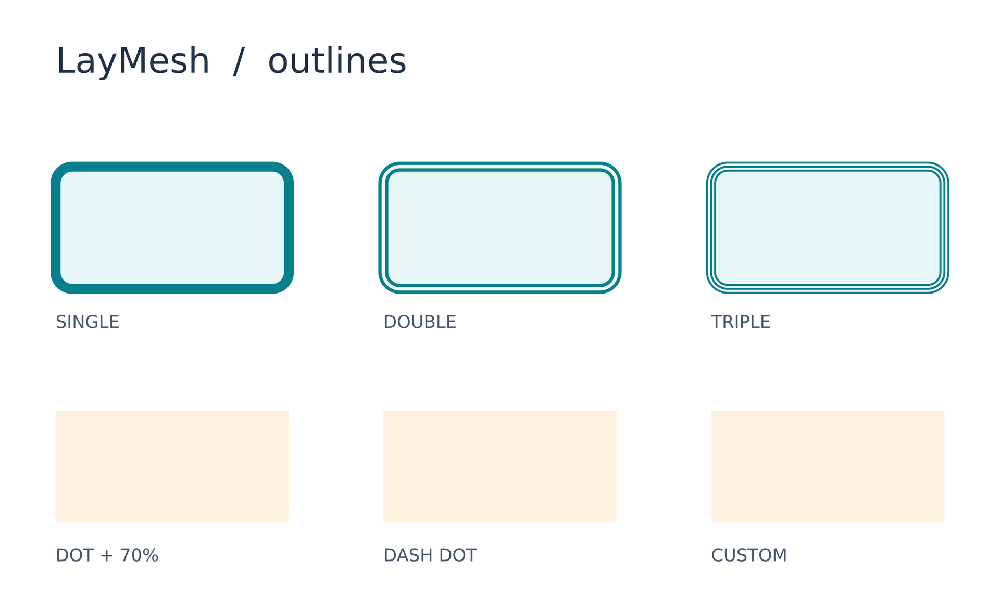
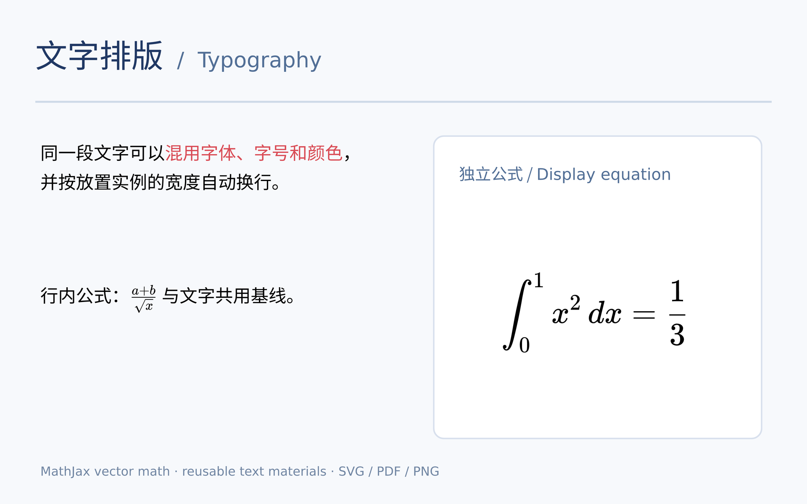

# 综合应用

这些示例把多项功能放在同一页面。要逐项学习，请从[分类画廊](README.zh-CN.md)进入。以下代码是原文件节选，完整运行以源码为准。

## 第一张图

用矩形、文字和锚点创建简单页面。

```lay
page = canvas(size=(160 mm, 100 mm), background="#ffffff")

card = rect(size=(60 mm, 30 mm),
            fill="#e7f4fa", border_color="#28618a", border_width=0.4 mm)
left = page.add(card, target=page.top_left, offset=(12 mm, 15 mm))
page.add(card, target=left.top_right, offset=(8 mm, 0 mm))

title = text(content="Hello LayMesh", font_size=14 pt, color="#203864")
page.add(title, anchor=center, target=left.center)
```



源码：[examples/hello.lay](../../examples/hello.lay)。

复现命令：`laymesh validate examples/hello.lay`；`laymesh render examples/hello.lay -o hello.png --dpi 150`。

实测：160 × 100 mm，3 个顶层实例；预览 160 × 100 mm，945 × 591 px。

## 素材拼版

一份素材定义在两个位置以不同宽度和裁剪参数复用。

```lay
page = canvas(name="LayMesh basic", size=(180 mm, 120 mm), layout_dpi=96, background="#ffffff")

photo = image(src="assets/photo.png")
left = page.add(photo,size=(76 mm, auto), target=page.top_left, offset=(10 mm, 25 mm))
right = page.add(photo,size=(55 mm, auto), crop=box(offset=(0.5, 0), size=(0.5, 1)), target=left.top_right, offset=(9 mm, 0 mm))

label = text(content="One image, two placements", font_family="DejaVu Sans", font_size=12 pt)
page.add(label, target=page.top_left, offset=(10 mm, 8 mm))
```



源码：[examples/basic.lay](../../examples/basic.lay)。

复现命令：`laymesh validate examples/basic.lay`；`laymesh render examples/basic.lay -o basic.png --dpi 150`。

实测：180 × 120 mm，7 个顶层实例；预览 180 × 120 mm，1063 × 709 px。

## 函数与控制流

用列表、单位、自定义函数和循环计算文字结果。

```lay
function twice(value) { return value * 2 }
values = [2, 4]
values = append(values, 6)
count = 0
for value in values { count = count + value }
for index in range(3) { count = count + index }
while count < 18 { count = count + 1 }
status = "pending"
if count == 18 { status = "ready" } else { status = "error" }
```



源码：[examples/functions.lay](../../examples/functions.lay)。

复现命令：`laymesh validate examples/functions.lay`；`laymesh render examples/functions.lay -o functions.png --dpi 150`。

实测：120 × 55 mm，3 个顶层实例；预览 120 × 55 mm，709 × 325 px。

## 组件卡片

导入本地组件，在循环中放置三张卡片。

```lay
import { card } from "./components/card.lay"

page = canvas(name="LayMesh components", size=(180 mm, 90 mm), background="#ffffff")
spacing = 58 mm
for index in range(3) {
  label = "Card " + str(index + 1)
  tile = card(label)
  placed = page.add(tile,size=(42 mm, auto), target=page.top_left,
                    offset=(8 mm + index * spacing, 12 mm), opacity=0.95)
}
```



源码：[examples/scripted.lay](../../examples/scripted.lay)。

复现命令：`laymesh validate examples/scripted.lay`；`laymesh render examples/scripted.lay -o scripted.png --dpi 150`。

实测：180 × 90 mm，3 个顶层实例；预览 180 × 90 mm，1063 × 531 px。

## 矢量绘制

集中展示路径、渐变、镂空、虚线和轮廓融合。

```lay
warm = linear_gradient(start=(0, 0), end=(1, 1),
                       stops=[(0, "#fff0ce"), (0.55, "#ff8a60"), (1, "#ad3462")])
cool = radial_gradient(center=(0.35, 0.3), radius=0.8,
                       stops=[(0, "#cbfff5"), (1, "#087f8c")])

wave = path(commands=[move_to(0 mm, 23 mm), cubic_to(14 mm, -5 mm, 31 mm, -5 mm, 45 mm, 23 mm),
                      cubic_to(31 mm, 40 mm, 14 mm, 40 mm, 0 mm, 23 mm), close()],
            fill=warm, border_color="#743152", border_width=0.5 mm)
page.add(wave, target=page.top_left, offset=(10 mm, 31 mm))
```



源码：[examples/vector.lay](../../examples/vector.lay)。

复现命令：`laymesh validate examples/vector.lay`；`laymesh render examples/vector.lay -o vector.png --dpi 150`。

实测：180 × 120 mm，9 个顶层实例；预览 180 × 120 mm，1063 × 709 px。

## 复合边框

单线、双线、三线以及虚线边框可重复使用。

```lay


card = rect(size=(42 mm, 22 mm), border_radius=3 mm, fill="#e7f6f6", border_color="#087f8c", border_width=1.8 mm, border_style="solid")
page.add(card, target=page.top_left, offset=(10 mm, 30 mm))
page.add(rect(size=(42 mm, 22 mm), border_radius=3 mm, fill="#e7f6f6", border_color="#087f8c", border_width=1.8 mm, border_style=double),
         target=page.top_left, offset=(69 mm, 30 mm))
page.add(rect(size=(42 mm, 22 mm), border_radius=3 mm, fill="#e7f6f6", border_color="#087f8c", border_width=1.8 mm, border_style=triple),
         target=page.top_left, offset=(128 mm, 30 mm))
```



源码：[examples/outlines.lay](../../examples/outlines.lay)。

复现命令：`laymesh validate examples/outlines.lay`；`laymesh render examples/outlines.lay -o outlines.png --dpi 150`。

实测：180 × 110 mm，13 个顶层实例；预览 180 × 110 mm，1063 × 650 px。

## 文字与公式

混合字体、彩色文字段、换行与公式排版。

```lay
header = text(size=(148 mm, auto),
  spans=[
    span("文字排版", font_family="Noto Sans CJK SC", color="#203864", font_size=18 pt),
    span("  /  Typography", font_family="DejaVu Sans", color="#526f96", font_size=12 pt)
  ],
  font_size=12 pt)
page.add(header, target=page.top_left, offset=(7 mm, 6 mm))
```



源码：[examples/typography.lay](../../examples/typography.lay)。

复现命令：`laymesh validate examples/typography.lay`；`laymesh render examples/typography.lay -o typography.png --dpi 150`。

实测：160 × 100 mm，8 个顶层实例；预览 160 × 100 mm，945 × 591 px。

## 完整排版图版

将图像、矢量、文字、组和组件组合在 16 cm 宽的单页版面。

```lay
import { photo, icon } from "./components/materials.lay"
import { card } from "./components/card.lay"

scale = 160 / 297
page = canvas(name="LayMesh layout atlas", size=(16 cm, 420 mm * scale), background="#ffffff")
artboard = group()
artboard.add(rect(size=(297 mm, 420 mm), fill="#ffffff"), target=artboard.top_left)
font_name = "DejaVu Sans"
```


源码：[examples/showcase.lay](../../examples/showcase.lay)。

复现命令：`laymesh validate examples/showcase.lay`；`laymesh render examples/showcase.lay -o showcase.png --dpi 150`。

实测：160 × 226.262626… mm，1 个顶层组；预览 160 × 226.262626… mm，945 × 1336 px。
