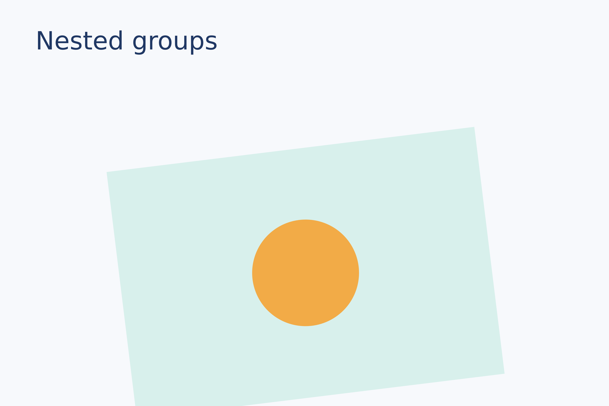

# Groups and components

Organize objects in local coordinates and reuse layouts through groups and local modules.

[Back to the gallery](README.en.md) · [Execution results](../examples-and-results.en.md)

## Group coordinates

<a id="group-local"></a>

### Local group coordinates

Position a child relative to another placement inside a group, then place the whole group on the page.

```lay
badge = group()
back = badge.add(rect(size=(44 mm, 32 mm), border_radius=3 mm, fill="#d8f0ec"),
                 target=badge.top_left)
badge.add(ellipse(size=(14 mm, 14 mm), fill="#eaa94a"),
          anchor=center, target=back.center)
page.add(badge, target=page.top_left, offset=(29 mm, 29 mm))
```


Source: [group-local.lay](../../examples/gallery/containers/group-local.lay).

Reproduce: `laymesh validate examples/gallery/containers/group-local.lay`; `laymesh render examples/gallery/containers/group-local.lay -o group-local.png --dpi 150`.

Observed CLI output: `有效：examples/gallery/containers/group-local.lay（120 × 80 mm，2 个顶层实例）`; PNG **709 × 472 px** at 150 DPI; warnings: none.

<a id="group-nested"></a>

### Nested groups and scaling

Nest one group inside another, then scale and rotate the outer placement.

```lay
inner = group()
inner.add(ellipse(size=(15 mm, 15 mm), fill="#f2ab47"), target=inner.top_left)
outer = group()
plate = outer.add(rect(size=(52 mm, 35 mm), fill="#d8f0ec"),
                  target=outer.top_left)
outer.add(inner, anchor=center, target=plate.center)
page.add(outer,size=(73 mm, 49 mm), target=page.top_left,
         offset=(21 mm, 25 mm), rotation=-7 deg)
```



Source: [group-nested.lay](../../examples/gallery/containers/group-nested.lay).

Reproduce: `laymesh validate examples/gallery/containers/group-nested.lay`; `laymesh render examples/gallery/containers/group-nested.lay -o group-nested.png --dpi 150`.

Observed CLI output: `有效：examples/gallery/containers/group-nested.lay（120 × 80 mm，2 个顶层实例）`; PNG **709 × 472 px** at 150 DPI; warnings: none.

## Reuse

<a id="group-reuse"></a>

### Place one group twice

Place the same group at two sizes without changing its original definition.

```lay
card = group()
base = card.add(rect(size=(38 mm, 28 mm), border_radius=3 mm, fill="#d8f0ec",
                     border_color="#087f8c", border_width=0.5 mm), target=card.top_left)
card.add(ellipse(size=(10 mm, 10 mm), fill="#f2ab47"),
         anchor=center, target=base.center)
first = page.add(card, target=page.top_left, offset=(8 mm, 30 mm))
page.add(card,size=(52 mm, 38 mm), target=first.top_right,
         offset=(11 mm, -3 mm))
```


Source: [group-reuse.lay](../../examples/gallery/containers/group-reuse.lay).

Reproduce: `laymesh validate examples/gallery/containers/group-reuse.lay`; `laymesh render examples/gallery/containers/group-reuse.lay -o group-reuse.png --dpi 150`.

Observed CLI output: `有效：examples/gallery/containers/group-reuse.lay（120 × 80 mm，3 个顶层实例）`; PNG **709 × 472 px** at 150 DPI; warnings: none.

<a id="module-import"></a>

### Local module component

Import a card function from a neighboring .lay module to create two independent placements.

```lay
import { card } from "./card-component.lay"
first = page.add(card("A"), target=page.top_left, offset=(8 mm, 29 mm))
page.add(card("B"), target=first.top_right, offset=(13 mm, 0 mm))
```


Source: [module-import.lay](../../examples/gallery/containers/module-import.lay).

Reproduce: `laymesh validate examples/gallery/containers/module-import.lay`; `laymesh render examples/gallery/containers/module-import.lay -o module-import.png --dpi 150`.

Observed CLI output: `有效：examples/gallery/containers/module-import.lay（120 × 80 mm，3 个顶层实例）`; PNG **709 × 472 px** at 150 DPI; warnings: none.
