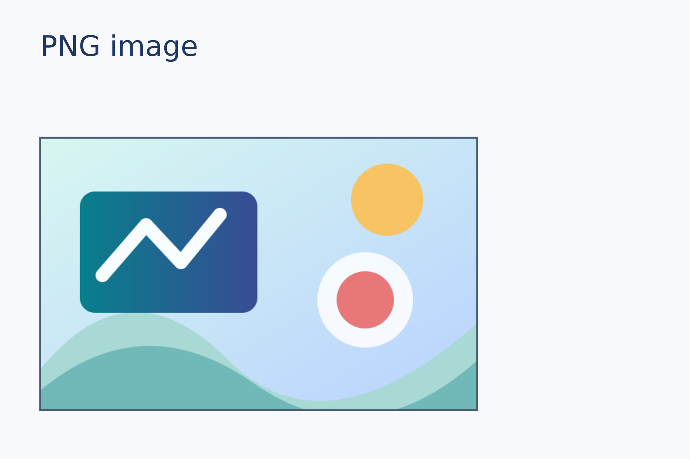
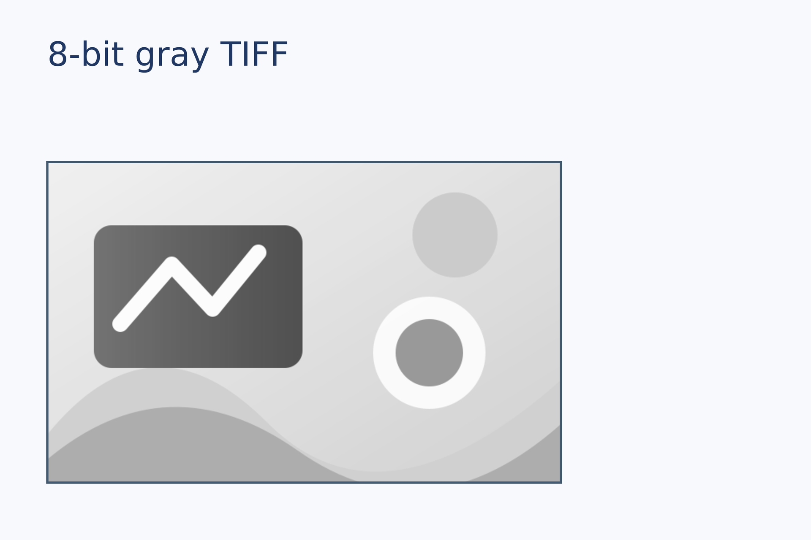
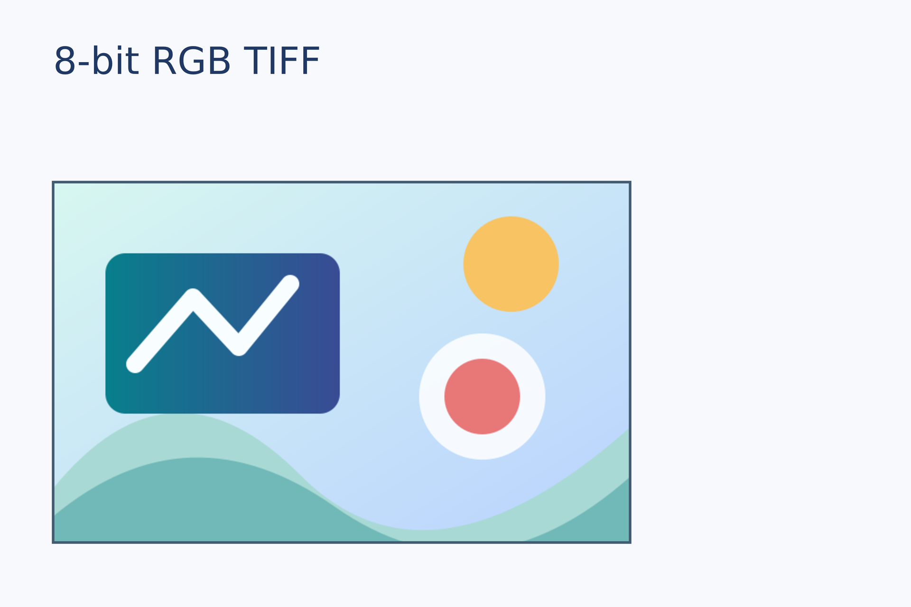
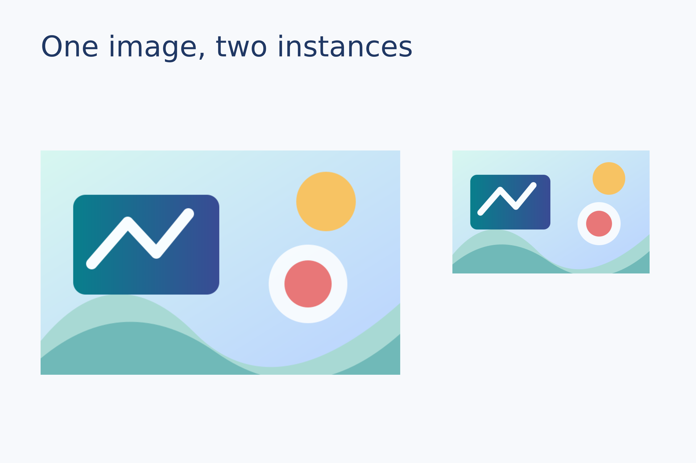
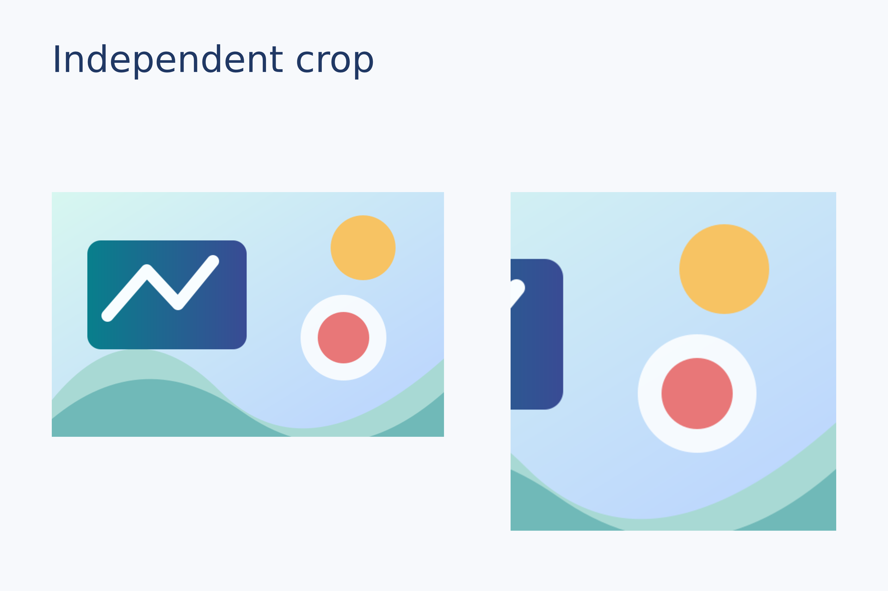
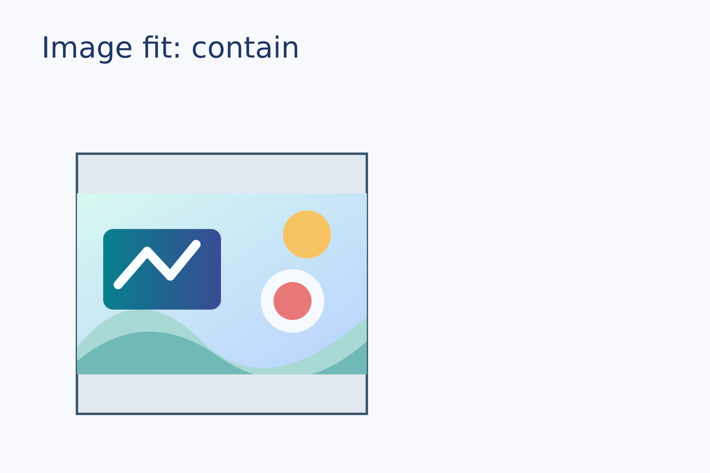
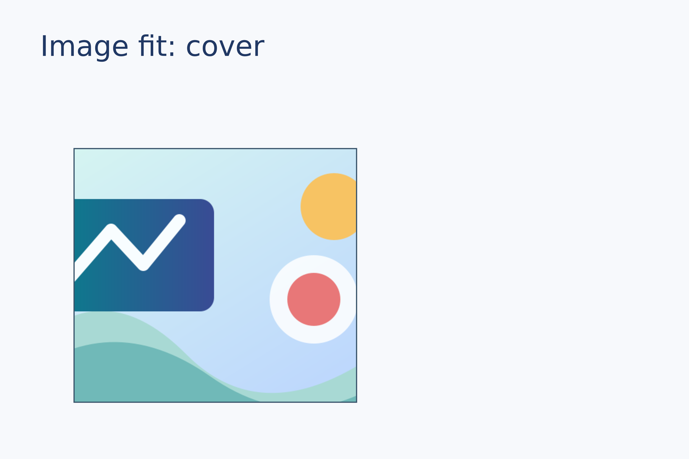
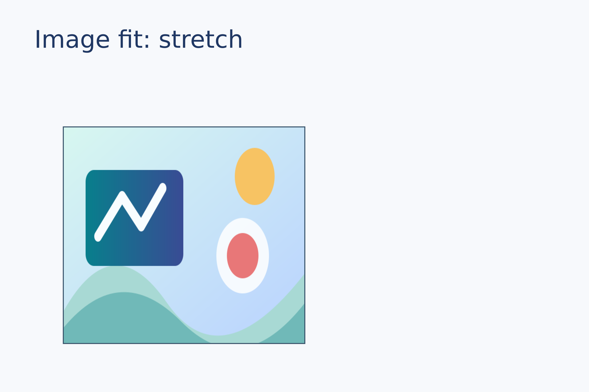

# Images and illustrations

Input formats, reuse, independent crops, and fitting images into frames. All sample assets are generated in this repository.

[Back to the gallery](README.en.md) · [Execution results](../examples-and-results.en.md)

## Input formats

<a id="png"></a>

### PNG bitmap

Import a PNG at a specified physical width while preserving the complete image on the page.

```lay
picture = image(src="../assets/sample.png")
placed = page.add(picture,size=(76 mm, auto), target=page.top_left, offset=(7 mm, 24 mm))
frame = rect(size=(76 mm, 47.5 mm), fill="none", border_color="#435b72", border_width=0.35 mm)
page.add(frame, target=placed.top_left)
```



Source: [png.lay](../../examples/gallery/images/png.lay).

Reproduce: `laymesh validate examples/gallery/images/png.lay`; `laymesh render examples/gallery/images/png.lay -o png.png --dpi 150`.

Observed CLI output: `有效：examples/gallery/images/png.lay（120 × 80 mm，3 个顶层实例）`; PNG **709 × 472 px** at 150 DPI; warnings: none.

<a id="jpeg"></a>

### JPEG bitmap

Place a JPEG in the same layout to inspect the rendered appearance of a lossy image.

```lay
picture = image(src="../assets/sample.jpg")
placed = page.add(picture,size=(76 mm, auto), target=page.top_left, offset=(7 mm, 24 mm))
frame = rect(size=(76 mm, 47.5 mm), fill="none", border_color="#435b72", border_width=0.35 mm)
page.add(frame, target=placed.top_left)
```


Source: [jpeg.lay](../../examples/gallery/images/jpeg.lay).

Reproduce: `laymesh validate examples/gallery/images/jpeg.lay`; `laymesh render examples/gallery/images/jpeg.lay -o jpeg.png --dpi 150`.

Observed CLI output: `有效：examples/gallery/images/jpeg.lay（120 × 80 mm，3 个顶层实例）`; PNG **709 × 472 px** at 150 DPI; warnings: none.

<a id="svg"></a>

### SVG vector asset

Import a safe subset of SVG. The artwork remains vector content in SVG and PDF exports.

```lay
picture = image(src="../assets/sample.svg")
placed = page.add(picture,size=(76 mm, auto), target=page.top_left, offset=(7 mm, 24 mm))
frame = rect(size=(76 mm, 47.5 mm), fill="none", border_color="#435b72", border_width=0.35 mm)
page.add(frame, target=placed.top_left)
```


Source: [svg.lay](../../examples/gallery/images/svg.lay).

Reproduce: `laymesh validate examples/gallery/images/svg.lay`; `laymesh render examples/gallery/images/svg.lay -o svg.png --dpi 150`.

Observed CLI output: `有效：examples/gallery/images/svg.lay（120 × 80 mm，3 个顶层实例）`; PNG **709 × 472 px** at 150 DPI; warnings: none.

<a id="tiff-gray"></a>

### 8-bit grayscale TIFF

Import a single-page, single-channel 8-bit TIFF generated by the repository scripts.

```lay
picture = image(src="../assets/gray8.tiff")
placed = page.add(picture,size=(76 mm, auto), target=page.top_left, offset=(7 mm, 24 mm))
frame = rect(size=(76 mm, 47.5 mm), fill="none", border_color="#435b72", border_width=0.35 mm)
page.add(frame, target=placed.top_left)
```



Source: [tiff-gray.lay](../../examples/gallery/images/tiff-gray.lay).

Reproduce: `laymesh validate examples/gallery/images/tiff-gray.lay`; `laymesh render examples/gallery/images/tiff-gray.lay -o tiff-gray.png --dpi 150`.

Observed CLI output: `有效：examples/gallery/images/tiff-gray.lay（120 × 80 mm，3 个顶层实例）`; PNG **709 × 472 px** at 150 DPI; warnings: none.

<a id="tiff-rgb"></a>

### 8-bit RGB TIFF

Import a single-page, three-channel 8-bit TIFF.

```lay
picture = image(src="../assets/rgb8.tiff")
placed = page.add(picture,size=(76 mm, auto), target=page.top_left, offset=(7 mm, 24 mm))
frame = rect(size=(76 mm, 47.5 mm), fill="none", border_color="#435b72", border_width=0.35 mm)
page.add(frame, target=placed.top_left)
```



Source: [tiff-rgb.lay](../../examples/gallery/images/tiff-rgb.lay).

Reproduce: `laymesh validate examples/gallery/images/tiff-rgb.lay`; `laymesh render examples/gallery/images/tiff-rgb.lay -o tiff-rgb.png --dpi 150`.

Observed CLI output: `有效：examples/gallery/images/tiff-rgb.lay（120 × 80 mm，3 个顶层实例）`; PNG **709 × 472 px** at 150 DPI; warnings: none.

## Instances and cropping

<a id="reuse"></a>

### Reuse one asset

Place one image definition twice at different widths; each placement has independent settings.

```lay
picture = image(src="../assets/sample.png")
first = page.add(picture,size=(62 mm, auto), target=page.top_left, offset=(7 mm, 26 mm))
page.add(picture,size=(34 mm, auto), target=first.top_right, offset=(9 mm, 0 mm))
```



Source: [reuse.lay](../../examples/gallery/images/reuse.lay).

Reproduce: `laymesh validate examples/gallery/images/reuse.lay`; `laymesh render examples/gallery/images/reuse.lay -o reuse.png --dpi 150`.

Observed CLI output: `有效：examples/gallery/images/reuse.lay（120 × 80 mm，3 个顶层实例）`; PNG **709 × 472 px** at 150 DPI; warnings: none.

<a id="crop"></a>

### Independent crops

Crop the right placement from the source while the left placement still shows the full image.

```lay
picture = image(src="../assets/sample.png")
first = page.add(picture,size=(53 mm, auto), target=page.top_left, offset=(7 mm, 26 mm))
page.add(picture,size=(44 mm, auto), crop=box(offset=(0.4, 0), size=(0.6, 1)),
         target=first.top_right, offset=(9 mm, 0 mm))
```



Source: [crop.lay](../../examples/gallery/images/crop.lay).

Reproduce: `laymesh validate examples/gallery/images/crop.lay`; `laymesh render examples/gallery/images/crop.lay -o crop.png --dpi 150`.

Observed CLI output: `有效：examples/gallery/images/crop.lay（120 × 80 mm，3 个顶层实例）`; PNG **709 × 472 px** at 150 DPI; warnings: none.

## Fit modes

<a id="fit-contain"></a>

### Contain

Scale proportionally to show the entire image inside the frame, leaving space when needed.

```lay
picture = image(src="../assets/sample.png")
frame = rect(size=(49 mm, 44 mm), fill="#e1e8ef", border_color="#39546b", border_width=0.4 mm)
placed = page.add(frame, target=page.top_left, offset=(13 mm, 26 mm))
page.add(picture,size=(49 mm, 44 mm), fit=contain, target=placed.top_left)
```



Source: [fit-contain.lay](../../examples/gallery/images/fit-contain.lay).

Reproduce: `laymesh validate examples/gallery/images/fit-contain.lay`; `laymesh render examples/gallery/images/fit-contain.lay -o fit-contain.png --dpi 150`.

Observed CLI output: `有效：examples/gallery/images/fit-contain.lay（120 × 80 mm，3 个顶层实例）`; PNG **709 × 472 px** at 150 DPI; warnings: none.

<a id="fit-cover"></a>

### Cover

Scale proportionally until the image fills the frame, clipping any overflow.

```lay
picture = image(src="../assets/sample.png")
frame = rect(size=(49 mm, 44 mm), fill="#e1e8ef", border_color="#39546b", border_width=0.4 mm)
placed = page.add(frame, target=page.top_left, offset=(13 mm, 26 mm))
page.add(picture,size=(49 mm, 44 mm), fit=cover, target=placed.top_left)
```



Source: [fit-cover.lay](../../examples/gallery/images/fit-cover.lay).

Reproduce: `laymesh validate examples/gallery/images/fit-cover.lay`; `laymesh render examples/gallery/images/fit-cover.lay -o fit-cover.png --dpi 150`.

Observed CLI output: `有效：examples/gallery/images/fit-cover.lay（120 × 80 mm，3 个顶层实例）`; PNG **709 × 472 px** at 150 DPI; warnings: none.

<a id="fit-stretch"></a>

### Stretch

Scale width and height independently to demonstrate a nonuniform fit.

```lay
picture = image(src="../assets/sample.png")
frame = rect(size=(49 mm, 44 mm), fill="#e1e8ef", border_color="#39546b", border_width=0.4 mm)
placed = page.add(frame, target=page.top_left, offset=(13 mm, 26 mm))
page.add(picture,size=(49 mm, 44 mm), fit=stretch, target=placed.top_left)
```



Source: [fit-stretch.lay](../../examples/gallery/images/fit-stretch.lay).

Reproduce: `laymesh validate examples/gallery/images/fit-stretch.lay`; `laymesh render examples/gallery/images/fit-stretch.lay -o fit-stretch.png --dpi 150`.

Observed CLI output: `有效：examples/gallery/images/fit-stretch.lay（120 × 80 mm，3 个顶层实例）`; PNG **709 × 472 px** at 150 DPI; warnings: none.
