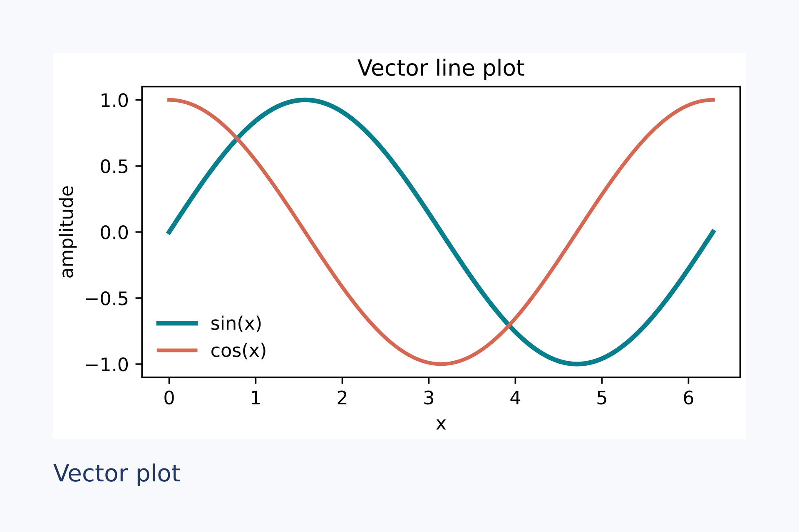
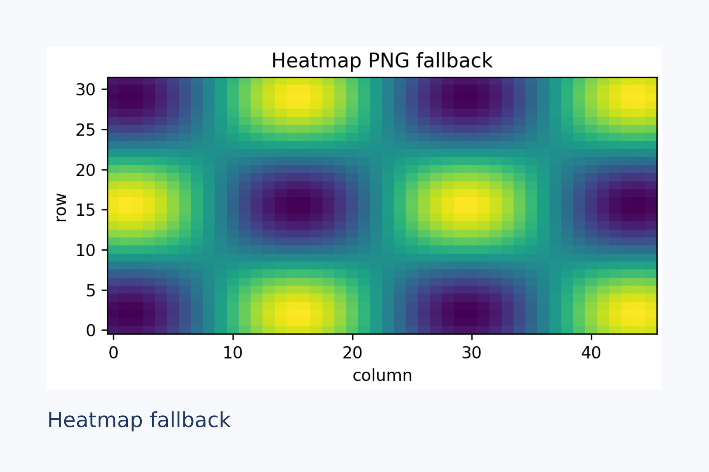

# Matplotlib 与 Notebook 实际输出

这两例由 [`scripts/build-notebook-gallery.py`](../../scripts/build-notebook-gallery.py) 调用 Python 桥接层实际生成，并保存展开后的 `.lay`、素材和最终 PNG。Notebook 中可用相同的 `{{fig}}` 绑定方式；完整交互示例见 [Jupyter Notebook](../../examples/jupyter-integration.ipynb)。两个页面均为 **120 × 80 mm**，最终预览在 **150 DPI** 下均为 **709 × 472 px**。

## 折线图：SVG 矢量素材

两条 Matplotlib 曲线使用 `plot` 绘制，桥接层保存兼容的 SVG 素材。图片上的标题与曲线来自 Matplotlib，页脚文字由 LayMesh 排版。

```python
x = np.linspace(0, 2 * np.pi, 121)
ax.plot(x, np.sin(x), label="sin(x)")
ax.plot(x, np.cos(x), label="cos(x)")
render_source(SOURCE, namespace={"fig": fig, "caption": "Vector plot"},
              output="vector-preview.png", dpi=150, save_source="vector.lay")
```



展开后的[布局源码](../../examples/gallery/notebook/vector.lay)及[SVG 素材](../../examples/gallery/notebook/vector.assets/fig-db872339bf178acf.svg)保存在仓库中。复现：`python scripts/build-notebook-gallery.py --write`。实测：保留 `.svg` 素材；未发出回退提示；最终页面 709 × 472 px。SVG 中的曲线仍是矢量路径，Matplotlib 图中文字默认转为路径。

## 热图：自动回退 PNG

`imshow` 产生的栅格图超出当前 SVG 安全子集时，桥接层按 `plot_dpi=240` 保存 PNG 素材，再由 LayMesh 以最终 `dpi=150` 渲染整页。两个 DPI 分别控制**图表素材**和**最终页面**，互不替代。

```python
z = np.sin(x[None, :] * 2) * np.cos(y[:, None] * 2)
ax.imshow(z, cmap="viridis", origin="lower", aspect="auto")
render_source(SOURCE, namespace={"fig": fig, "caption": "Heatmap fallback"},
              output="heatmap-preview.png", dpi=150, plot_dpi=240,
              save_source="heatmap.lay")
```



展开后的[布局源码](../../examples/gallery/notebook/heatmap.lay)及[PNG 素材](../../examples/gallery/notebook/heatmap.assets/fig-be7ca6af9345e8f0.png)保存在仓库中。复现：`python scripts/build-notebook-gallery.py --write`。实测提示：`Matplotlib 图 fig 已改用 240 DPI PNG：SVG 使用了当前 LayMesh 不支持的图形内容`；最终页面 709 × 472 px。

[返回分类画廊](README.zh-CN.md) · [Python/Jupyter 指南](../python-jupyter.zh-CN.md)
