# 科研数据绘图

直角坐标、极坐标与雷达图；物理绘图区保持固定，所有面板和共享装饰手动定位。

[返回画廊索引](README.zh-CN.md) · [执行结果](../examples-and-results.zh-CN.md)

## 精确坐标与统计

<a id="multi-axes-breaks"></a>

### 多轴与独立断口

三条纵轴使用不同的断区和物理间距；横轴也独立断开。固定绘图区的宽高和所有轴间距都可直接编辑。

```lay
# Independent axis gaps. Lengths are literal mm, not stretch factors.
page=canvas(size=(210 mm,128 mm),background="#ffffff")
s=plot_style(font_family="DejaVu Sans",font_size=8 pt)
p=plot(size=(195 mm,112 mm),plot_area=box(offset=(24 mm, 20 mm), size=(110 mm, 62 mm)),style=s,
 x=axis(label="Time (s)",range=(0,10),ticks=[0,1,2,8,9,10],breaks=[(2,8)],break_gap=3 mm,segment_lengths=[45 mm,62 mm],minor_ticks="auto"),
 y=axis(label="Signal (a.u.)",range=(0,100),ticks=[0,5,80,90,100],breaks=[(10,80)],break_gap=2 mm,segment_lengths=[20 mm,40 mm],line_color="#264b69"))
p.add_axis(name="temperature",side="right",offset=0 mm,
 axis=axis(label="Temperature (K)",range=(200,1000),ticks=[200,400,800,1000],breaks=[(400,800)],break_gap=4 mm,segment_lengths=[29 mm,29 mm],line_color="#a04725"))
p.add_axis(name="pressure",side="right",offset=29 mm,
 axis=axis(label="Pressure (MPa)",range=(0,100),ticks=[0,25,50,75,100],line_color="#34705a"))
a=p.line(x=[0,1,2,8,9,10],y=[1,5,9,84,92,98],marker="circle",color="#264b69",label="Signal")
b=p.line(x=[0,1,2,8,9,10],y=[220,300,380,830,910,980],y_axis="temperature",marker="diamond",color="#a04725",label="Temperature")
c=p.line(x=[0,1,2,8,9,10],y=[15,26,40,55,72,91],y_axis="pressure",line_dash=[2 mm,1 mm],color="#34705a",label="Pressure")
p.errorbar(x=[1,9],y=[5,91],yerr=[4,8],color="#264b69",cap_size=2 mm)
chart=page.add(p,offset=(6 mm,8 mm))
page.add(text(content="Independent gaps on three vertical axes",font_family="DejaVu Sans",font_size=10 pt),target=chart.plot_top_left,offset=(0 mm,-14 mm))
page.add(legend(layers=[a,b,c],columns=3,gap=3 mm,background="none"),target=chart.plot_bottom_left,offset=(0 mm,23 mm))
# This data anchor uses temperature values, including its independent break.
page.add(text(content="T",font_family="DejaVu Sans",font_size=8 pt,color="#a04725"),anchor=bottom_left,target=chart.data(x=9,y=910,y_axis="temperature"),offset=(2 mm,-2 mm))
```

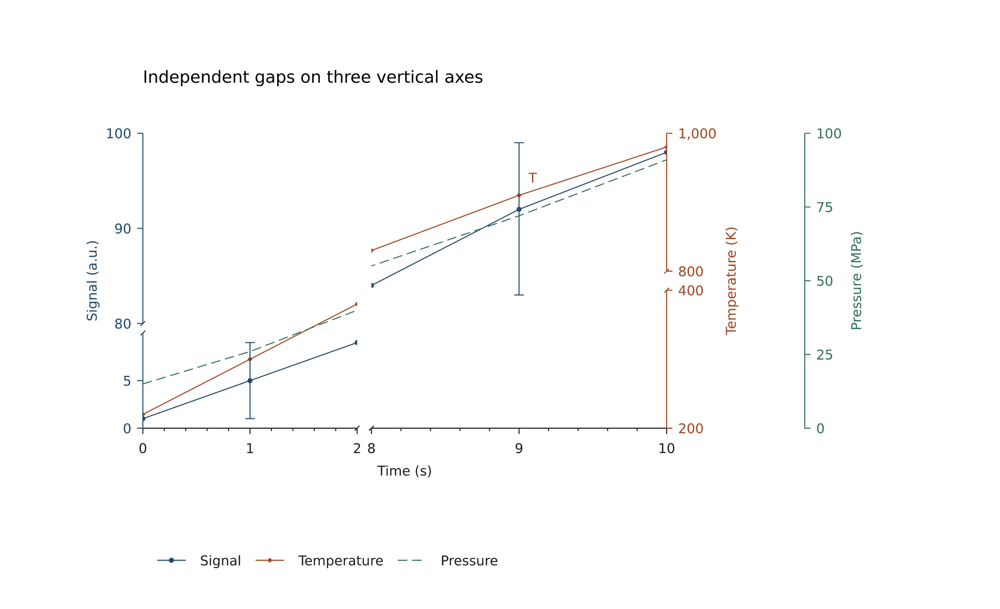

源码：[multi-axes-breaks.lay](../../examples/plot/multi-axes-breaks.lay)。

复现命令：`laymesh validate examples/plot/multi-axes-breaks.lay`；`laymesh render examples/plot/multi-axes-breaks.lay -o multi-axes-breaks.png --dpi 150`。

实测：`有效：examples/plot/multi-axes-breaks.lay（210 × 128 mm，4 个顶层实例）`；PNG **1240 × 756 px**，150 DPI；警告：无。

<a id="statistics"></a>

### 基础图层与描述统计

明确的柱位置与堆叠基线、阶梯、加权规则一致的直方图、ECDF、箱线及小提琴图。常量小提琴样本保留中位数并给出预期警告。

```lay
# Statistics are evaluated in original data units. Positions preserve input order.
page=canvas(size=(274 mm,128 mm),background="#ffffff")
s=plot_style(font_family="DejaVu Sans",font_size=7 pt)
a=plot(size=(88 mm,91 mm),plot_area=box(offset=(16 mm, 15 mm), size=(62 mm, 55 mm)),style=s,
 x=axis(range=(0,5),ticks=[1,2,3,4],tick_text=["A","B","C","D"]),y=axis(label="Change",range=(-2,7),ticks=[-2,0,2,4,6]))
bar=a.bar(positions=[1,2,3,4],values=[2,-1,4,3],data_width=0.65,fill="#e0e6eb",border_color="#264b69",hatch="slash",hatch_spacing=1.5 mm,label="Change")
a.bar(positions=[1,3,4],values=[1,1,2],baseline=[2,4,3],data_width=0.65,fill="none",border_color="#a04725",hatch="cross",label="Stack")
a.hline(y=0,color="#777777",line_width=0.3 pt)
a.step(x=[0.5,1.5,2.5,3.5,4.5],y=[1,2,1,3,4],where="post",color="#a04725")
ca=page.add(a,offset=(4 mm,10 mm))
page.add(text(content="(a) Bars, stacks and steps",font_family="DejaVu Sans",font_size=9 pt),target=ca.plot_top_left,offset=(0 mm,-12 mm))

b=plot(size=(104 mm,91 mm),plot_area=box(offset=(16 mm, 15 mm), size=(62 mm, 55 mm)),style=s,
 x=axis(label="Observation",range=(0,6),ticks=[0,2,4,6]),y=axis(label="Density",range=(0,0.5),ticks=[0,0.2,0.4]))
b.add_axis(name="cumulative",side="right",axis=axis(label="ECDF",range=(0,1),ticks=[0,0.5,1],line_color="#a04725"))
hist=b.hist(values=[0.4,0.8,1.1,1.2,1.6,2.2,2.3,2.8,3.1,3.8,4.1,5.4],bins=[0,1,2,3,4,6],stat="density",fill="#d9e5dd",border_color="#34705a",label="Density")
ecdf=b.ecdf(values=[0.4,0.8,1.1,1.2,1.6,2.2,2.3,2.8,3.1,3.8,4.1,5.4],y_axis="cumulative",color="#a04725",label="ECDF")
cb=page.add(b,offset=(90 mm,10 mm))
page.add(text(content="(b) Histogram and ECDF",font_family="DejaVu Sans",font_size=9 pt),target=cb.plot_top_left,offset=(0 mm,-12 mm))

c=plot(size=(88 mm,91 mm),plot_area=box(offset=(20 mm, 15 mm), size=(62 mm, 55 mm)),style=s,
 x=axis(range=(0,4),ticks=[1,2,3],tick_text=["Box","KDE","Constant"]),y=axis(label="Observation",range=(0,11),ticks=[0,5,10]))
box=c.boxplot(values=[1,2,2,3,3,4,5,10],position=1,data_width=0.65,fill="#e0e6eb",border_color="#264b69",label="R-7 / 1.5 IQR")
violin=c.violin(values=[1,1.5,2,2.2,2.4,3,3.5,4.8,5],position=2,data_width=0.75,fill="#e8d8d1",border_color="#a04725",label="Gaussian KDE")
c.violin(values=[3,3,3],position=3,data_width=0.65,color="#34705a")
cc=page.add(c,offset=(179 mm,10 mm))
page.add(text(content="(c) Box and violin",font_family="DejaVu Sans",font_size=9 pt),target=cc.plot_top_left,offset=(0 mm,-12 mm))
page.add(legend(layers=[bar,hist,ecdf,box,violin],columns=5,gap=3 mm,background="none",sample_width=5 mm,sample_gap=2 mm),offset=(25 mm,105 mm))
```

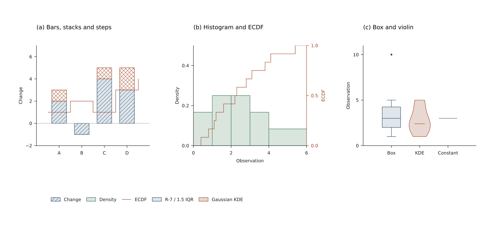

源码：[statistics.lay](../../examples/plot/statistics.lay)。

复现命令：`laymesh validate examples/plot/statistics.lay`；`laymesh render examples/plot/statistics.lay -o statistics.png --dpi 150`。

实测：`有效：examples/plot/statistics.lay（274 × 128 mm，7 个顶层实例）`；PNG **1618 × 756 px**，150 DPI；警告：examples/plot/statistics.lay:26:1: W_PLOT_MISSING: 样本不足或为常量，小提琴图仅显示中位数。

<a id="shared-colors"></a>

### 共享颜色与独立色标

非均匀热图、规则网格等高线、逐点颜色/大小/透明度共用一个中心发散标尺。独立水平色标手动放置。

```lay
# One physical color scale for nonuniform cells, contours and point colors.
page=canvas(size=(256 mm,132 mm),background="#ffffff")
s=plot_style(font_family="DejaVu Sans",font_size=7 pt)
colors=color_scale(norm="centered",vmin=-2,vmax=2,center=0,cmap=["#264b69","#f4f3ef","#a04725"])
a=plot(size=(82 mm,92 mm),plot_area=box(offset=(16 mm, 18 mm), size=(60 mm, 54 mm)),style=s,x=axis(label="x",range=(0,4),ticks=[0,2,4]),y=axis(label="y",range=(0,4),ticks=[0,2,4]))
a.heatmap(z=[[-2,-1,0,1],[-1,0,1,2],[0,1,2,1],[1,2,1,0]],x_edges=[0,0.5,1.5,3,4],y_edges=[0,1,2.5,3,4],color_scale=colors)
ca=page.add(a,offset=(2 mm,5 mm))
page.add(text(content="(a) Nonuniform cells",font_family="DejaVu Sans",font_size=9 pt),target=ca.plot_top_left,offset=(0 mm,-12 mm))
b=plot(size=(82 mm,92 mm),plot_area=box(offset=(16 mm, 18 mm), size=(60 mm, 54 mm)),style=s,x=axis(label="x",range=(0,4),ticks=[0,2,4]),y=axis(label="y",range=(0,4),ticks=[0,2,4]))
b.contourf(z=[[-2,-1,0,1,2],[-1,0,1,2,1],[0,1,2,1,0],[1,2,1,0,-1],[2,1,0,-1,-2]],x=[0,1,2,3,4],y=[0,1,2,3,4],levels=[-2,-1,0,1],color_scale=colors)
b.contour(z=[[-2,-1,0,1,2],[-1,0,1,2,1],[0,1,2,1,0],[1,2,1,0,-1],[2,1,0,-1,-2]],levels=[-1,0,1],color="#555555",line_width=0.3 pt)
cb=page.add(b,offset=(83 mm,5 mm))
page.add(text(content="(b) Grid contours",font_family="DejaVu Sans",font_size=9 pt),target=cb.plot_top_left,offset=(0 mm,-12 mm))
c=plot(size=(82 mm,92 mm),plot_area=box(offset=(16 mm, 18 mm), size=(60 mm, 54 mm)),style=s,x=axis(label="x",range=(0,4),ticks=[0,2,4]),y=axis(label="y",range=(0,4),ticks=[0,2,4]))
c.scatter(x=[0.5,1,1.5,2,2.5,3,3.5],y=[1,3,2,1,3,2,3],c=[-2,-1,0,1,2,1,-1],color_scale=colors,marker_size=[2 mm,3 mm,4 mm,5 mm,6 mm,4 mm,3 mm],opacity=[1,1,0.7,1,1,0.7,1],marker_border_color="#444444",marker_border_width=0.2 mm)
cc=page.add(c,offset=(164 mm,5 mm))
page.add(text(content="(c) Color, size, opacity",font_family="DejaVu Sans",font_size=9 pt),target=cc.plot_top_left,offset=(0 mm,-12 mm))
page.add(colorbar(scale=colors,orientation="horizontal",length=92 mm,ticks=[-2,-1,0,1,2],label=formula(source=r"\Delta E\;(\mathrm{eV})",font_size=9 pt),style=s),offset=(76 mm,101 mm))
```

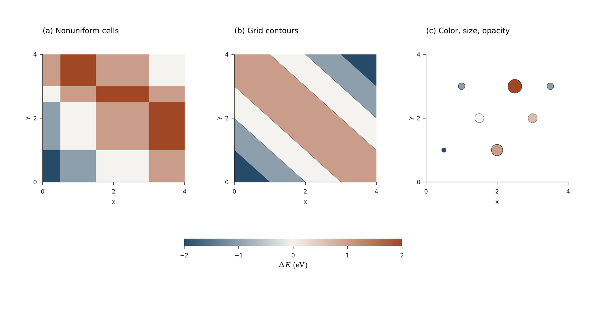

源码：[shared-colors.lay](../../examples/plot/shared-colors.lay)。

复现命令：`laymesh validate examples/plot/shared-colors.lay`；`laymesh render examples/plot/shared-colors.lay -o shared-colors.png --dpi 150`。

实测：`有效：examples/plot/shared-colors.lay（256 × 132 mm，7 个顶层实例）`；PNG **1512 × 780 px**，150 DPI；警告：无。

<a id="inset"></a>

### 手动局部放大图

独立绘图区、箭头和文字通过已有锚点组合到组内；主图采用 symlog，局部放大图仍使用自己的线性映射。

```lay
# Insets are independent plots; placement stays completely manual and editable.
page=canvas(size=(154 mm,112 mm),background="#ffffff")
s=plot_style(font_family="DejaVu Sans",font_size=8 pt)
p=plot(size=(140 mm,102 mm),plot_area=box(offset=(20 mm, 18 mm), size=(105 mm, 64 mm)),style=s,x=axis(label="Time (s)",range=(0,10)),y=axis(label="Response",scale="symlog",constant=0.5,range=(-1,100),ticks=[-1,0,1,10,100]))
a=p.line(x=[0,1,2,3,4,5,6,7,8,9,10],y=[-0.5,0,0.4,1,2,4,8,16,32,64,90],marker="circle",color="#264b69",label="Observed")
g=group()
chart=g.add(p)
# Add a white inset background as a separate editable shape.
g.add(rect(size=(44 mm, 35 mm),fill="#ffffff",border_color="#bbbbbb",border_width=0.3 pt),target=chart.plot_top_left,offset=(4 mm,3 mm))
zoom=plot(size=(44 mm,35 mm),plot_area=box(offset=(9 mm, 3 mm), size=(31 mm, 23 mm)),style=s,x=axis(range=(0,3),ticks=[0,1,2,3],tick_font_size=6 pt,tick_color="#555555"),y=axis(range=(-0.6,1.2),ticks=[0,1],tick_font_size=6 pt))
zoom.line(x=[0,1,2,3],y=[-0.5,0,0.4,1],marker="circle",marker_size=1 mm,color="#264b69")
inset=g.add(zoom,target=chart.plot_top_left,offset=(4 mm,3 mm))
g.add(line(end_head=head(), dx=7 mm,dy=6 mm,line_color="#777777",line_width=0.4 pt),anchor="end",target=chart.data(x=3,y=1),offset=(0 mm,-1 mm))
g.add(text(content="Local detail",font_family="DejaVu Sans",font_size=7 pt),target=inset.plot_top_left,offset=(0 mm,-6 mm))
g.add(legend(layers=[a],background="none"),target=chart.plot_top_right,anchor=top_right,offset=(0 mm,-10 mm))
page.add(g,offset=(6 mm,4 mm))
```

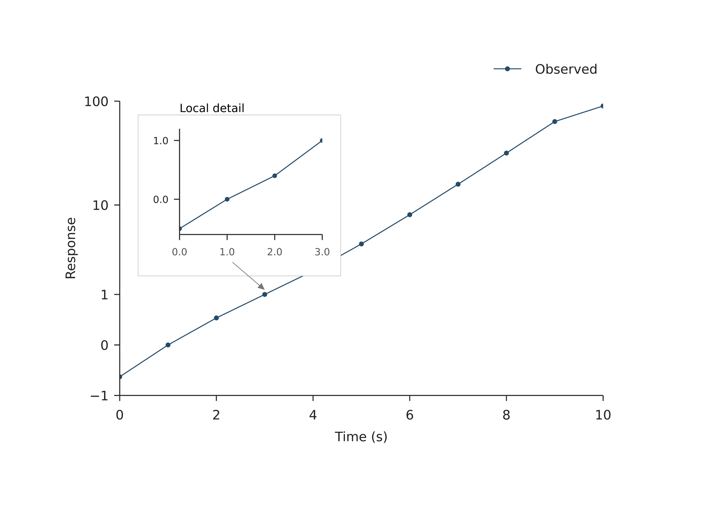

源码：[inset.lay](../../examples/plot/inset.lay)。

复现命令：`laymesh validate examples/plot/inset.lay`；`laymesh render examples/plot/inset.lay -o inset.png --dpi 150`。

实测：`有效：examples/plot/inset.lay（154 × 112 mm，1 个顶层实例）`；PNG **909 × 661 px**，150 DPI；警告：无。

## 极坐标与雷达图

<a id="polar-directions"></a>

### 方向曲线、跨零度与负半径

比较数学角与北向顺时针；负半径给出可隐藏的预期警告。

```lay
page=canvas(size=(205 mm,120 mm),background="#ffffff")
s=plot_style(font_family="DejaVu Sans",font_size=7 pt,grid_color="#dddddd")
p=plot(projection="polar",size=(98 mm,100 mm),plot_area=box(offset=(18 mm, 18 mm), size=(62 mm, 62 mm)),style=s,
       theta=axis(ticks=[0,90,180,270],grid="major"),r=axis(range=(0,5),ticks=[1,3,5],grid="major",tick_font_size=6 pt))
a=p.line(theta=[0,45,90,135,180,225,270,315],r=[4.5,3,1.6,2.5,4,2.8,1.3,3.4],closed=true,marker="diamond",marker_size=1.7 mm,color="#264b69",label="Response")
p.line(theta=[350,10],r=[4,4],color="#b65337",line_width=0.6 mm,label="350 to 10 degrees")
p.scatter(theta=[180],r=[-4.5],marker="circle",marker_size=3 mm,marker_fill="none",marker_border_color="#b65337",marker_border_width=0.3 mm)
c=page.add(p,offset=(3 mm,4 mm))
page.add(text(content="(a) Directional response",font_family="DejaVu Sans",font_size=9 pt),target=c.plot_top_left,offset=(-4 mm,-15 mm))
page.add(text(content="Peak",font_family="DejaVu Sans",font_size=7 pt),target=c.data(theta=0,r=4.5),offset=(-12 mm,-6 mm))
q=plot(projection="polar",size=(98 mm,100 mm),plot_area=box(offset=(18 mm, 18 mm), size=(62 mm, 62 mm)),style=s,theta_zero=90 deg,theta_direction="cw",
       theta=axis(ticks=[0,90,180,270],tick_text=["N","E","S","W"],grid="major"),r=axis(range=(0,5),ticks=[1,3,5],grid="major",tick_font_size=6 pt))
q.line(theta=[0,45,90,135,180,225,270,315],r=[4.5,3,1.6,2.5,4,2.8,1.3,3.4],closed=true,marker="diamond",marker_size=1.7 mm,color="#264b69")
d=page.add(q,offset=(103 mm,4 mm))
page.add(text(content="(b) North / clockwise",font_family="DejaVu Sans",font_size=9 pt),target=d.plot_top_left,offset=(-4 mm,-15 mm))
page.add(legend(layers=[a],style=s),offset=(12 mm,103 mm))
page.add(text(content="Negative radius: same point after a half-turn (warning can be hidden).",font_family="DejaVu Sans",font_size=7 pt),offset=(53 mm,107 mm))
```

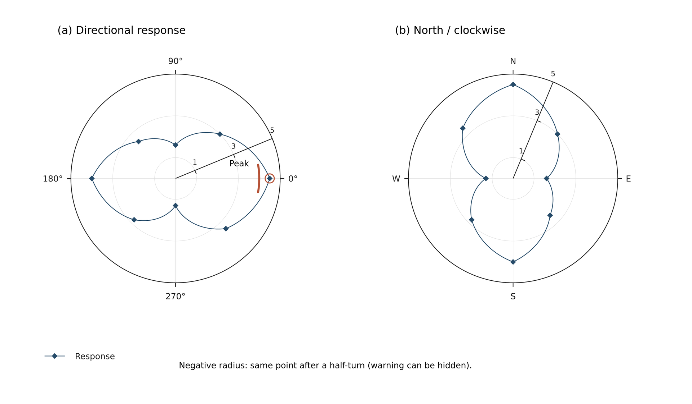

源码：[polar-directions.lay](../../examples/plot/polar-directions.lay)。

复现命令：`laymesh validate examples/plot/polar-directions.lay`；`laymesh render examples/plot/polar-directions.lay -o polar-directions.png --dpi 150`。

实测：`有效：examples/plot/polar-directions.lay（205 × 120 mm，7 个顶层实例）`；PNG **1211 × 709 px**，150 DPI；警告：examples/plot/polar-directions.lay:8:1: W_POLAR_NEGATIVE_RADIUS: 极坐标包含 1 个负半径坐标；已翻转半周并取绝对值。

<a id="polar-errors"></a>

### 极坐标误差带与端帽

局部扇区中的径向/角向误差、空心标记和物理斜线纹理。

```lay
page=canvas(size=(128 mm,112 mm),background="#ffffff")
s=plot_style(font_family="DejaVu Sans",font_size=8 pt)
p=plot(projection="polar",size=(118 mm,100 mm),plot_area=box(offset=(23 mm, 20 mm), size=(72 mm, 72 mm)),style=s,
       theta=axis(range=(0,240),ticks=[0,60,120,180,240],grid="major"),r=axis(range=(0,8),ticks=[2,4,6,8],grid="major",tick_font_size=6 pt))
b=p.band(theta=[10,45,90,135,180,225],lower=[3,4,3,2,3,2],upper=[5,6,5,4,5,4],fill="#b3c5ce",hatch="slash",hatch_spacing=2 mm,hatch_width=0.1 mm,opacity=0.45,label="Uncertainty")
e=p.errorbar(theta=[10,45,90,135,180,225],r=[4,5,4,3,4,3],thetaerr=6,rerr=0.5,marker="diamond",marker_size=2 mm,marker_fill="none",marker_border_color="#264b69",color="#264b69",cap_size=2 mm,label="Measurements")
c=page.add(p,offset=(4 mm,2 mm))
page.add(text(spans=[span("Signal "),formula(source=r"I(\theta)",font_size=10 pt)],font_family="DejaVu Sans",font_size=10 pt),offset=(30 mm,5 mm))
page.add(legend(layers=[b,e],columns=2,style=s),offset=(20 mm,99 mm))
```

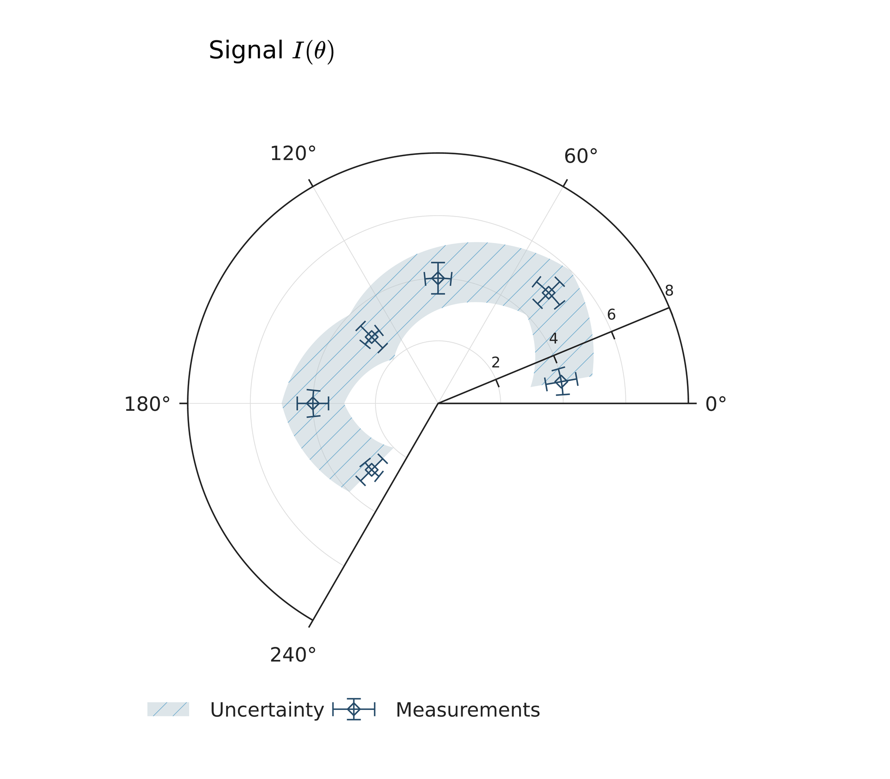

源码：[polar-errors.lay](../../examples/plot/polar-errors.lay)。

复现命令：`laymesh validate examples/plot/polar-errors.lay`；`laymesh render examples/plot/polar-errors.lay -o polar-errors.png --dpi 150`。

实测：`有效：examples/plot/polar-errors.lay（128 × 112 mm，3 个顶层实例）`；PNG **756 × 661 px**，150 DPI；警告：无。

<a id="polar-rose"></a>

### 角度直方图与扇环堆叠

周期分箱保留原始计数；逐柱基线实现手动堆叠，内孔使用 mm。

```lay
page=canvas(size=(208 mm,116 mm),background="#ffffff")
s=plot_style(font_family="DejaVu Sans",font_size=7 pt)
p=plot(projection="polar",size=(100 mm,100 mm),plot_area=box(offset=(18 mm, 20 mm), size=(64 mm, 64 mm)),style=s,theta_zero=90 deg,theta_direction="cw",
       theta=axis(ticks=[0,90,180,270],grid="major"),r=axis(range=(0,8),ticks=[2,4,6,8],grid="major",tick_font_size=6 pt))
p.hist(values=[-5,0,10,15,20,40,50,80,90,100,130,160,180,190,195,200,205,230,260,280,315,350,360],bins=8,fill="#8da9b9",border_color="#ffffff",border_width=0.25 mm)
a=page.add(p,offset=(2 mm,2 mm))
page.add(text(content="(a) Angular counts",font_family="DejaVu Sans",font_size=9 pt),target=a.plot_top_left,offset=(-3 mm,-15 mm))
q=plot(projection="polar",size=(100 mm,100 mm),plot_area=box(offset=(18 mm, 20 mm), size=(64 mm, 64 mm)),style=s,inner_radius=7 mm,
       theta=axis(ticks=[0,90,180,270],grid="major"),r=axis(range=(0,8),ticks=[2,4,6,8],grid="major",tick_font_size=6 pt))
u=q.bar(positions=[0,60,120,180,240,300],values=[3,4,2,5,3,4],angle_width=40,fill="#264b69",border_color="none",label="Series A")
v=q.bar(positions=[0,60,120,180,240,300],values=[2,1,3,1,2,2],baseline=[3,4,2,5,3,4],angle_width=40,fill="#b46c50",border_color="none",label="Series B")
b=page.add(q,offset=(105 mm,2 mm))
page.add(text(content="(b) Explicit stacking / inner hole",font_family="DejaVu Sans",font_size=9 pt),target=b.plot_top_left,offset=(-8 mm,-15 mm))
page.add(legend(layers=[u,v],columns=2,style=s),offset=(66 mm,102 mm))
```

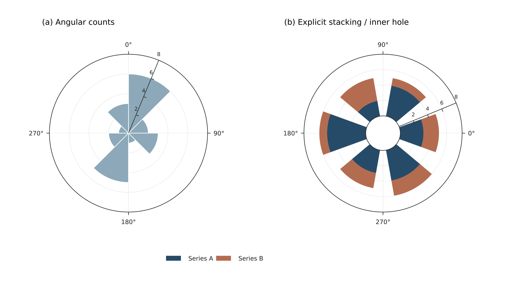

源码：[polar-rose.lay](../../examples/plot/polar-rose.lay)。

复现命令：`laymesh validate examples/plot/polar-rose.lay`；`laymesh render examples/plot/polar-rose.lay -o polar-rose.png --dpi 150`。

实测：`有效：examples/plot/polar-rose.lay（208 × 116 mm，5 个顶层实例）`；PNG **1228 × 685 px**，150 DPI；警告：无。

<a id="polar-field"></a>

### 极坐标热图与周期等高线

非均匀径向网格与周期场共用独立色标，填色接缝不重复叠加。

```lay
page=canvas(size=(218 mm,127 mm),background="#ffffff")
s=plot_style(font_family="DejaVu Sans",font_size=7 pt)
colors=color_scale(vmin=0,vmax=4,cmap="viridis")
p=plot(projection="polar",size=(102 mm,102 mm),plot_area=box(offset=(18 mm, 20 mm), size=(66 mm, 66 mm)),style=s,
       theta=axis(ticks=[0,90,180,270]),r=axis(range=(0,3),ticks=[1,2,3],tick_color="#ffffff",tick_font_size=6 pt))
p.heatmap(z=[[1,1.1,1.2,1.1,1,0.9,0.8,0.9],[2,2.3,2.6,2.3,2,1.7,1.4,1.7],[3,3.4,3.8,3.4,3,2.6,2.2,2.6]],theta_edges=[0,45,90,135,180,225,270,315,360],r_edges=[0,0.8,1.8,3],color_scale=colors)
a=page.add(p,offset=(4 mm,3 mm))
page.add(text(content="(a) Nonuniform polar cells",font_family="DejaVu Sans",font_size=9 pt),target=a.plot_top_left,offset=(-6 mm,-16 mm))
q=plot(projection="polar",size=(102 mm,102 mm),plot_area=box(offset=(18 mm, 20 mm), size=(66 mm, 66 mm)),style=s,
       theta=axis(ticks=[0,90,180,270]),r=axis(range=(0,3),ticks=[1,2,3],tick_color="#ffffff",tick_font_size=6 pt))
z=[[0,0,0,0,0,0,0,0],[1,1.15,1.3,1.15,1,0.85,0.7,0.85],[2,2.3,2.6,2.3,2,1.7,1.4,1.7],[3,3.4,3.8,3.4,3,2.6,2.2,2.6]]
q.contourf(z=z,theta=[0,45,90,135,180,225,270,315],r=[0,1,2,3],levels=[0,0.5,1,1.5,2,2.5,3,3.5],periodic=true,color_scale=colors)
q.contour(z=z,theta=[0,45,90,135,180,225,270,315],r=[0,1,2,3],levels=[1,2,3],periodic=true,color="#ffffff",line_width=0.15 mm)
b=page.add(q,offset=(112 mm,3 mm))
page.add(text(content="(b) Periodic contour bands",font_family="DejaVu Sans",font_size=9 pt),target=b.plot_top_left,offset=(-6 mm,-16 mm))
page.add(colorbar(scale=colors,orientation="horizontal",length=86 mm,thickness=3 mm,ticks=[0,1,2,3,4],label=formula(source=r"I(r,\theta)",font_size=9 pt),style=s),offset=(68 mm,104 mm))
```

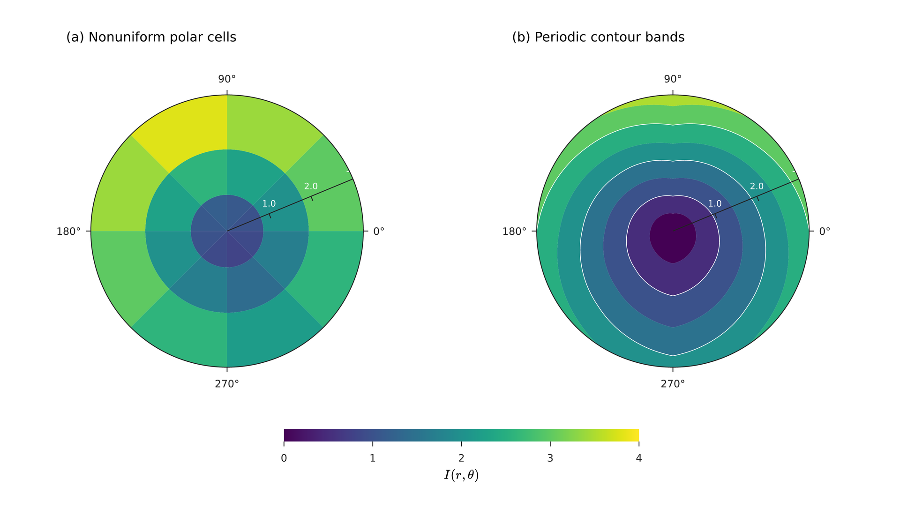

源码：[polar-field.lay](../../examples/plot/polar-field.lay)。

复现命令：`laymesh validate examples/plot/polar-field.lay`；`laymesh render examples/plot/polar-field.lay -o polar-field.png --dpi 150`。

实测：`有效：examples/plot/polar-field.lay（218 × 127 mm，5 个顶层实例）`；PNG **1287 × 750 px**，150 DPI；警告：无。

<a id="radar"></a>

### 原始量纲雷达图

明确每个指标范围，保留负温度单位和原始数值锚点；提供共同尺度对照。

```lay
page=canvas(size=(238 mm,126 mm),background="#ffffff")
s=plot_style(font_family="DejaVu Sans",font_size=7 pt)
p=plot(projection="radar",size=(115 mm,110 mm),plot_area=box(offset=(25 mm, 25 mm), size=(64 mm, 64 mm)),style=s,
       categories=["Strength","Density","Cost","Temperature","Life"],
       category_labels=["Strength (MPa)","Density", "Cost", "Temperature (C)","Life"],
       ranges=[(0,1000),(0,10),(0,100),(-50,150),(0,100)],r=axis(ticks=[0.5,1],grid="major",tick_font_size=5 pt))
a=p.area(values=[800,6,40,70,80],fill="#264b69",color="#264b69",opacity=0.18,label="Material A")
b=p.area(values=[600,4,70,120,65],fill="#b46c50",color="#b46c50",opacity=0.18,label="Material B")
p.line(values=[800,6,40,70,80],marker="diamond",marker_size=1.5 mm,color="#264b69")
p.line(values=[600,4,70,120,65],marker="triangle",marker_size=1.5 mm,color="#b46c50")
c=page.add(p,offset=(2 mm,0 mm))
page.add(text(content="(a) Explicit ranges, original units",font_family="DejaVu Sans",font_size=9 pt),offset=(12 mm,5 mm))
q=plot(projection="radar",size=(115 mm,110 mm),plot_area=box(offset=(25 mm, 25 mm), size=(64 mm, 64 mm)),style=s,categories=["A","B","C","D","E"],radar_frame="circle",r=axis(range=(0,1),ticks=[0.5,1],grid="major",tick_font_size=5 pt))
q.area(values=[0.8,0.6,0.4,0.6,0.8],fill="#264b69",opacity=0.18)
q.line(values=[0.8,0.6,0.4,0.6,0.8],marker="diamond",marker_size=1.5 mm,color="#264b69")
d=page.add(q,offset=(120 mm,0 mm))
page.add(text(content="(b) Common scale / circular frame",font_family="DejaVu Sans",font_size=9 pt),offset=(128 mm,5 mm))
page.add(legend(layers=[a,b],columns=2,style=s),offset=(78 mm,108 mm))
```

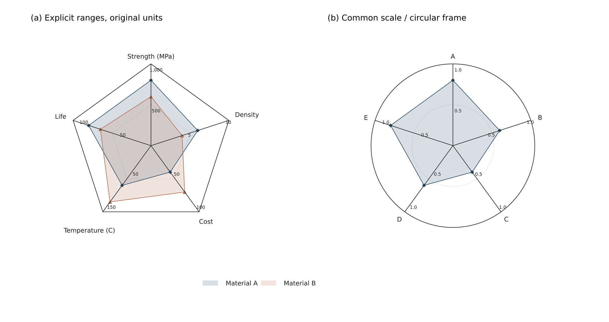

源码：[radar.lay](../../examples/plot/radar.lay)。

复现命令：`laymesh validate examples/plot/radar.lay`；`laymesh render examples/plot/radar.lay -o radar.png --dpi 150`。

实测：`有效：examples/plot/radar.lay（238 × 126 mm，5 个顶层实例）`；PNG **1406 × 744 px**，150 DPI；警告：无。

<a id="polar-data"></a>

### Python 极坐标数据与缺失区域

NumPy 场与雷达数组保存为哈希 JSON，缺失邻接单元格保持空缺。

```lay
page=canvas(size=(228 mm,132 mm),background="#ffffff")
s=plot_style(font_family="DejaVu Sans",font_size=7 pt)
colors=color_scale(vmin=0,vmax=4,cmap="viridis")
p=plot(projection="polar",size=(105 mm,110 mm),plot_area=box(offset=(20 mm, 22 mm), size=(66 mm, 66 mm)),style=s,
       theta=axis(ticks=[0,90,180,270]),r=axis(range=(0,3),ticks=[1,2,3],tick_color="#ffffff",tick_font_size=6 pt))
p.contourf(z=array(src="polar-data.assets/field-1f0c1f4eca6acc4d.json"),theta=array(src="polar-data.assets/theta-a1a6d05666acec02.json"),r=array(src="polar-data.assets/radius-c2faeb8428cb0845.json"),levels=[0,0.5,1,1.5,2,2.5,3,3.5],periodic=true,color_scale=colors)
a=page.add(p,offset=(3 mm,0 mm))
page.add(text(content="(a) Missing polar samples",font_family="DejaVu Sans",font_size=9 pt),offset=(13 mm,5 mm))
q=plot(projection="radar",size=(118 mm,110 mm),plot_area=box(offset=(25 mm, 22 mm), size=(66 mm, 66 mm)),style=s,
       categories=["Strength","Density","Cost","Temperature","Life"],ranges=[(0,1000),(0,10),(0,100),(-50,150),(0,100)],r=axis(ticks=[0.5,1],grid="major",tick_font_size=5 pt))
q.area(values=array(src="polar-data.assets/values-24bfdcd1baba759e.json"),fill="#264b69",opacity=0.2)
q.line(values=array(src="polar-data.assets/values-24bfdcd1baba759e.json"),color="#264b69",marker="diamond",marker_size=1.6 mm)
b=page.add(q,offset=(109 mm,0 mm))
page.add(text(content="(b) Raw units from Python",font_family="DejaVu Sans",font_size=9 pt),offset=(126 mm,5 mm))
page.add(colorbar(scale=colors,orientation="horizontal",length=72 mm,thickness=3 mm,ticks=[0,1,2,3,4],label="Field",style=s),offset=(27 mm,107 mm))
```

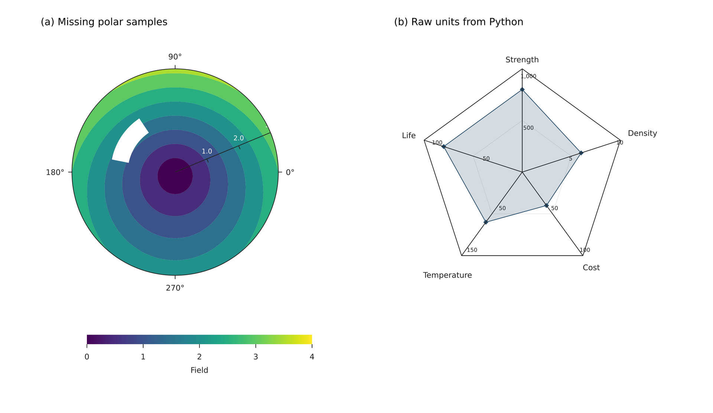

源码：[polar-data.lay](../../examples/plot/polar-data.lay)。

复现命令：`laymesh validate examples/plot/polar-data.lay`；`laymesh render examples/plot/polar-data.lay -o polar-data.png --dpi 150`。

实测：`有效：examples/plot/polar-data.lay（228 × 132 mm，5 个顶层实例）`；PNG **1346 × 780 px**，150 DPI；警告：examples/plot/polar-data.lay:8:1: W_PLOT_MISSING: 等高线包含 9 个缺失采样点；邻接网格单元留空。


<a id="dictionary-series"></a>

### 按字典循环绘制曲线

series.items() 提供图例名称与数据，palette("tab10") 驱动自动颜色轮换。

```lay
# Loop through series in insertion order; style colors rotate automatically.
page=canvas(size=(130mm,90mm),background="#ffffff")
series={"Baseline":[1,2,3,3.5],"Annealed":[1.2,2.8,3.1,4],"Cold worked":[2,2.2,2.8,3.1]}
style=plot_style(colors=palette("tab10"),font_family="DejaVu Sans",font_size=8pt)
chart=plot(size=(120mm,80mm),style=style,x=axis(label="Time",range=(0,3)),y=axis(label="Response",range=(0,5)))
for name,ys in series.items() {
 chart.line(x=[0,1,2,3],y=ys,label=name,marker="circle")
}
chart.legend(position="top_left")
page.add(chart,offset=(5mm,5mm))
```

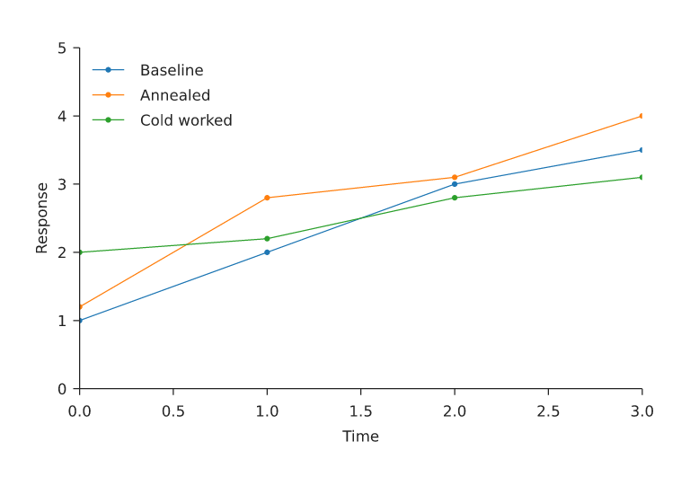

源码： [dictionary-series.lay](../../examples/plot/dictionary-series.lay).

复现命令： `laymesh validate examples/plot/dictionary-series.lay`; `laymesh render examples/plot/dictionary-series.lay -o dictionary-series.png --dpi 150`.

实测： `有效：examples/plot/dictionary-series.lay（130 × 90 mm，1 个顶层实例）`; PNG **768 × 531 px**, 150 DPI.


<a id="cmap-presets"></a>

### 完整预设配色总览

展示 Matplotlib 3.11.2 的 87 个规范预设；分类配色保持原生颜色顺序。

```lay
# Complete canonical preset catalogue; aliases and _r variants are omitted here.
names=cmap_names()
page=canvas(size=(210mm,len(names)*4mm+22mm),background="#ffffff")
page.add(text(content="Matplotlib 3.11.2 - 87 cmap presets",font_family="DejaVu Sans",font_size=12pt),offset=(8mm,5mm))
for row,name in enumerate(names) {
 cm=cmap(name)
 colors=cm.colors(64)
 if cm.category=="qualitative" {colors=cm.colors()}
 width=142mm/len(colors)
 page.add(text(content=name,font_family="DejaVu Sans",font_size=7pt),offset=(8mm,18mm+row*4mm))
 for i,color in enumerate(colors) {
  page.add(rect(size=(width,3mm),fill=color),offset=(57mm+i*width,18mm+row*4mm))
 }
}
```

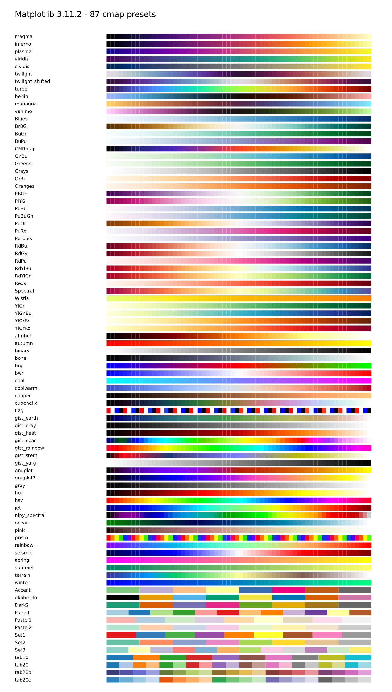

源码： [cmap-presets.lay](../../examples/plot/cmap-presets.lay).

复现命令： `laymesh validate examples/plot/cmap-presets.lay`; `laymesh render examples/plot/cmap-presets.lay -o cmap-presets.png --dpi 150`.

实测： `有效：examples/plot/cmap-presets.lay（210 × 370 mm，4976 个顶层实例）`; PNG **1240 × 2185 px**, 150 DPI.


<a id="cmap-scales"></a>

### 多图层共享配色与色标

同一不可变 coolwarm 配色对象用于热图、填色等高线、散点与共享色标。

```lay
# The same immutable handle drives heatmap, contour, scatter and colorbar.
page=canvas(size=(210mm,108mm),background="#ffffff")
cm=cmap("coolwarm")
scale=color_scale(norm="centered",vmin=-2,vmax=2,center=0,cmap=cm)
style=plot_style(font_family="DejaVu Sans",font_size=8pt)
a=plot(size=(90mm,85mm),style=style,x=axis(range=(0,4)),y=axis(range=(0,4)))
a.heatmap(z=[[-2,-1,0,1],[-1,0,1,2],[0,1,2,1],[1,2,1,0]],extent=(0,4,0,4),color_scale=scale)
page.add(a,offset=(4mm,5mm))
b=plot(size=(90mm,85mm),style=style,x=axis(range=(0,4)),y=axis(range=(0,4)))
b.contourf(z=[[-2,-1,0,1,2],[-1,0,1,2,1],[0,1,2,1,0],[1,2,1,0,-1],[2,1,0,-1,-2]],levels=[-2,-1,0,1],color_scale=scale)
b.scatter(x=[0.5,1.5,2.5,3.5],y=[3.5,2.5,1.5,0.5],c=[-2,-1,1,2],color_scale=scale,marker_border_color="#222222",marker_border_width=0.5pt)
page.add(b,offset=(101mm,5mm))
page.add(colorbar(scale=scale,length=150mm,orientation="horizontal",label="Shared value",style=style),offset=(28mm,90mm))
```

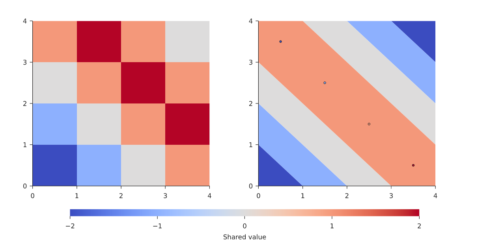

源码： [cmap-scales.lay](../../examples/plot/cmap-scales.lay).

复现命令： `laymesh validate examples/plot/cmap-scales.lay`; `laymesh render examples/plot/cmap-scales.lay -o cmap-scales.png --dpi 150`.

实测： `有效：examples/plot/cmap-scales.lay（210 × 108 mm，3 个顶层实例）`; PNG **1240 × 638 px**, 150 DPI.
