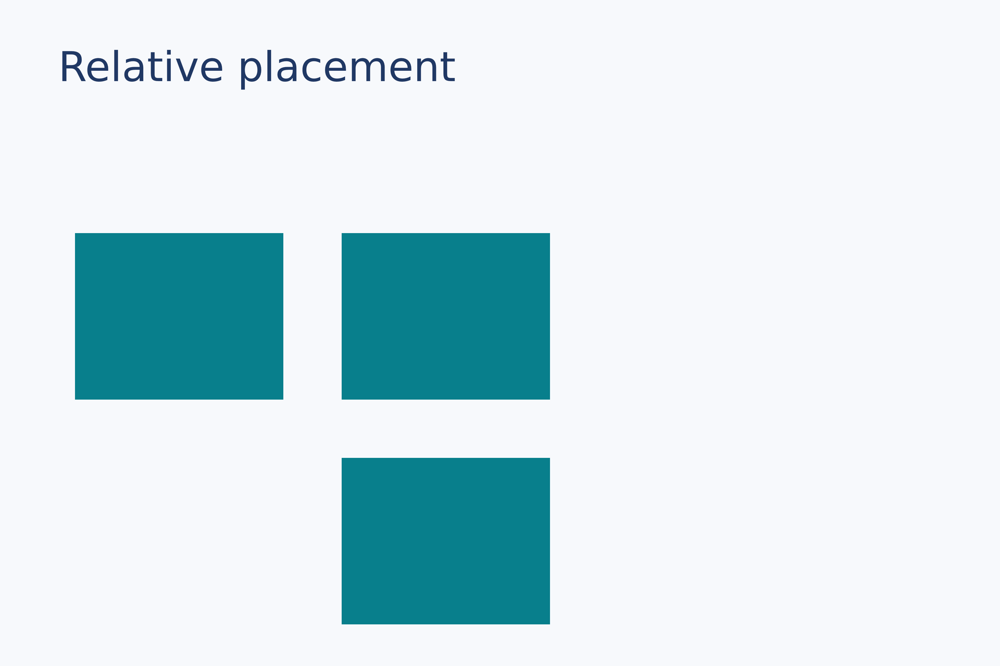
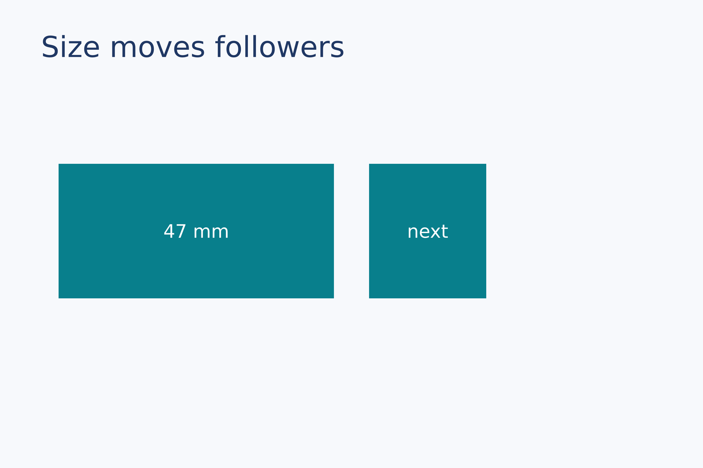
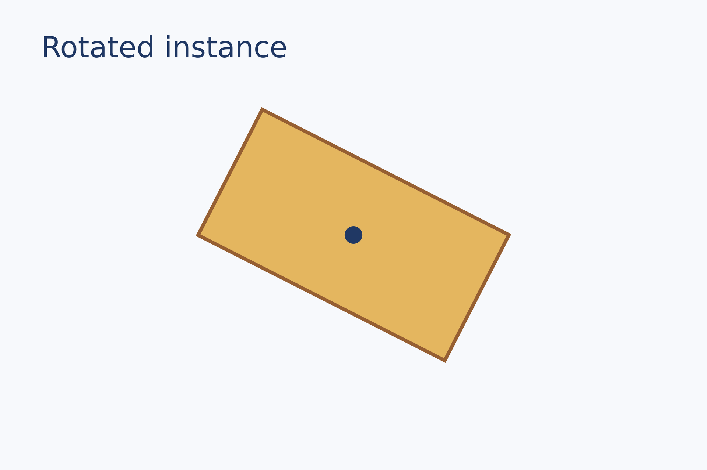
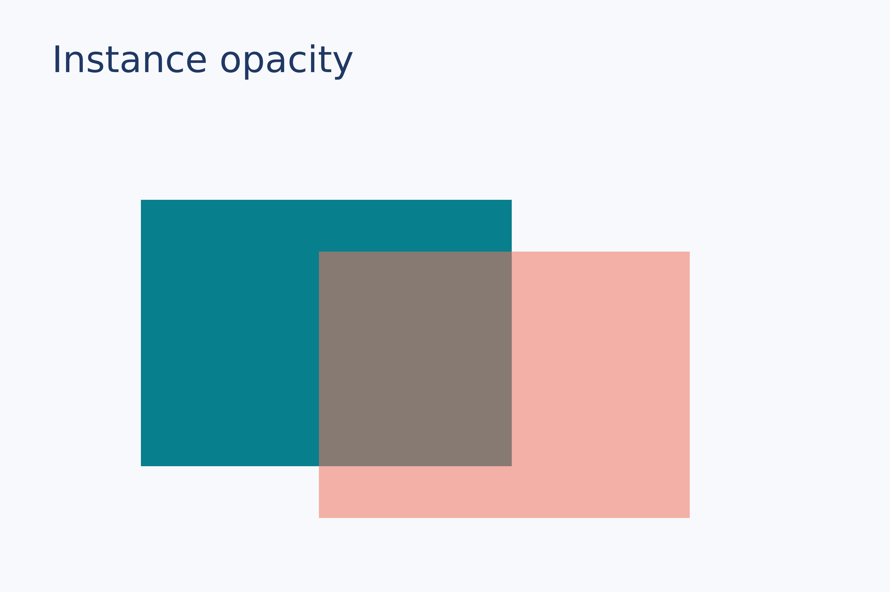
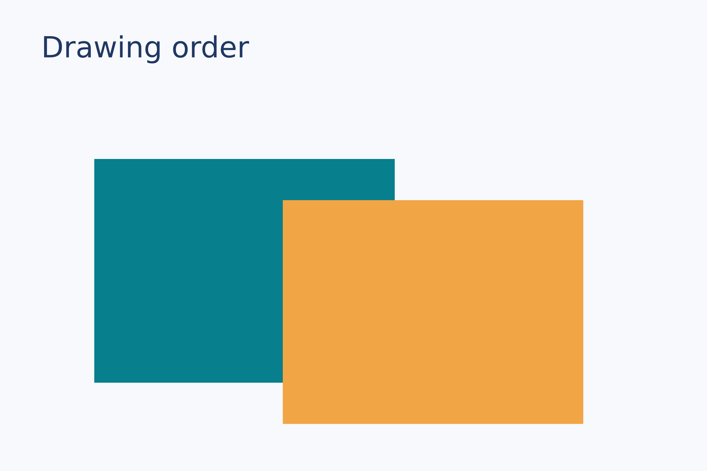
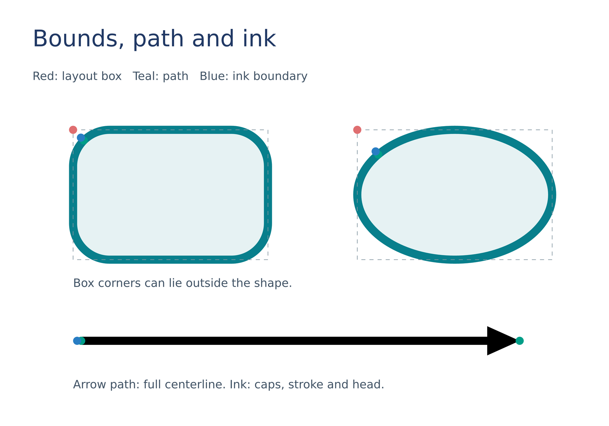
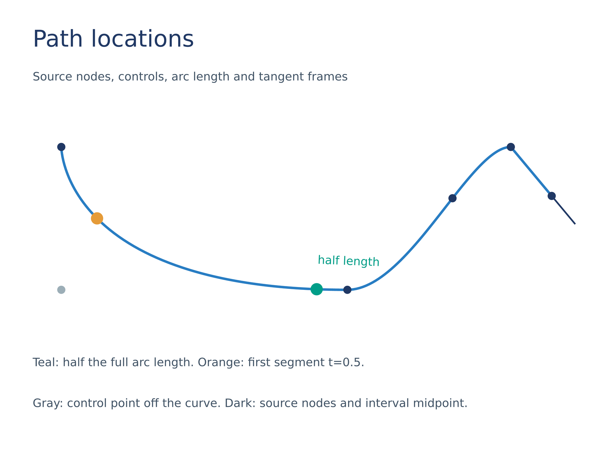
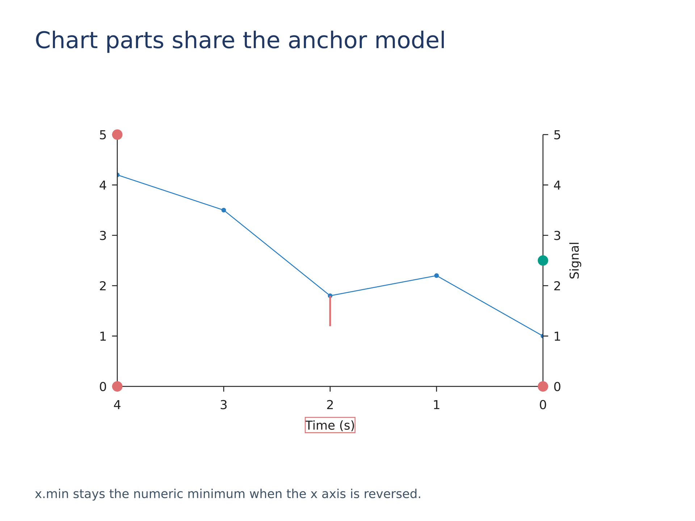
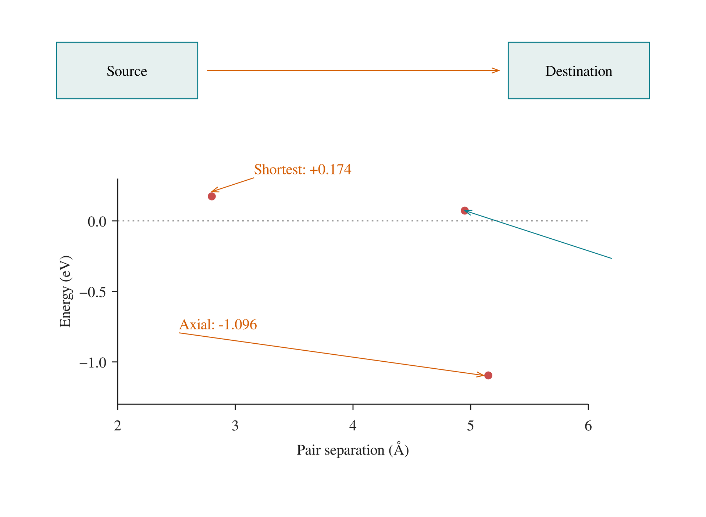

# Positioning and layers

Build relationships with placement anchors; rotation, opacity, and add order then determine the final drawing.

[Back to the gallery](README.en.md) · [Execution results](../examples-and-results.en.md)

## Anchors and dependencies

<a id="anchors"></a>

### Nine-point anchors

Put a dot at each of a rectangle's nine anchors to show their actual positions.

```lay
panel = rect(size=(72 mm, 45 mm), fill="#e6f2f3", border_color="#087f8c", border_width=0.5 mm)
placed = page.add(panel, target=page.top_left, offset=(24 mm, 26 mm))
dot = ellipse(size=(4 mm, 4 mm), fill="#df6e70")
page.add(dot, anchor=center, target=placed.top_left)
page.add(dot, anchor=center, target=placed.top_center)
page.add(dot, anchor=center, target=placed.top_right)
page.add(dot, anchor=center, target=placed.middle_left)
page.add(dot, anchor=center, target=placed.center)
page.add(dot, anchor=center, target=placed.middle_right)
page.add(dot, anchor=center, target=placed.bottom_left)
page.add(dot, anchor=center, target=placed.bottom_center)
page.add(dot, anchor=center, target=placed.bottom_right)
```


Source: [anchors.lay](../../examples/gallery/positioning/anchors.lay).

Reproduce: `laymesh validate examples/gallery/positioning/anchors.lay`; `laymesh render examples/gallery/positioning/anchors.lay -o anchors.png --dpi 150`.

Observed CLI output: `有效：examples/gallery/positioning/anchors.lay（120 × 80 mm，11 个顶层实例）`; PNG **709 × 472 px** at 150 DPI; warnings: none.

<a id="relative"></a>

### Relative placement chain

Anchor each later block to an earlier placement so the chain follows changes.

```lay
tile = rect(size=(25 mm, 20 mm), fill="#087f8c")
a = page.add(tile, target=page.top_left, offset=(9 mm, 28 mm))
b = page.add(tile, target=a.top_right, offset=(7 mm, 0 mm))
page.add(tile, target=b.bottom_right, anchor=top_right, offset=(0 mm, 7 mm))
```



Source: [relative.lay](../../examples/gallery/positioning/relative.lay).

Reproduce: `laymesh validate examples/gallery/positioning/relative.lay`; `laymesh render examples/gallery/positioning/relative.lay -o relative.png --dpi 150`.

Observed CLI output: `有效：examples/gallery/positioning/relative.lay（120 × 80 mm，4 个顶层实例）`; PNG **709 × 472 px** at 150 DPI; warnings: none.

<a id="dependent-size"></a>

### Size-dependent placement

Override the first placement's width and let a later object follow the new anchor position.

```lay
box = rect(size=(20 mm, 23 mm), fill="#087f8c")
first = page.add(box,size=(47 mm, auto), target=page.top_left, offset=(10 mm, 28 mm))
follower = page.add(box, target=first.top_right, offset=(6 mm, 0 mm))
page.add(text(content="47 mm", font_family=font, font_size=9 pt, color="#ffffff"),
         anchor=center, target=first.center)
page.add(text(content="next", font_family=font, font_size=9 pt, color="#ffffff"),
         anchor=center, target=follower.center)
```



Source: [dependent-size.lay](../../examples/gallery/positioning/dependent-size.lay).

Reproduce: `laymesh validate examples/gallery/positioning/dependent-size.lay`; `laymesh render examples/gallery/positioning/dependent-size.lay -o dependent-size.png --dpi 150`.

Observed CLI output: `有效：examples/gallery/positioning/dependent-size.lay（120 × 80 mm，5 个顶层实例）`; PNG **709 × 472 px** at 150 DPI; warnings: none.

## Placement transforms

<a id="rotation"></a>

### Rotation

Rotate a rectangle around its center; a marker shows the rotation origin.

```lay
tile = rect(size=(47 mm, 24 mm), fill="#e4b65f", border_color="#965f32", border_width=0.6 mm)
page.add(tile, anchor=center, target=page.center, rotation=27 deg)
marker = ellipse(size=(3 mm, 3 mm), fill="#203864")
page.add(marker, anchor=center, target=page.center)
```



Source: [rotation.lay](../../examples/gallery/positioning/rotation.lay).

Reproduce: `laymesh validate examples/gallery/positioning/rotation.lay`; `laymesh render examples/gallery/positioning/rotation.lay -o rotation.png --dpi 150`.

Observed CLI output: `有效：examples/gallery/positioning/rotation.lay（120 × 80 mm，3 个顶层实例）`; PNG **709 × 472 px** at 150 DPI; warnings: none.

<a id="opacity"></a>

### Opacity

Overlap two rectangles; the foreground placement's opacity applies only to that placement.

```lay
back = rect(size=(50 mm, 36 mm), fill="#087f8c")
front = rect(size=(50 mm, 36 mm), fill="#ef755f")
page.add(back, target=page.top_left, offset=(19 mm, 27 mm))
page.add(front, target=page.top_left, offset=(43 mm, 34 mm), opacity=0.55)
```



Source: [opacity.lay](../../examples/gallery/positioning/opacity.lay).

Reproduce: `laymesh validate examples/gallery/positioning/opacity.lay`; `laymesh render examples/gallery/positioning/opacity.lay -o opacity.png --dpi 150`.

Observed CLI output: `有效：examples/gallery/positioning/opacity.lay（120 × 80 mm，3 个顶层实例）`; PNG **709 × 472 px** at 150 DPI; warnings: none.

<a id="drawing-order"></a>

### Drawing order

Later add calls paint on top, as visible where opaque blocks overlap.

```lay
blue = rect(size=(51 mm, 38 mm), fill="#087f8c")
orange = rect(size=(51 mm, 38 mm), fill="#f2a545")
page.add(blue, target=page.top_left, offset=(16 mm, 27 mm))
page.add(orange, target=page.top_left, offset=(48 mm, 34 mm))
```



Source: [drawing-order.lay](../../examples/gallery/positioning/drawing-order.lay).

Reproduce: `laymesh validate examples/gallery/positioning/drawing-order.lay`; `laymesh render examples/gallery/positioning/drawing-order.lay -o drawing-order.png --dpi 150`.

Observed CLI output: `有效：examples/gallery/positioning/drawing-order.lay（120 × 80 mm，3 个顶层实例）`; PNG **709 × 472 px** at 150 DPI; warnings: none.

## Geometry queries

<a id="geometry-anchors"></a>

### Bounds, path and ink

Select layout-box corners, geometric paths and ink boundaries on rounded rectangles, ellipses and thick arrows.

```lay
panel = page.add(rect(size=(48mm,32mm),border_radius=9mm,fill="#e6f2f3",border_color="#087f8c",border_width=2mm),offset=(18mm,32mm))
oval = page.add(ellipse(size=(48mm,32mm),fill="#e6f2f3",border_color="#087f8c",border_width=2mm),offset=(88mm,32mm))
box_dot = ellipse(size=(2mm,2mm),fill="#df6e70")
path_dot = ellipse(size=(2mm,2mm),fill="#009e88")
ink_dot = ellipse(size=(2mm,2mm),fill="#287dc3")
for placed in [panel,oval] {
    page.add(rect(size=(placed.bounds.width,placed.bounds.height),border_color="#8396a1",border_width=0.15mm,border_dash=[1mm,1mm]),target=placed.bounds.top_left)
    page.add(box_dot,anchor=center,target=placed.bounds.top_left)
    page.add(path_dot,anchor=center,target=placed.path.nearest(to=placed.bounds.top_left)[0])
    page.add(ink_dot,anchor=center,target=placed.ink.boundary.nearest(to=placed.bounds.top_left)[0])
}
shaft = page.add(line(end_head=head(), dx=108mm,dy=0mm,line_width=2mm,line_cap="round"),offset=(20mm,84mm))
page.add(path_dot,anchor=center,target=shaft.path.start)
page.add(path_dot,anchor=center,target=shaft.path.end)
page.add(ink_dot,anchor=center,target=shaft.ink.boundary.nearest(to=(18mm,84mm))[0])
```



Source: [geometry-anchors.lay](../../examples/gallery/positioning/geometry-anchors.lay).

Reproduce: `laymesh validate examples/gallery/positioning/geometry-anchors.lay`; `laymesh render examples/gallery/positioning/geometry-anchors.lay -o geometry-anchors.png --dpi 150`.

Observed CLI output: `有效：examples/gallery/positioning/geometry-anchors.lay（150 × 105 mm，18 个顶层实例）`; PNG **886 × 620 px**, 150 DPI; warnings: none.

<a id="path-locations"></a>

### Path locations

Source nodes and controls, arc-length versus parameter points, intervals and tangent-frame offsets.

```lay
curve=page.add(path(commands=[move_to(0mm,0mm),cubic_to(0mm,0mm,0mm,35mm,70mm,35mm),cubic_to(85mm,35mm,100mm,0mm,110mm,0mm),line_to(120mm,12mm)],border_color="#287dc3",border_width=0.6mm),offset=(15mm,36mm))
route=curve.path.subpaths[0]
node_dot=ellipse(size=(2mm,2mm),fill="#203864")
for point in route.nodes {page.add(node_dot,anchor=center,target=point)}
control=route.segments[0].controls[1]
page.add(ellipse(size=(2mm,2mm),fill="#9caeb7"),anchor=center,target=control)
halfway=route.at(fraction=0.5)
parameter_half=route.segments[0].at(t=0.5)
page.add(ellipse(size=(3mm,3mm),fill="#009e88"),anchor=center,target=halfway)
page.add(ellipse(size=(3mm,3mm),fill="#e59b38"),anchor=center,target=parameter_half)
page.add(text("half length",font_family="DejaVu Sans",font_size=8pt,color="#009e88"),anchor=self.bounds.bottom_left,target=halfway,offset=(0mm,5mm),offset_space="target",rotation=halfway.tangent_angle)
page.add(line(dx=9mm,dy=0mm,line_color="#203864",line_width=0.4mm),anchor=self.path.start,target=route.end,rotation=route.end.tangent_angle)
interval=route.between(route.nodes[1],route.nodes[3])
page.add(node_dot,anchor=center,target=interval.at(fraction=0.5))
```



Source: [path-locations.lay](../../examples/gallery/positioning/path-locations.lay).

Reproduce: `laymesh validate examples/gallery/positioning/path-locations.lay`; `laymesh render examples/gallery/positioning/path-locations.lay -o path-locations.png --dpi 150`.

Observed CLI output: `有效：examples/gallery/positioning/path-locations.lay（150 × 110 mm，15 个顶层实例）`; PNG **886 × 650 px**, 150 DPI; warnings: none.

<a id="chart-parts"></a>

### Chart components

Domain endpoints on a reversed axis, vertical spines, label bounds and data-coordinate anchors.

```lay
p=plot(size=(136mm,88mm),plot_area=box(offset=(18mm,10mm),size=(98mm,58mm)),font_family="DejaVu Sans",x=axis(range=(0,4),reverse=true,label="Time (s)"),y=axis(range=(0,5)))
p.add_axis(name="signal",side="right",axis=axis(range=(0,5),label="Signal"))
p.line(y_axis="signal",x=[0,1,2,3,4],y=[1,2.2,1.8,3.5,4.2],marker="circle",color="#287dc3")
chart=page.add(p,offset=(9mm,21mm))
dot=ellipse(size=(2.4mm,2.4mm),fill="#df6e70")
page.add(dot,anchor=center,target=chart.plot_area.bounds.top_left)
page.add(dot,anchor=center,target=chart.axes["x"].min)
page.add(dot,anchor=center,target=chart.axes["x"].max)
page.add(ellipse(size=(2.4mm,2.4mm),fill="#009e88"),anchor=center,target=chart.axes["signal"].spine.path.at(fraction=0.5))
label=chart.axes["x"].label.bounds
page.add(rect(size=(label.width,label.height),border_color="#df6e70",border_width=0.2mm),target=label.top_left)
page.add(line(dx=0mm,dy=-7mm,line_color="#df6e70",line_width=0.4mm),anchor=self.path.end,target=chart.data(x=2,y=1.8,y_axis="signal"))
```



Source: [chart-parts.lay](../../examples/gallery/positioning/chart-parts.lay).

Reproduce: `laymesh validate examples/gallery/positioning/chart-parts.lay`; `laymesh render examples/gallery/positioning/chart-parts.lay -o chart-parts.png --dpi 150`.

Observed CLI output: `有效：examples/gallery/positioning/chart-parts.lay（160 × 120 mm，9 个顶层实例）`; PNG **945 × 709 px**, 150 DPI; warnings: none.

## Connections and annotations

<a id="line-connections"></a>

### Two-endpoint connections

Reuse line styles to connect physical positions, instance anchors and chart data points, with independent endpoint offsets. The complete source also demonstrates data annotations and mixed physical/data endpoints.

```lay
pointer=line(line_color="#d55e00",line_width=0.55pt,end_head=head(shape=open,size=(1.5mm,1.1mm)))

# Each placement chooses its own geometry without changing the material.
a=page.add(rect(size=(30mm,12mm),fill="#e6f0ef",border_color="#087f8c",border_width=0.6pt),offset=(12mm,9mm))
b=page.add(rect(size=(30mm,12mm),fill="#e6f0ef",border_color="#087f8c",border_width=0.6pt),offset=(108mm,9mm))
page.add(text("Source"),anchor=center,target=a.center)
page.add(text("Destination"),anchor=center,target=b.center)
page.add(pointer,start=a.middle_right,end=b.middle_left,start_offset=(2mm,0mm),end_offset=(-2mm,0mm))

# Data mapping is resolved before the physical endpoint offset.
```



Source: [line-connections.lay](../../examples/gallery/positioning/line-connections.lay).

Reproduce: `laymesh validate examples/gallery/positioning/line-connections.lay`; `laymesh render examples/gallery/positioning/line-connections.lay -o line-connections.png --dpi 150`.

Observed CLI output: `有效：examples/gallery/positioning/line-connections.lay（150 × 110 mm，11 个顶层实例）`; PNG **886 × 650 px** at 150 DPI; no warnings. SVG and single-page vector PDF exports were also verified.
