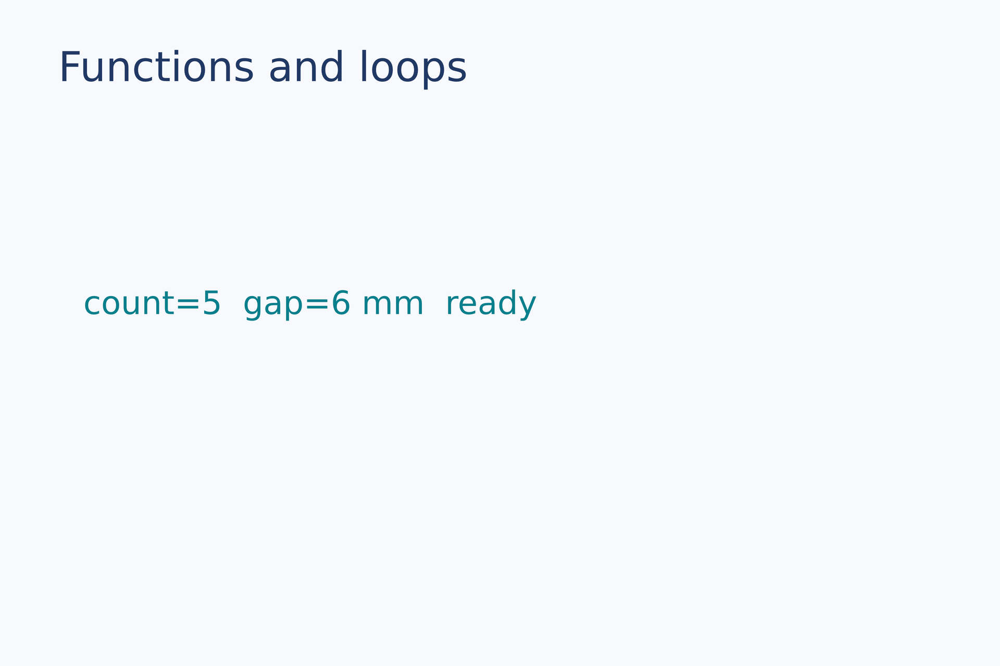
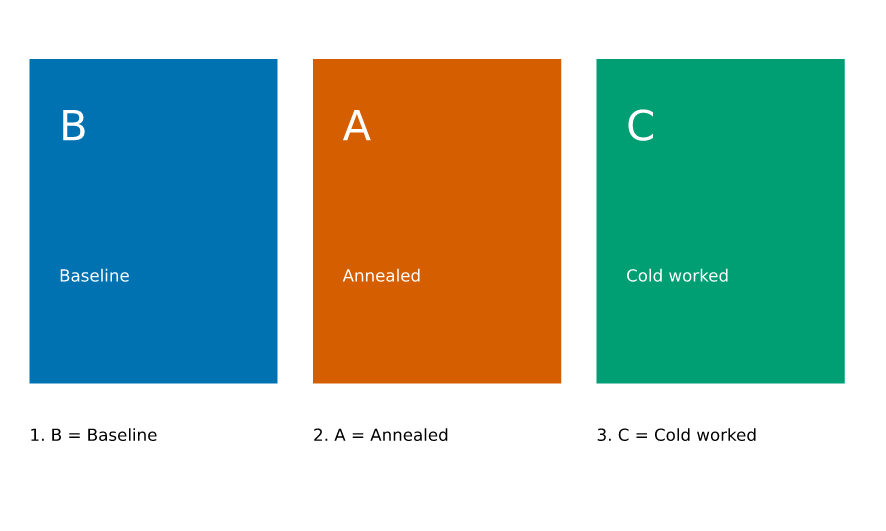

# Scripting and calculations

Variables, units, functions, and control flow within the restricted .lay language.

[Back to the gallery](README.en.md) · [Execution results](../examples-and-results.en.md)

## Expressions

<a id="units-builtins"></a>

### Units and built-ins

Write the results of append, len, min, max, abs, and str directly onto the image.

```lay
values = append([2, 4], 6)
count = len(values)
low = min(2 mm, 5 mm, 3 mm)
high = max(2 mm, 5 mm, 3 mm)
distance = abs(-4 mm)
label = text(content="len=" + str(count) + "  min=" + str(low) +
                     "  max=" + str(high) + "  abs=" + str(distance),
             font_family=font, font_size=10 pt, color="#087f8c")
page.add(label, target=page.top_left, offset=(8 mm, 34 mm))
```


Source: [units-builtins.lay](../../examples/gallery/scripting/units-builtins.lay).

Reproduce: `laymesh validate examples/gallery/scripting/units-builtins.lay`; `laymesh render examples/gallery/scripting/units-builtins.lay -o units-builtins.png --dpi 150`.

Observed CLI output: `有效：examples/gallery/scripting/units-builtins.lay（120 × 80 mm，2 个顶层实例）`; PNG **709 × 472 px** at 150 DPI; warnings: none.

## Control flow

<a id="control-flow"></a>

### Functions and loops

Combine a user function with for, while, and if to compute visible text.

```lay
function doubled(value, factor=2) { return value * factor }
count = 0
for index in range(3) { count = count + index }
while count < 5 { count = count + 1 }
status = "pending"
if count == 5 { status = "ready" } else { status = "error" }
label = text(content="count=" + str(count) + "  gap=" +
                     str(doubled(3 mm)) + "  " + status,
             font_family=font, font_size=11 pt, color="#087f8c")
page.add(label, target=page.top_left, offset=(10 mm, 34 mm))
```



Source: [control-flow.lay](../../examples/gallery/scripting/control-flow.lay).

Reproduce: `laymesh validate examples/gallery/scripting/control-flow.lay`; `laymesh render examples/gallery/scripting/control-flow.lay -o control-flow.png --dpi 150`.

Observed CLI output: `有效：examples/gallery/scripting/control-flow.lay（120 × 80 mm，2 个顶层实例）`; PNG **709 × 472 px** at 150 DPI; warnings: none.


<a id="dictionaries"></a>

### Dictionaries and unpacked loops

Cards follow insertion order and demonstrate independent copies, updates, key/value lists and nested unpacking.

```lay
# Insertion order controls the layout; assigning a dictionary copies its values.
page=canvas(size=(150mm,90mm),background="#ffffff")
labels=dict()
labels["B"]="Baseline"
labels["A"]="Annealed"
copy=labels
copy["B"]="Changed copy"
labels=labels.update({"C":"Cold worked"})
keys=labels.keys()
values=labels.values()
items=labels.items()
default=labels.get("missing","No data")
colors=["#0072b2","#d55e00","#009e73"]
for i,(key,value) in enumerate(items) {
 card=group()
 card.add(rect(size=(42mm,55mm),fill=colors[i]))
 card.add(text(content=key,font_family="DejaVu Sans",font_size=20pt,color="#ffffff"),offset=(5mm,7mm))
 card.add(text(content=value,font_family="DejaVu Sans",font_size=8pt,color="#ffffff"),offset=(5mm,35mm))
 page.add(card,offset=(5mm+i*48mm,10mm))
}
for i,(key,value) in enumerate(zip(keys,values)) {
 page.add(text(content=f"{i+1}. {key} = {value}",font_family="DejaVu Sans",font_size=8pt),offset=(5mm+i*48mm,72mm))
}
```



Source: [dictionaries.lay](../../examples/gallery/scripting/dictionaries.lay).

Reproduce: `laymesh validate examples/gallery/scripting/dictionaries.lay`; `laymesh render examples/gallery/scripting/dictionaries.lay -o dictionaries.png --dpi 150`.

Observed CLI output: `有效：examples/gallery/scripting/dictionaries.lay（150 × 90 mm，6 个顶层实例）`; PNG **886 × 531 px**, 150 DPI.
