# Shapes and drawing

Basic shapes, paths, fills, dashes, compound outlines, and visible-outline fusion.

[Back to the gallery](README.en.md) · [Execution results](../examples-and-results.en.md)

## Basic shapes

<a id="rect"></a>

### Rounded rectangle

Set corner radius, fill, and stroke independently on a rectangle.

```lay
tile = rect(size=(61 mm, 37 mm), border_radius=6 mm, fill="#d8f0ec",
            border_color="#087f8c", border_width=1 mm)
page.add(tile, target=page.top_left, offset=(28 mm, 28 mm))
```

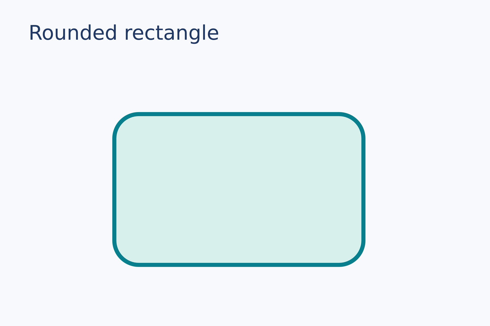

Source: [rect.lay](../../examples/gallery/shapes/rect.lay).

Reproduce: `laymesh validate examples/gallery/shapes/rect.lay`; `laymesh render examples/gallery/shapes/rect.lay -o rect.png --dpi 150`.

Observed CLI output: `有效：examples/gallery/shapes/rect.lay（120 × 80 mm，2 个顶层实例）`; PNG **709 × 472 px** at 150 DPI; warnings: none.

<a id="ellipse"></a>

### Ellipse

Use different width and height to show the fill, stroke, and bounding box.

```lay
oval = ellipse(size=(68 mm, 38 mm), fill="#f3be6b",
               border_color="#a66435", border_width=0.8 mm)
page.add(oval, target=page.top_left, offset=(25 mm, 28 mm))
```

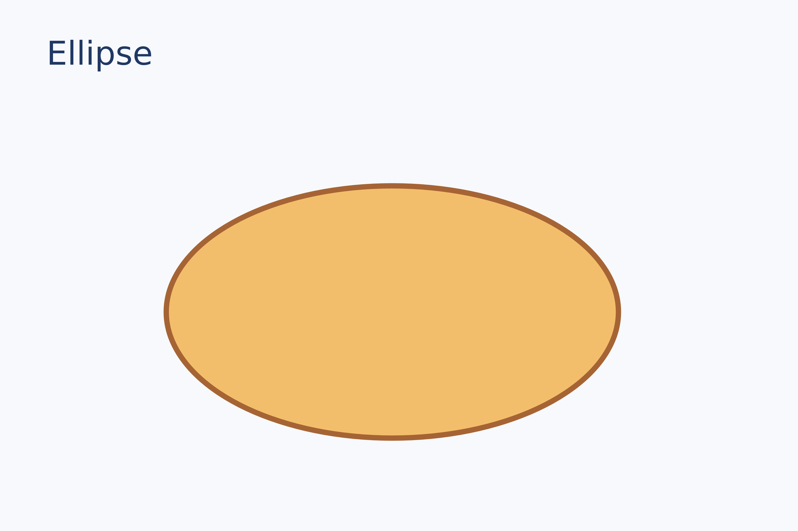

Source: [ellipse.lay](../../examples/gallery/shapes/ellipse.lay).

Reproduce: `laymesh validate examples/gallery/shapes/ellipse.lay`; `laymesh render examples/gallery/shapes/ellipse.lay -o ellipse.png --dpi 150`.

Observed CLI output: `有效：examples/gallery/shapes/ellipse.lay（120 × 80 mm，2 个顶层实例）`; PNG **709 × 472 px** at 150 DPI; warnings: none.

<a id="line-arrow"></a>

### Line and arrow

Draw a straight line and a diagonal arrow in the same coordinate system.

```lay
page.add(line(dx=55 mm, dy=0 mm, line_color="#087f8c", line_width=1.2 mm),
         target=page.top_left, offset=(18 mm, 34 mm))
page.add(line(end_head=head(), dx=55 mm, dy=13 mm, line_color="#e67563", line_width=1.2 mm),
         target=page.top_left, offset=(18 mm, 48 mm))
```

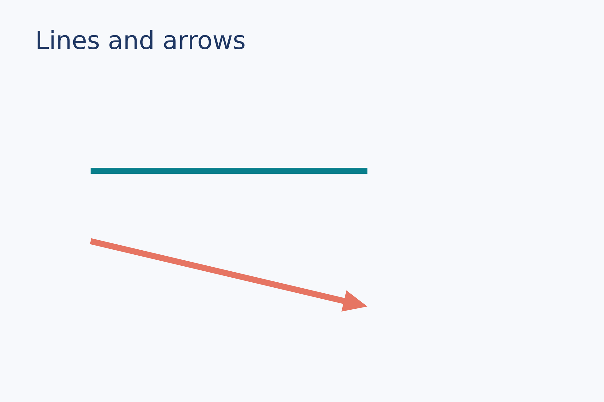

Source: [line-arrow.lay](../../examples/gallery/shapes/line-arrow.lay).

Reproduce: `laymesh validate examples/gallery/shapes/line-arrow.lay`; `laymesh render examples/gallery/shapes/line-arrow.lay -o line-arrow.png --dpi 150`.

Observed CLI output: `有效：examples/gallery/shapes/line-arrow.lay（120 × 80 mm，3 个顶层实例）`; PNG **709 × 472 px** at 150 DPI; warnings: none.

## Preset shapes

<a id="polygon-polyline"></a>

### Polygon and polyline

A polygon closes automatically; a polyline follows only the supplied points.

```lay
area = polygon(points=[(0 mm, 26 mm), (20 mm, 0 mm), (41 mm, 9 mm),
                       (50 mm, 28 mm), (12 mm, 35 mm)],
               fill="#a4dcd7", border_color="#087f8c", border_width=0.6 mm)
page.add(area, target=page.top_left, offset=(8 mm, 30 mm))
route = polyline(points=[(0 mm, 28 mm), (13 mm, 6 mm), (28 mm, 25 mm),
                         (43 mm, 0 mm)],
                 line_color="#e67563", line_width=1.4 mm, line_cap=round)
page.add(route, target=page.top_left, offset=(66 mm, 33 mm))
```

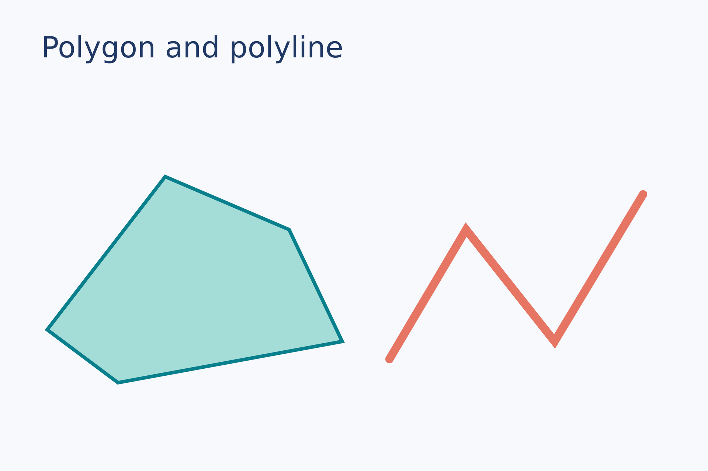

Source: [polygon-polyline.lay](../../examples/gallery/shapes/polygon-polyline.lay).

Reproduce: `laymesh validate examples/gallery/shapes/polygon-polyline.lay`; `laymesh render examples/gallery/shapes/polygon-polyline.lay -o polygon-polyline.png --dpi 150`.

Observed CLI output: `有效：examples/gallery/shapes/polygon-polyline.lay（120 × 80 mm，3 个顶层实例）`; PNG **709 × 472 px** at 150 DPI; warnings: none.

<a id="arc-sector"></a>

### Arc and sector

Compare an open arc with a closed sector at the same radius.

```lay
page.add(arc(radius=18 mm, start=-45 deg, end=220 deg,
             line_color="#087f8c", line_width=1.5 mm, line_cap=round),
         target=page.top_left, offset=(16 mm, 32 mm))
page.add(sector(radius=18 mm, start=-40 deg, end=160 deg,
                fill="#f3be6b", border_color="#a66435", border_width=0.5 mm),
         target=page.top_left, offset=(68 mm, 32 mm))
```

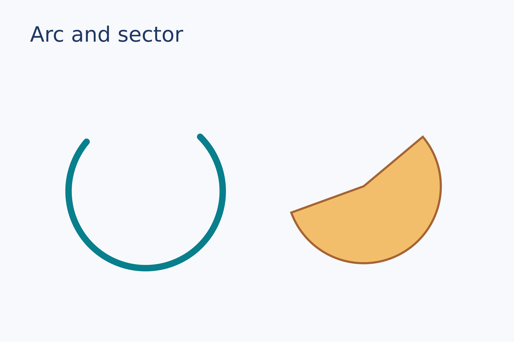

Source: [arc-sector.lay](../../examples/gallery/shapes/arc-sector.lay).

Reproduce: `laymesh validate examples/gallery/shapes/arc-sector.lay`; `laymesh render examples/gallery/shapes/arc-sector.lay -o arc-sector.png --dpi 150`.

Observed CLI output: `有效：examples/gallery/shapes/arc-sector.lay（120 × 80 mm，3 个顶层实例）`; PNG **709 × 472 px** at 150 DPI; warnings: none.

<a id="star-ring"></a>

### Star and ring

Inner and outer radii shape the star; the ring keeps its central hole transparent.

```lay
page.add(star(points=7, outer_radius=20 mm, inner_radius=9 mm,
              fill="#f3be6b", border_color="#a66435", border_width=0.6 mm),
         target=page.top_left, offset=(15 mm, 31 mm))
page.add(ring(outer_radius=20 mm, inner_radius=9 mm,
              fill="#70c4be", border_color="#087f8c", border_width=0.6 mm),
         target=page.top_left, offset=(65 mm, 31 mm))
```

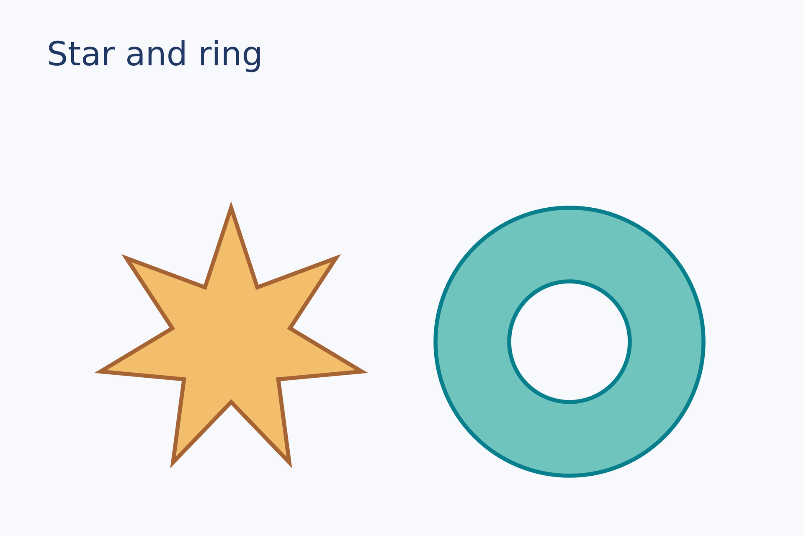

Source: [star-ring.lay](../../examples/gallery/shapes/star-ring.lay).

Reproduce: `laymesh validate examples/gallery/shapes/star-ring.lay`; `laymesh render examples/gallery/shapes/star-ring.lay -o star-ring.png --dpi 150`.

Observed CLI output: `有效：examples/gallery/shapes/star-ring.lay（120 × 80 mm，3 个顶层实例）`; PNG **709 × 472 px** at 150 DPI; warnings: none.

## Paths and fills

<a id="path-commands"></a>

### Path commands

Join straight, quadratic, cubic, and elliptical-arc segments into one path.

```lay
curve = path(commands=[
    move_to(0 mm, 27 mm),
    line_to(12 mm, 5 mm),
    quad_to(23 mm, -5 mm, 35 mm, 10 mm),
    cubic_to(44 mm, 24 mm, 54 mm, 7 mm, 65 mm, 13 mm),
    arc_to(12 mm, 12 mm, 0 deg, false, true, 82 mm, 27 mm)
], fill="none", border_color="#087f8c", border_width=1.5 mm,
   border_cap=round, border_join=round)
page.add(curve, target=page.top_left, offset=(13 mm, 31 mm))
```


Source: [path-commands.lay](../../examples/gallery/shapes/path-commands.lay).

Reproduce: `laymesh validate examples/gallery/shapes/path-commands.lay`; `laymesh render examples/gallery/shapes/path-commands.lay -o path-commands.png --dpi 150`.

Observed CLI output: `有效：examples/gallery/shapes/path-commands.lay（120 × 80 mm，2 个顶层实例）`; PNG **709 × 472 px** at 150 DPI; warnings: none.

<a id="evenodd-hole"></a>

### Even-odd hole

Outer and inner subpaths use even-odd fill to leave a transparent hole.

```lay
frame = path(commands=[
  move_to(0 mm, 0 mm), line_to(62 mm, 0 mm),
  line_to(62 mm, 42 mm), line_to(0 mm, 42 mm), close(),
  move_to(19 mm, 12 mm), line_to(43 mm, 12 mm),
  line_to(43 mm, 30 mm), line_to(19 mm, 30 mm), close()
], fill="#087f8c", fill_rule=evenodd,
   border_color="#203864", border_width=0.5 mm)
page.add(frame, target=page.top_left, offset=(27 mm, 27 mm))
```

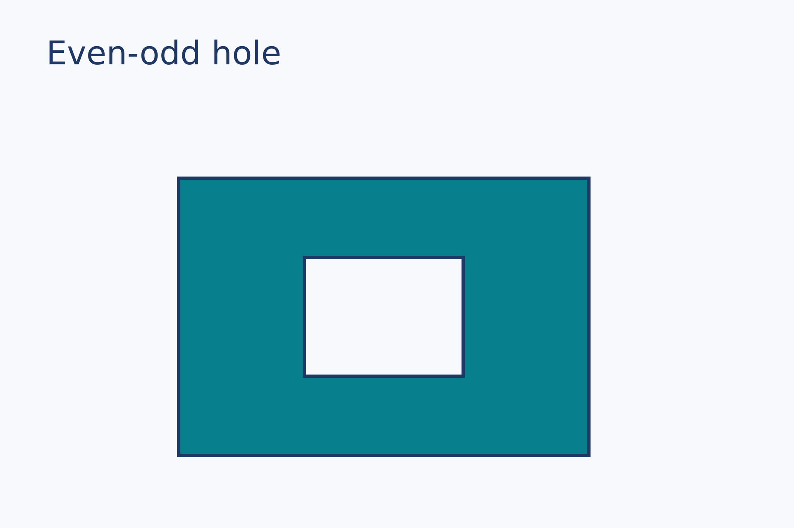

Source: [evenodd-hole.lay](../../examples/gallery/shapes/evenodd-hole.lay).

Reproduce: `laymesh validate examples/gallery/shapes/evenodd-hole.lay`; `laymesh render examples/gallery/shapes/evenodd-hole.lay -o evenodd-hole.png --dpi 150`.

Observed CLI output: `有效：examples/gallery/shapes/evenodd-hole.lay（120 × 80 mm，2 个顶层实例）`; PNG **709 × 472 px** at 150 DPI; warnings: none.

<a id="linear-gradient"></a>

### Linear gradient

Fill a rectangle diagonally with multiple color stops.

```lay
paint = linear_gradient(start=(0, 0), end=(1, 1),
                        stops=[(0, "#f8cf7b"), (0.5, "#ed8770"), (1, "#8f5fa5")])
page.add(rect(size=(75 mm, 42 mm), border_radius=5 mm, fill=paint),
         target=page.top_left, offset=(22 mm, 27 mm))
```


Source: [linear-gradient.lay](../../examples/gallery/shapes/linear-gradient.lay).

Reproduce: `laymesh validate examples/gallery/shapes/linear-gradient.lay`; `laymesh render examples/gallery/shapes/linear-gradient.lay -o linear-gradient.png --dpi 150`.

Observed CLI output: `有效：examples/gallery/shapes/linear-gradient.lay（120 × 80 mm，2 个顶层实例）`; PNG **709 × 472 px** at 150 DPI; warnings: none.

<a id="radial-gradient"></a>

### Radial gradient

Control the transition inside an ellipse with a center and radius.

```lay
paint = radial_gradient(center=(0.37, 0.3), radius=0.8,
                        stops=[(0, "#d8fff7"), (1, "#087f8c")])
page.add(ellipse(size=(54 mm, 43 mm), fill=paint),
         target=page.top_left, offset=(33 mm, 27 mm))
```

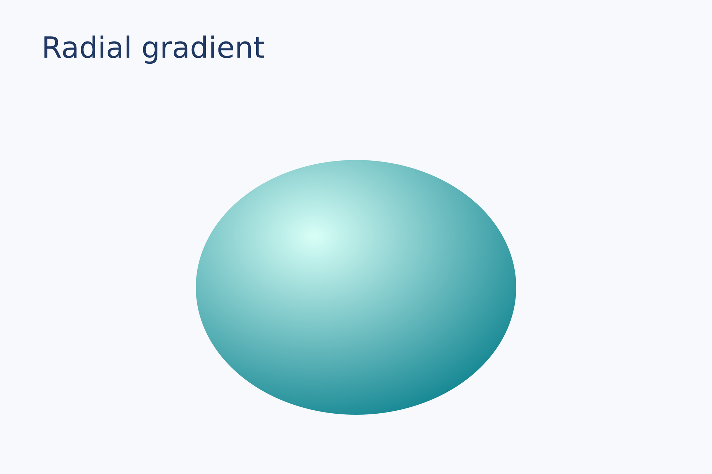

Source: [radial-gradient.lay](../../examples/gallery/shapes/radial-gradient.lay).

Reproduce: `laymesh validate examples/gallery/shapes/radial-gradient.lay`; `laymesh render examples/gallery/shapes/radial-gradient.lay -o radial-gradient.png --dpi 150`.

Observed CLI output: `有效：examples/gallery/shapes/radial-gradient.lay（120 × 80 mm，2 个顶层实例）`; PNG **709 × 472 px** at 150 DPI; warnings: none.

## Strokes and composition

<a id="dashes"></a>

### Custom dashes

Compare one and multiple dash-gap length pairs on two lines.

```lay
page.add(line(dx=84 mm, dy=0 mm, line_color="#087f8c", line_width=1.3 mm,
              line_dash=[5 mm, 2 mm], line_cap=round),
         target=page.top_left, offset=(16 mm, 35 mm))
page.add(line(dx=84 mm, dy=0 mm, line_color="#e67563", line_width=1.3 mm,
              line_dash=[1 mm, 2 mm, 5 mm, 2 mm], line_cap=round),
         target=page.top_left, offset=(16 mm, 52 mm))
```

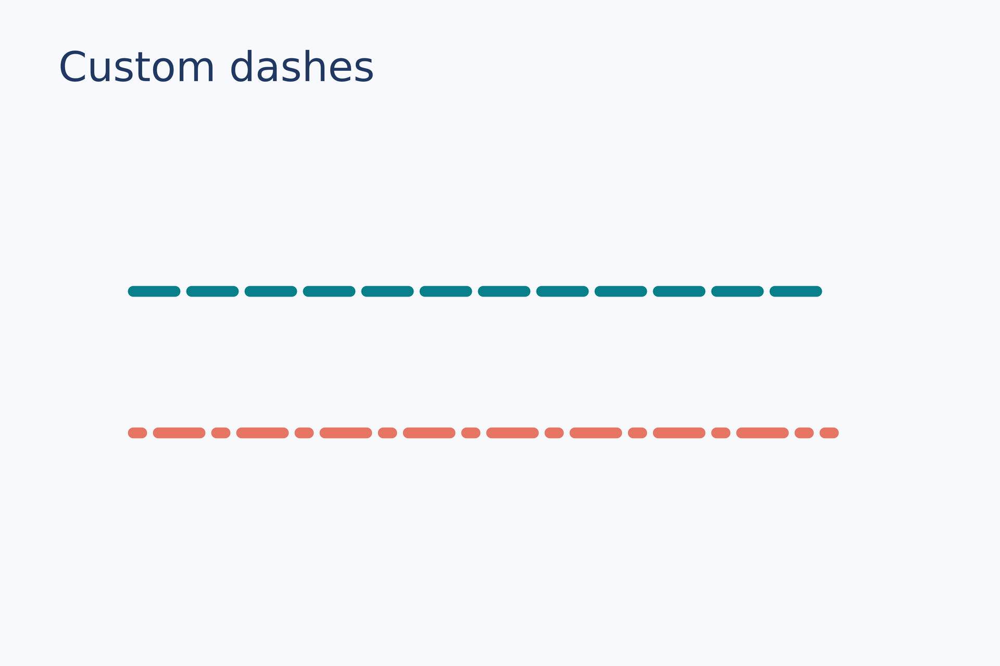

Source: [dashes.lay](../../examples/gallery/shapes/dashes.lay).

Reproduce: `laymesh validate examples/gallery/shapes/dashes.lay`; `laymesh render examples/gallery/shapes/dashes.lay -o dashes.png --dpi 150`.

Observed CLI output: `有效：examples/gallery/shapes/dashes.lay（120 × 80 mm，3 个顶层实例）`; PNG **709 × 472 px** at 150 DPI; warnings: none.

<a id="outlines"></a>

### Reusable outlines

Create single, double, and triple outlines from the same color and line width.

```lay


box = rect(size=(27 mm, 25 mm), border_radius=3 mm,
           fill="#d8f0ec", border_color="#087f8c", border_width=1.6 mm, border_style="solid")
page.add(box, target=page.top_left, offset=(11 mm, 32 mm))
page.add(rect(size=(27 mm, 25 mm), border_radius=3 mm,
              fill="#d8f0ec", border_color="#087f8c", border_width=1.6 mm, border_style=double),
         target=page.top_left, offset=(46 mm, 32 mm))
page.add(rect(size=(27 mm, 25 mm), border_radius=3 mm,
              fill="#d8f0ec", border_color="#087f8c", border_width=1.6 mm, border_style=triple),
         target=page.top_left, offset=(81 mm, 32 mm))
```

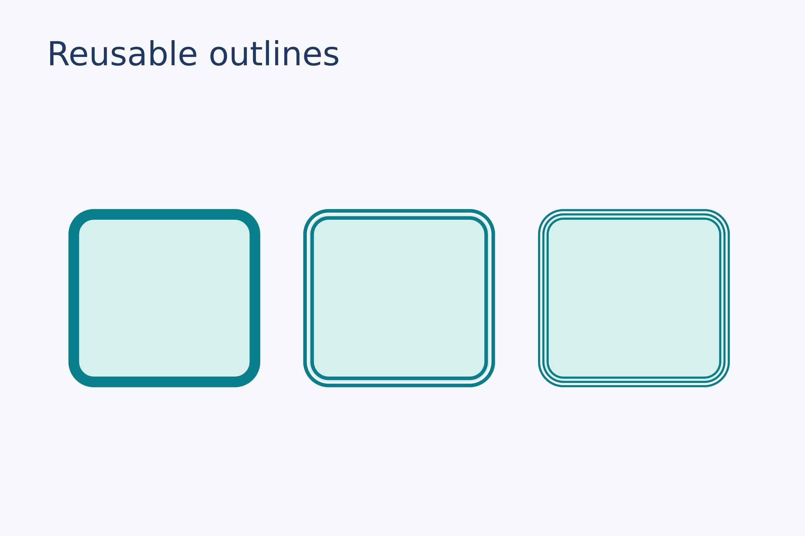

Source: [outlines.lay](../../examples/gallery/shapes/outlines.lay).

Reproduce: `laymesh validate examples/gallery/shapes/outlines.lay`; `laymesh render examples/gallery/shapes/outlines.lay -o outlines.png --dpi 150`.

Observed CLI output: `有效：examples/gallery/shapes/outlines.lay（120 × 80 mm，4 个顶层实例）`; PNG **709 × 472 px** at 150 DPI; warnings: none.

<a id="fuse"></a>

### Visible-outline fusion

Join the visible outlines of a rectangle and line into a new vector path.

```lay
box = rect(size=(23 mm, 21 mm), fill="#087f8c")
left = page.add(box, target=page.top_left, offset=(16 mm, 35 mm))
stem = page.add(line(dx=42 mm, dy=0 mm, line_color="#087f8c",
                     line_width=4 mm),
                target=page.top_left, offset=(45 mm, 45.5 mm))
joined = page.fuse(left, stem, points=(left.middle_right, stem.start),
                   bridge_width=4 mm, junction=round, radius=2 mm,
                   fill="#087f8c", border_color="none")
```

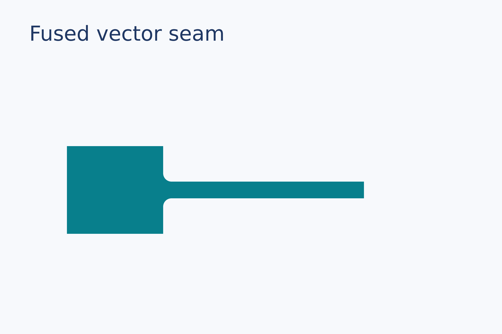

Source: [fuse.lay](../../examples/gallery/shapes/fuse.lay).

Reproduce: `laymesh validate examples/gallery/shapes/fuse.lay`; `laymesh render examples/gallery/shapes/fuse.lay -o fuse.png --dpi 150`.

Observed CLI output: `有效：examples/gallery/shapes/fuse.lay（120 × 80 mm，2 个顶层实例）`; PNG **709 × 472 px** at 150 DPI; warnings: none.

<a id="fuse-angled"></a>

### Angled line on a straight edge

Join lines sloping up and down to rectangle edges and inspect both continuous fillets.

```lay
box = rect(size=(20 mm, 18 mm), fill="#087f8c")
upper = page.add(box, target=page.top_left, offset=(12 mm, 24 mm))
up_line = page.add(line(dx=35 mm, dy=-12 mm, line_width=3 mm),
                   target=page.top_left, offset=(44 mm, 21 mm))
up_join = page.fuse(upper, up_line, points=(upper.middle_right, up_line.start),
                    bridge_width=3 mm, junction=round, radius=2 mm,
                    fill="#087f8c", border_color="none")

lower = page.add(box, target=page.top_left, offset=(12 mm, 50 mm))
down_line = page.add(line(dx=35 mm, dy=12 mm, line_width=3 mm),
                     target=page.top_left, offset=(44 mm, 59 mm))
down_join = page.fuse(lower, down_line, points=(lower.middle_right, down_line.start),
                      bridge_width=3 mm, junction=round, radius=2 mm,
                      fill="#087f8c", border_color="none")
```

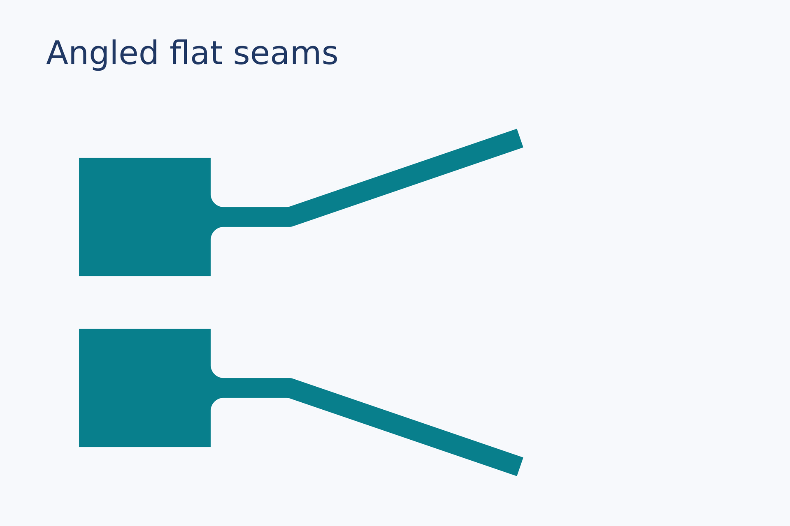

Source: [fuse-angled.lay](../../examples/gallery/shapes/fuse-angled.lay).

Reproduce: `laymesh validate examples/gallery/shapes/fuse-angled.lay`; `laymesh render examples/gallery/shapes/fuse-angled.lay -o fuse-angled.png --dpi 150`.

Observed CLI output: `有效：examples/gallery/shapes/fuse-angled.lay（120 × 80 mm，3 个顶层实例）`; PNG **709 × 472 px** at 150 DPI; warnings: none.

<a id="fuse-curved"></a>

### Angled line on a curved edge

Join lines to an ellipse and a free Bézier curve, inspecting the curved seams.

```lay
disk = ellipse(size=(22 mm, 22 mm), fill="#087f8c")
round_surface = page.add(disk, target=page.top_left, offset=(12 mm, 24 mm))
up_line = page.add(line(dx=30 mm, dy=-8 mm, line_width=3 mm),
                   target=page.top_left, offset=(46 mm, 27 mm))
round_join = page.fuse(round_surface, up_line,
                       points=(round_surface.middle_right, up_line.start),
                       bridge_width=3 mm, junction=round, radius=2 mm,
                       fill="#087f8c", border_color="none")

freeform = path(commands=[move_to(0 mm,0 mm), line_to(20 mm,0 mm),
                          cubic_to(25 mm,4 mm,25 mm,16 mm,20 mm,20 mm),
                          line_to(0 mm,20 mm), close()], fill="#087f8c")
curved_surface = page.add(freeform, target=page.top_left, offset=(12 mm, 51 mm))
down_line = page.add(line(dx=30 mm, dy=8 mm, line_width=3 mm),
                     target=page.top_left, offset=(46 mm, 61 mm))
curved_join = page.fuse(curved_surface, down_line,
                        points=(curved_surface.middle_right, down_line.start),
                        bridge_width=3 mm, junction=round, radius=2 mm,
                        fill="#087f8c", border_color="none")
```

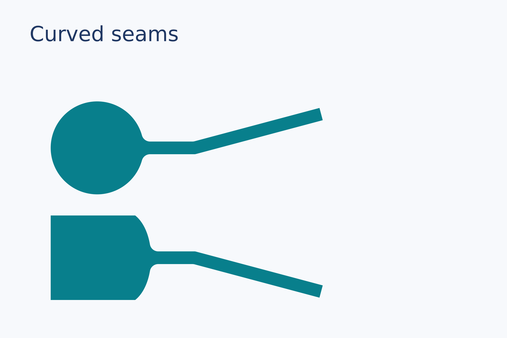

Source: [fuse-curved.lay](../../examples/gallery/shapes/fuse-curved.lay).

Reproduce: `laymesh validate examples/gallery/shapes/fuse-curved.lay`; `laymesh render examples/gallery/shapes/fuse-curved.lay -o fuse-curved.png --dpi 150`.

Observed CLI output: `有效：examples/gallery/shapes/fuse-curved.lay（120 × 80 mm，3 个顶层实例）`; PNG **709 × 472 px** at 150 DPI; warnings: none.

<a id="fuse-outline-edge"></a>

### Line joined to a hollow edge

Join a diagonal line at the midpoint of a hollow rectangle's right edge while preserving its hole.

```lay
frame = rect(size=(46 mm, 42 mm), fill="none",
             border_color="#ffffff", border_width=2 mm)
box = page.add(frame, target=page.top_left, offset=(16 mm, 26 mm))
stem = page.add(line(dx=32 mm, dy=-32 mm, line_color="#ffffff",
                     line_width=2 mm, line_cap=round),
                target=page.top_left, offset=(62 mm, 15 mm))
joined = page.fuse(box, stem, points=(box.middle_right, stem.start),
                   junction=round, radius=1.5 mm,
                   fill="#ffffff", border_color="none")
```

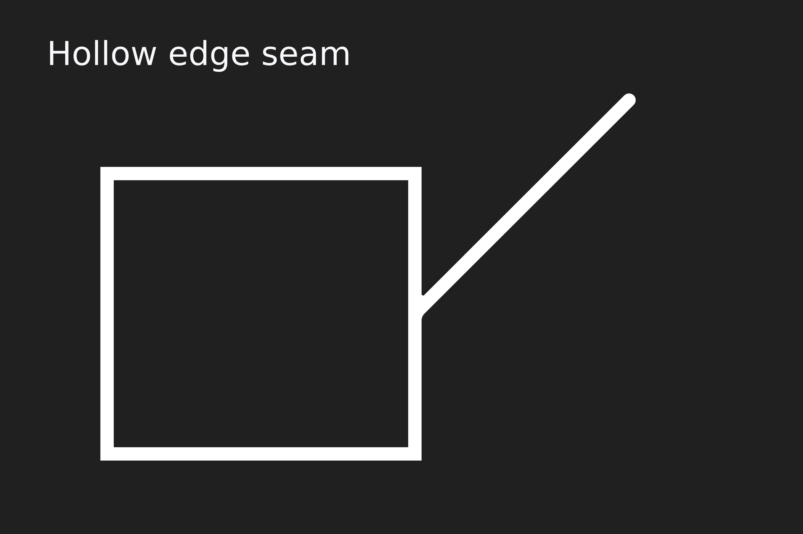

Source: [fuse-outline-edge.lay](../../examples/gallery/shapes/fuse-outline-edge.lay).

Reproduce: `laymesh validate examples/gallery/shapes/fuse-outline-edge.lay`; `laymesh render examples/gallery/shapes/fuse-outline-edge.lay -o fuse-outline-edge.png --dpi 150`.

Observed CLI output: `有效：examples/gallery/shapes/fuse-outline-edge.lay（120 × 80 mm，2 个顶层实例）`; PNG **709 × 472 px** at 150 DPI; warnings: none.

<a id="fuse-outline-corner"></a>

### Line joined to a hollow corner

Join a diagonal line at a hollow rectangle's upper-right corner and preserve both contours.

```lay
frame = rect(size=(46 mm, 38 mm), fill="none",
             border_color="#ffffff", border_width=2 mm)
box = page.add(frame, target=page.top_left, offset=(16 mm, 34 mm))
stem = page.add(line(dx=28 mm, dy=-28 mm, line_color="#ffffff",
                     line_width=2 mm, line_cap=round),
                target=page.top_left, offset=(62 mm, 6 mm))
joined = page.fuse(box, stem, points=(box.top_right, stem.start),
                   junction=round, radius=1.5 mm,
                   fill="#ffffff", border_color="none")
```

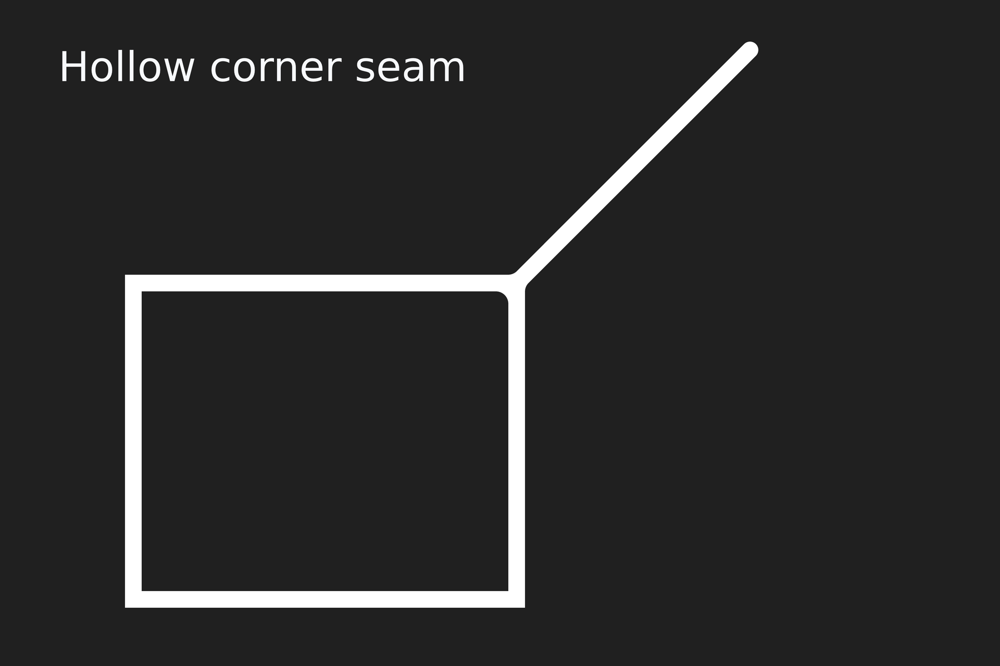

Source: [fuse-outline-corner.lay](../../examples/gallery/shapes/fuse-outline-corner.lay).

Reproduce: `laymesh validate examples/gallery/shapes/fuse-outline-corner.lay`; `laymesh render examples/gallery/shapes/fuse-outline-corner.lay -o fuse-outline-corner.png --dpi 150`.

Observed CLI output: `有效：examples/gallery/shapes/fuse-outline-corner.lay（120 × 80 mm，2 个顶层实例）`; PNG **709 × 472 px** at 150 DPI; warnings: none.

<a id="line-endpoints"></a>

### Line endpoints and standalone heads

```lay
# Gallery: shapes / line-endpoints
page=canvas(name="Line endpoints",size=(180mm,120mm),background="#fff")
page.add(text("Line endpoints",font_family="DejaVu Sans",font_size=16pt,color="#203864"),offset=(8mm,6mm))
# BEGIN DEMO
shapes=["triangle","open","stealth","dot","diamond","bar"]
for item in [(36mm,"Start"),(77mm,"End"),(118mm,"Both"),(153mm,"Head only")] {
    page.add(text(item[1],font_family="DejaVu Sans",font_size=8pt,color="#425466"),offset=(item[0],18mm))
}
for i in range(6) {
    y=30mm+i*11mm
    page.add(text(shapes[i],font_family="DejaVu Sans",font_size=8pt,color="#425466"),offset=(8mm,y-2mm))
    h=head(shape=shapes[i],size=(6mm,5mm))
    page.add(line(length=27mm,line_width=1.6mm,line_color="#0072b299",start_head=h,end_cap="round"),offset=(35mm,y))
    page.add(line(length=27mm,line_width=1.6mm,line_color="#0072b299",start_cap="round",end_head=h),offset=(76mm,y))
    page.add(line(length=27mm,line_width=1.6mm,line_color="#0072b299",start_head=h,end_head=h),offset=(117mm,y))
    page.add(line(length=0mm,angle=-25deg,line_color="#087f8c",end_head=h),anchor=self.path.end,offset=(162mm,y))
}
route=page.add(path(commands=[move_to(0mm,8mm),cubic_to(c1x=12mm,c1y=-4mm,c2x=32mm,c2y=20mm,x=47mm,y=8mm)],border_color="#e67563",border_width=1.5mm,start_head=head(size=(6mm,5mm)),end_head=head(size=(6mm,5mm))),offset=(35mm,95mm))
for p in [route.path.start,route.path.end] {
    page.add(ellipse(size=(1mm,1mm),fill="#203864"),anchor=center,target=p)
}
# END DEMO
page.add(text("Dots mark logical endpoints; centerline reaches each arrow tip.",font_family="DejaVu Sans",font_size=8pt,color="#425466"),offset=(35mm,111mm))
```

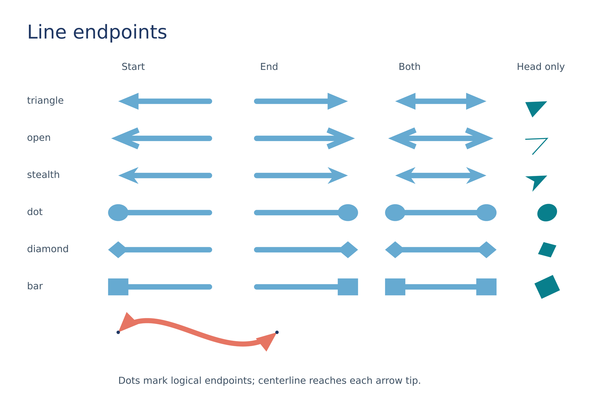

Source: [line-endpoints.lay](../../examples/gallery/shapes/line-endpoints.lay).

Reproduce: `laymesh validate examples/gallery/shapes/line-endpoints.lay`; `laymesh render examples/gallery/shapes/line-endpoints.lay -o line-endpoints.png --dpi 150`.

Observed CLI output: valid, **180 × 120 mm** page; PNG **1063 × 709 px** at 150 DPI; no warnings.

<a id="colors-alpha"></a>

### Color spaces and transparency

```lay
# Gallery: shapes / colors-alpha
page=canvas(name="Color spaces and alpha",size=(145mm,95mm),background="#fff")
page.add(text("Color spaces and alpha",font_family="DejaVu Sans",font_size=16pt,color="#203864"),offset=(8mm,6mm))
# BEGIN DEMO
colors=["#0072b290",rgb(0,114,178,alpha=0.56),hsv(202deg,1,0.7,alpha=0.56),oklch(0.55,0.12,240deg,alpha=0.56)]
labels=["HEX + alpha","RGB + alpha","HSV + alpha","OKLCH + alpha"]
for i in range(4) {
    x=8mm+i*34mm
    page.add(rect(size=(27mm,43mm),fill="#e6f2f3"),offset=(x,25mm))
    page.add(rect(size=(27mm,14mm),fill="#bbbbbb"),offset=(x,39mm))
    page.add(ellipse(size=(25mm,36mm),fill=colors[i]),offset=(x+1mm,28mm))
    page.add(text(labels[i],font_family="DejaVu Sans",font_size=7pt,color="#425466"),offset=(x,72mm))
}
# END DEMO
page.add(text("One color model across shapes, text, gradients and plots.",font_family="DejaVu Sans",font_size=8pt,color=oklch(0.45,0.1,200deg)),offset=(8mm,84mm))
```

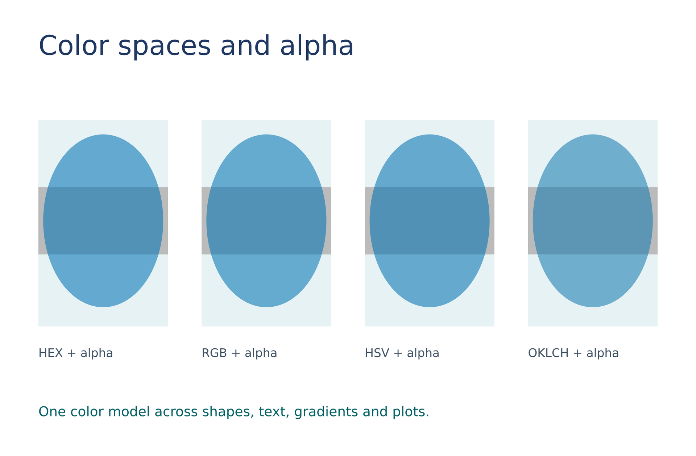

Source: [colors-alpha.lay](../../examples/gallery/shapes/colors-alpha.lay).

Reproduce: `laymesh validate examples/gallery/shapes/colors-alpha.lay`; `laymesh render examples/gallery/shapes/colors-alpha.lay -o colors-alpha.png --dpi 150`.

Observed CLI output: valid, **145 × 95 mm** page; PNG **856 × 561 px** at 150 DPI; no warnings.

## Filled arrows

<a id="arrows"></a>

### Filled arrow templates

```lay
page.add(arrow(length=55mm,shaft_width=5mm,head_size=(11mm,13mm)))
page.add(arrow.uturn(span=(39mm,25mm),heads=both))
```

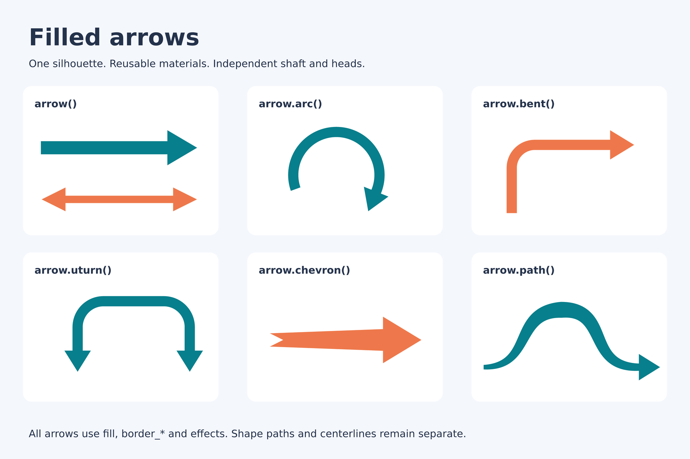

Source: [arrows.lay](../../examples/gallery/shapes/arrows.lay).

Reproduce: `laymesh render examples/gallery/shapes/arrows.lay -o arrows.png --dpi 150`.

Observed CLI output: PNG **1417 × 945 px**, 150 DPI. SVG/PDF/PNG/PPTX exports verified; ordinary arrows remain vector and special-effect PPTX fallbacks emit warnings.

<a id="arrow-connections"></a>

### Arrow anchor connections

```lay
page.add(arrow.arc(sweep_angle=95deg),start=a.top_center,end=b.top_center)
page.add(arrow.arc(radius=-100mm),start=a.bottom_center,end=b.bottom_center)
```

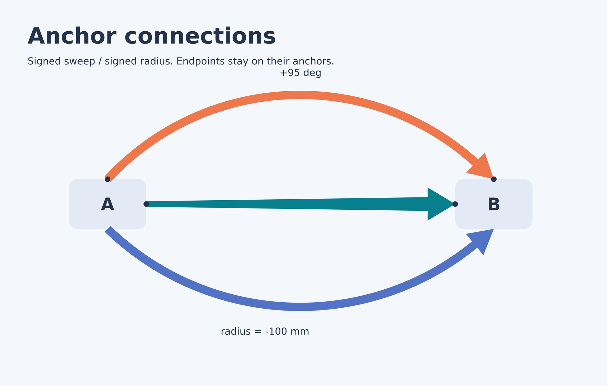

Source: [arrow-connections.lay](../../examples/gallery/shapes/arrow-connections.lay).

Reproduce: `laymesh render examples/gallery/shapes/arrow-connections.lay -o arrow-connections.png --dpi 150`.

Observed CLI output: PNG **1299 × 827 px**, 150 DPI. SVG/PDF/PNG/PPTX exports verified; ordinary arrows remain vector and special-effect PPTX fallbacks emit warnings.

<a id="arrow-effects"></a>

### Arrow styles and effects

```lay
page.add(arrow(length=74mm,shaft_width=(5mm,10mm),
    fill="#438deb",effects=[shadow(blur=1.3mm,offset=(1.5mm,2mm))]))
```

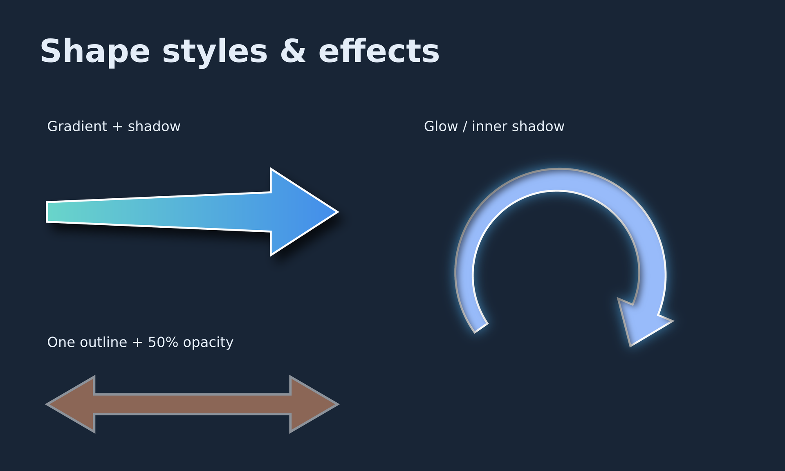

Source: [arrow-effects.lay](../../examples/gallery/shapes/arrow-effects.lay).

Reproduce: `laymesh render examples/gallery/shapes/arrow-effects.lay -o arrow-effects.png --dpi 150`.

Observed CLI output: PNG **1181 × 709 px**, 150 DPI. SVG/PDF/PNG/PPTX exports verified; ordinary arrows remain vector and special-effect PPTX fallbacks emit warnings.
