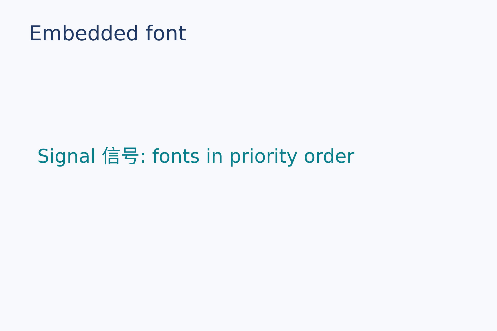
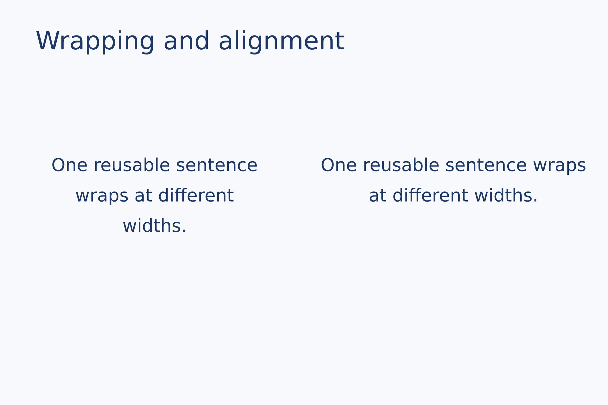
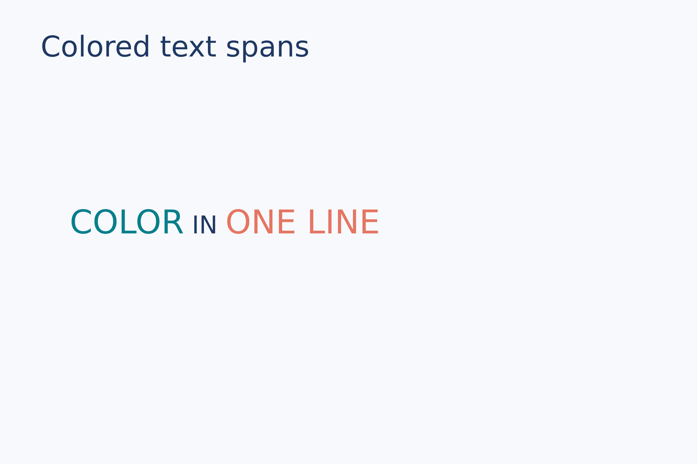
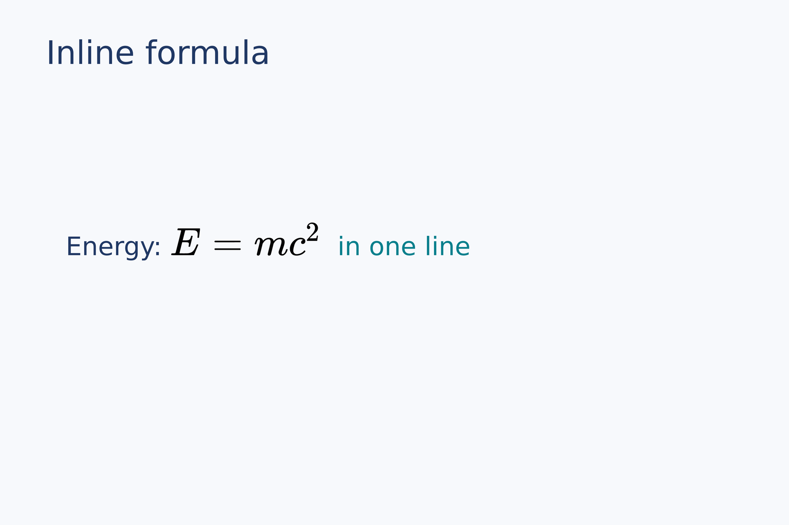
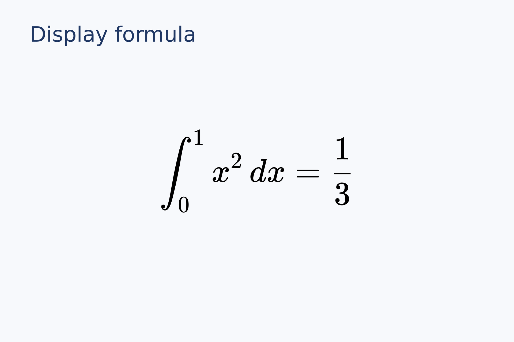

# 文字与公式

文字、换行、彩色文字段和两种公式排版形式。

[返回画廊索引](README.zh-CN.md) · [执行结果](../examples-and-results.zh-CN.md)

## 文字

<a id="font"></a>

### 字体名称与回退

通过已安装的系统字体或字体文件及有序回退列表排版中英文，保持三个导出后端一致。

```lay
label = text(content="Signal 信号: fonts in priority order", font_family=font,
             font_size=13 pt, color="#087f8c")
page.add(label, target=page.top_left, offset=(9 mm, 34 mm))
```



源码：[font.lay](../../examples/gallery/typography/font.lay)。

复现命令：`laymesh validate examples/gallery/typography/font.lay`；`laymesh render examples/gallery/typography/font.lay -o font.png --dpi 150`。

实测：`有效：examples/gallery/typography/font.lay（120 × 80 mm，2 个顶层实例）`；PNG **709 × 472 px**，150 DPI；警告：无。

<a id="wrap-align"></a>

### 宽度、换行和对齐

同一段文字以两种实例宽度居中排版，行数随宽度改变。

```lay
body = text(size=(45 mm, auto),content="One reusable sentence wraps at different widths.",
            font_family=font, font_size=10 pt, align=center,
            line_height=6 mm, color="#203864")
page.add(body, target=page.top_left, offset=(8 mm, 29 mm))
page.add(body,size=(57 mm, auto), target=page.top_left, offset=(61 mm, 29 mm))
```



源码：[wrap-align.lay](../../examples/gallery/typography/wrap-align.lay)。

复现命令：`laymesh validate examples/gallery/typography/wrap-align.lay`；`laymesh render examples/gallery/typography/wrap-align.lay -o wrap-align.png --dpi 150`。

实测：`有效：examples/gallery/typography/wrap-align.lay（120 × 80 mm，3 个顶层实例）`；PNG **709 × 472 px**，150 DPI；警告：无。

<a id="spans"></a>

### 彩色文字段

同一行内的 span 分别覆盖颜色和字号。

```lay
rich = text(spans=[
  span("COLOR", color="#087f8c", font_size=16 pt),
  span(" IN ", color="#203864", font_size=12 pt),
  span("ONE LINE", color="#e67563", font_size=16 pt)
], font_family=font, font_size=12 pt)
page.add(rich, target=page.top_left, offset=(12 mm, 35 mm))
```



源码：[spans.lay](../../examples/gallery/typography/spans.lay)。

复现命令：`laymesh validate examples/gallery/typography/spans.lay`；`laymesh render examples/gallery/typography/spans.lay -o spans.png --dpi 150`。

实测：`有效：examples/gallery/typography/spans.lay（120 × 80 mm，2 个顶层实例）`；PNG **709 × 472 px**，150 DPI；警告：无。

## 公式

<a id="inline-formula"></a>

### 行内公式

公式作为 text 中的一段与普通文字共用一行。

```lay
sentence = text(size=(98 mm, auto),spans=[
  span("Energy: ", color="#203864"),
  formula(source=r"E=mc^2", font_size=17 pt),
  span("  in one line", color="#087f8c")
], font_family=font, font_size=11 pt)
page.add(sentence, target=page.top_left, offset=(10 mm, 34 mm))
```



源码：[inline-formula.lay](../../examples/gallery/typography/inline-formula.lay)。

复现命令：`laymesh validate examples/gallery/typography/inline-formula.lay`；`laymesh render examples/gallery/typography/inline-formula.lay -o inline-formula.png --dpi 150`。

实测：`有效：examples/gallery/typography/inline-formula.lay（120 × 80 mm，2 个顶层实例）`；PNG **709 × 472 px**，150 DPI；警告：无。

<a id="display-formula"></a>

### 独立公式

独立公式按页面中心锚点放置，PDF 保留原始 LaTeX 源码。

```lay
equation = formula(source=r"\int_0^1 x^2\,dx=\frac{1}{3}",
                   font_size=22 pt, style=display)
page.add(equation, anchor=center, target=page.center)
```



源码：[display-formula.lay](../../examples/gallery/typography/display-formula.lay)。

复现命令：`laymesh validate examples/gallery/typography/display-formula.lay`；`laymesh render examples/gallery/typography/display-formula.lay -o display-formula.png --dpi 150`。

实测：`有效：examples/gallery/typography/display-formula.lay（120 × 80 mm，2 个顶层实例）`；PNG **709 × 472 px**，150 DPI；警告：无。
