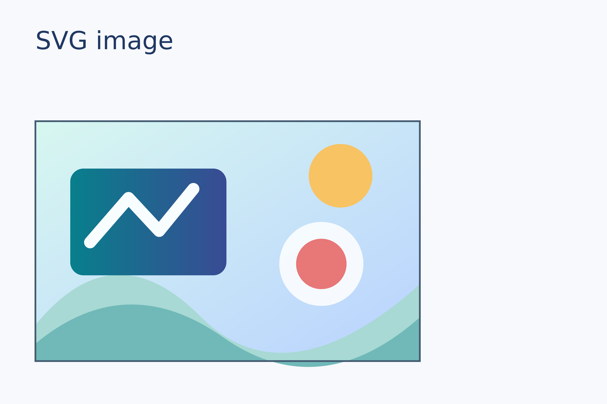
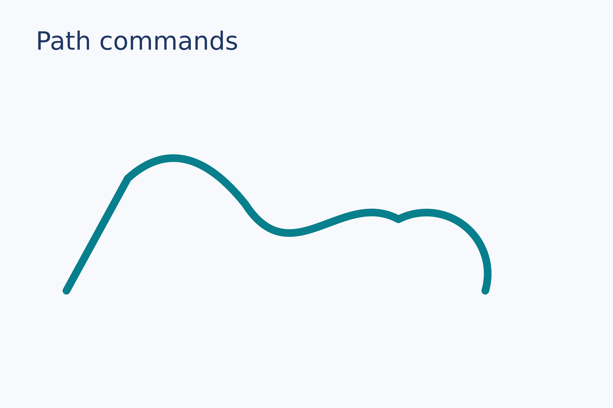
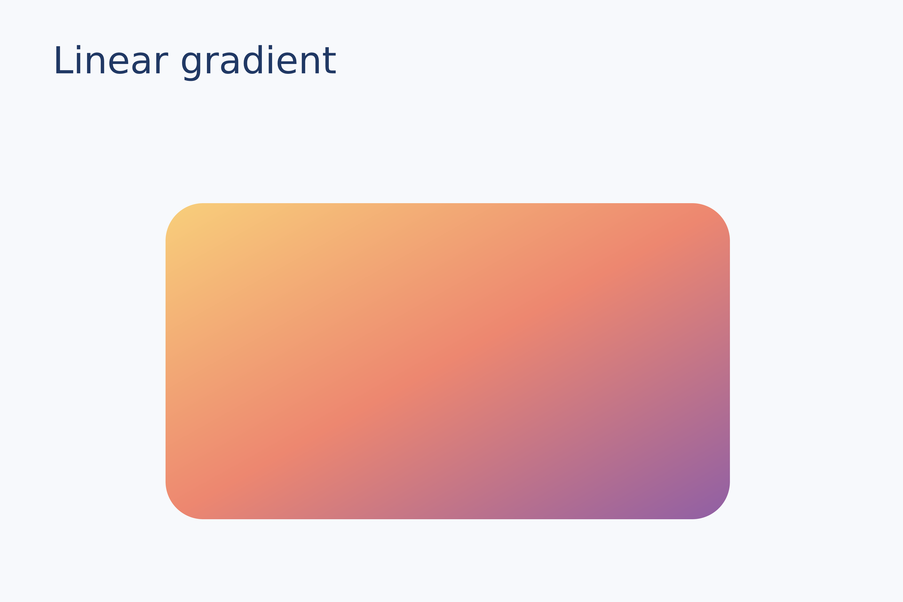
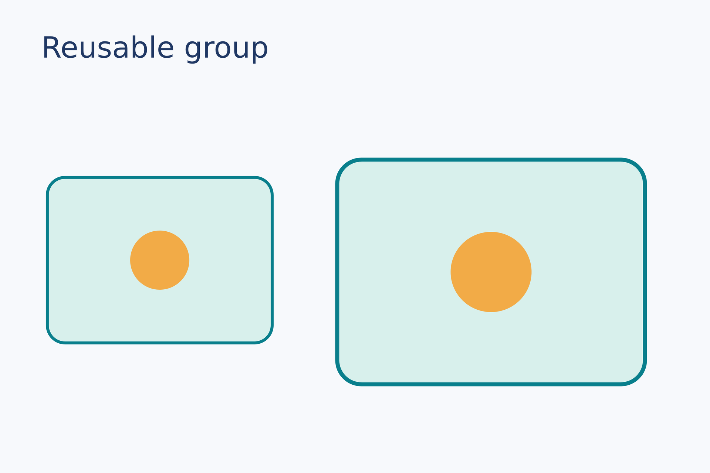
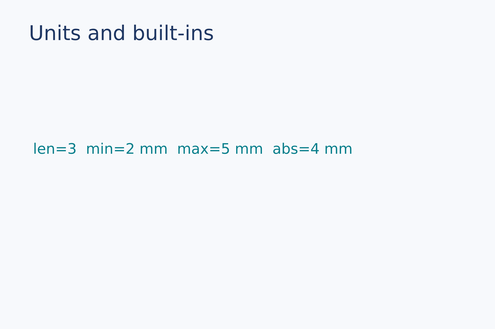
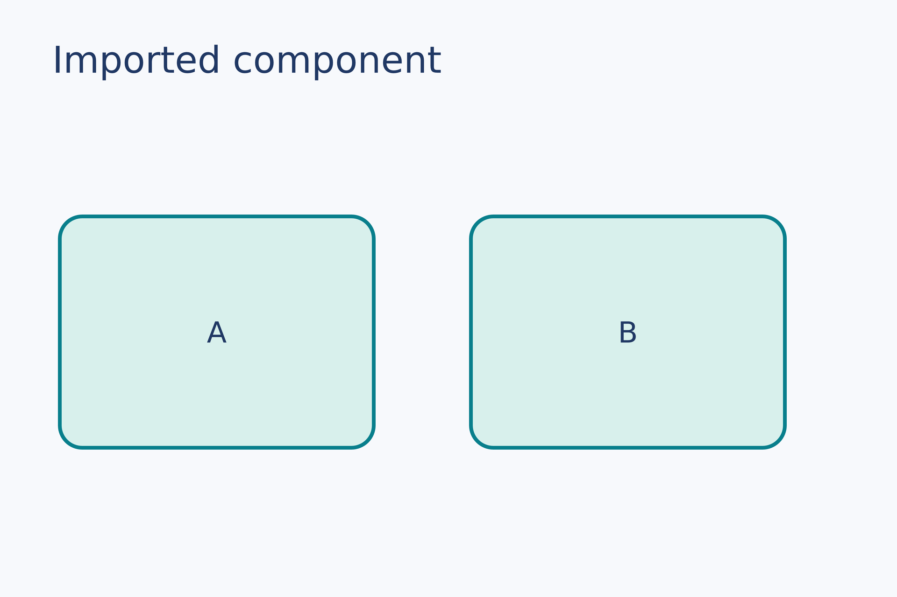

# `.lay` language and feature reference

This page documents the **executable syntax** of the current Rust engine. Read a layout as canvas → reusable definitions → placements → export. Complete source files and actual output are in [examples and results](examples-and-results.en.md). The LayMesh parser interprets `.lay`; Python and JavaScript do not execute it.

## 1. Files, values, and units

An entry `.lay` file must define exactly one `canvas(...)`. Constructors return reusable **material definitions**; `page.add(...)` returns a **placed instance**. Only instances have page anchors. Strings support single/double quotes and triple-quoted forms; formulas often use raw `r"..."` strings to preserve backslashes. `#` begins a line comment. Calls use parentheses and commas; indentation does not affect meaning.

| Syntax | Meaning |
| --- | --- |
| `12`, `true`, `false`, `"Title"` | Scalar, boolean, and string values |
| `12 mm`, `1.2 cm`, `0.5 in`, `10 pt` | Lengths, stored internally as mm |
| `16 px` | Length converted using canvas `layout_dpi`, default 96 |
| `45 deg`, or `45` on placement | Degrees of rotation |
| `(x, y)`, `[a, b]`, `items[0]` | Tuples, lists, and zero-based indexing |
| `+ - * /`, comparisons, `and or not` | Unit-aware arithmetic and boolean expressions; `and/or` short-circuit |

Lengths of the same type can be added or subtracted. Multiplying or dividing by a scalar preserves a length; dividing two lengths produces a scalar. Incompatible types, division by zero, and out-of-range values are errors. `px` requires a canvas `layout_dpi`. **PNG export `--dpi` is independent of layout `layout_dpi`.**

### Canvas: `canvas`

```lay
page = canvas(name="Figure 1", size=(180 mm, 120 mm),
              layout_dpi=96, background="#ffffff")
```

| Parameter | Meaning and default |
| --- | --- |
| `size` | Required pair of positive lengths `(width, height)`; physical SVG/PDF page size |
| `name` | Optional Scene name; default `"Untitled"` |
| `layout_dpi` | Positive number, default 96; affects layout `px` and unsized images |
| `background` | `#RGB/#RGBA/#RRGGBB/#RRGGBBAA`, `rgb(...)`, `hsv(...)`, `oklch(...)`, or `"none"`; transparent by default |

The canvas variable may have any name. PNG dimensions use `round(mm × dpi / 25.4)` on each axis. The 180 × 120 mm [basic example](../examples/basic.lay) produced **2126 × 1417 px** at 300 DPI.

## 2. Material constructors



Asset paths below resolve relative to the `.lay` file **that defines the material**, including imported modules. Unless specified otherwise, a material can be placed repeatedly.

| Function | Required | Options and behavior | Example |
| --- | --- | --- | --- |
| `image` | `src="..."` | PNG, JPEG, safe SVG, single-page 8-bit grayscale/RGB TIFF; normalized when loaded | [basic](../examples/basic.lay) |
| `text` | Either `content="..."` or `spans=[...]`; `font_size=10 pt` | `font_family`, `font_weight=400`, `font_style="normal"`, `color="#000000"`, `line_height`, `size=(80, auto)`, `align=left` | [typography](../examples/typography.lay) |
| `span` | First positional argument is text | Only inside `text(spans=[...])`; may override `font_family`, `font_size`, `font_weight`, `font_style`, `color` | [typography](../examples/typography.lay) |
| `formula` | `source=r"..."`, `font_size=10pt` | `style=inline|display`, `math_font="ratex-katex"`; standalone or text span | [typography](../examples/typography.lay) |
| `rect` | `size=(width, height)` | `fill="none"`, `border_radius=0`, stroke settings | [outlines](../examples/outlines.lay) |
| `ellipse` | `size=(width, height)` | Fill and stroke settings; no nonzero corner radius | [basic](../examples/basic.lay) |
| `line` | `dx/dy` or `length/angle` | Full logical centerline; zero length requires explicit angle; independent caps and `head(...)` configs; default width `0.3pt` | [Endpoints](topics/shapes.en.md) |
| `group` | None | Populate through `g.add(...)`; can nest and be placed repeatedly | [scripted](../examples/scripted.lay) |

`font_weight` must be an integer from 100 to 900. `align` is `left`, `center`, `right`, or `justify`. With a width, text wraps at Unicode line-break opportunities and long words at grapheme boundaries; `\n` forces a break. Without width, it stays on one line except explicit breaks. A placement width can reflow the same material independently. The [typography example](../examples/typography.lay) demonstrates fonts, colored spans, inline formulas, and display formulas.

`font_family` accepts a system family, a TTF/OTF path, or a TTC/OTC face such as `"fonts/collection.ttc#PostScriptFace"`. Ordered lists fall back per grapheme cluster. Missing glyphs produce measured squares with located `W_FONT` warnings and do not stop export. Variable fonts currently use a static substitute. RaTeX uses `math_font="ratex-katex"`; legacy `mathjax-*` names warn and map to that default. Body fonts are never bundled. Custom macros, `\require`, and external resources are rejected.

### Vector constructors



These accept `fill`, `fill_rule=nonzero|evenodd`, and stroke settings. `polyline` and `arc` default to no fill with a black stroke. Coordinates, radii, and points are lengths; angles may use `deg`.

| Function | Geometry parameters | Behavior |
| --- | --- | --- |
| `path` | `commands=[move_to(...), ...]` | Begins with `move_to`; multiple subpaths and holes; at most 10,000 commands. [Example](../examples/vector.lay) |
| `polygon` | `points=[(x,y), ...]` | At least three points; closes automatically |
| `polyline` | `points=[(x,y), ...]` | At least two points; stays open |
| `arc` | `radius`, `start`, `end` | Open arc, span greater than 0 and less than 360° |
| `sector` | `radius`, `start`, `end` | Closed sector |
| `star` | `points`, `outer_radius`, `inner_radius`, optional `rotation` | 3–1000 tips; inner radius smaller than outer |
| `ring` | `outer_radius`, `inner_radius` | Transparent inner hole using even-odd fill |

The commands inside `path(commands=...)` are:

| Command | Positional arguments | Meaning |
| --- | --- | --- |
| `move_to` | `x, y` | Start a subpath |
| `line_to` | `x, y` | Straight segment end |
| `quad_to` | `cx, cy, x, y` | Quadratic control point and end |
| `cubic_to` | `c1x, c1y, c2x, c2y, x, y` | Cubic control points and end |
| `arc_to` | `rx, ry, rotation, large_arc, sweep, x, y` | Elliptical arc; flags are booleans |
| `close` | None | Close the current subpath |

### Colors, gradients, and outlines



`fill` accepts `#RGB/#RGBA/#RRGGBB/#RRGGBBAA`, `rgb(...)`, `hsv(...)`, `oklch(...)`, `"none"`, `linear_gradient(...)`, or `radial_gradient(...)`. A stop is `(position, color)` or `(position, color, opacity)`, with position and opacity in 0–1. Linear defaults to `start=(0,0)` and `end=(1,0)`; radial defaults to `center=(0.5,0.5)`, `radius=0.5`. Gradient coordinates are proportional to the placement bounds. See the [vector example](../examples/vector.lay).

```lay

card = rect(size=(42 mm, 22 mm), fill="#e7f6f6", border_color="#087f8c", border_width=1.8 mm, border_style=double, border_dash=[4 * (1.8 mm), 2 * (1.8 mm), 0.01 * (1.8 mm), 2 * (1.8 mm)], border_cap="round", border_opacity=0.8)
```

Closed outlines use `border_color/width/style/dash/cap/join/opacity`; open lines use the corresponding `line_*` names. Styles are `solid/dashed/dotted/dash_dot/double/triple/none`; double/triple gaps remain transparent. Reuse styles with LCSS classes; `outline()` is removed. See [themes and fills](topics/lcss.en.md).

## 3. Placement, anchors, groups, and fusion



```lay
first = page.add(photo,size=(80 mm, auto), target=page.top_left,
                 offset=(8 mm, 12 mm))
second = page.add(photo,size=(40 mm, auto), anchor=top_left,
                  target=first.top_right, offset=(4 mm, 0 mm))
```

`canvas.add(material, ...)` and `group.add(material, ...)` return placements. An unused result can be written as a bare `page.add(...)` statement. Common settings are `anchor` (default `top_left`), `target` (the current container's top-left by default), `offset=(0 mm,0 mm)`, `rotation=0`, and `opacity=1`. Later calls draw over earlier ones. Nine anchors are `top_left/top_center/top_right`, `middle_left/center/middle_right`, and `bottom_left/bottom_center/bottom_right`. These anchors use the rotated axis-aligned bounding box. A target must already exist in the same canvas or group. Within a group, `group.top_left` is its local origin.

Explicit `instance.bounds/path/ink` views support indexed candidate queries, `self` source selectors, arc-length and parameter points, tangent-frame offsets and chart components. See [geometric anchors and path locations](topics/anchors.en.md).

Lines expose `instance.start/end` and support placement with `anchor="start"/"end"`. Native plots expose nine data-rectangle anchors prefixed with `plot_`, plus `instance.data(x=...,y=...)` data anchors; for example, `anchor="plot_top_left"` or `target=chart.plot_center`. These anchors rotate with their instances. See [fixed data area and annotations](plotting.en.md#fixed-data-area-and-annotations).

| Material | Additional `add` options | Rule |
| --- | --- | --- |
| Image | `size=(width, height)`, `fit=contain|cover|stretch`, `crop=box(offset=(x,y), size=(w,h))` | One size implies the other from the cropped aspect ratio; crop is normalized 0–1; SVG crop is unsupported |
| Text | `size=(80, auto)` | Rewrap this placement without changing the definition |
| Native plot | `size=(width, height)` | Reflow the outer frame while preserving fonts, strokes and markers; `plot_area` also preserves the data rectangle |
| Rectangle, ellipse, path, group | `size=(width, height)` | Scale the placement; group children scale together |
| Formula, line | No size override | Common options still apply |

Groups use local coordinates. Placing a group seals its contents; the same group can still be placed again. Nesting is limited to 128 levels and a group cannot contain itself. Crop precedes fitting: `contain` preserves the full image, `cover` clips overflow, and `stretch` may distort aspect ratio.

`page.fuse(a, b, ...)` or `group.fuse(a, b, ...)` combines two **already placed vector instances in the same container** into a new path. Set `points=(a.anchor,b.anchor)` to select connection anchors; omit it to use nearest visible-outline points. A gap requires positive `bridge_width`. `junction=miter|bevel|round`; `round` requires `radius`. The result uses `fill` and `border_*` settings; it can also set stroke options, `fill_rule`, and `opacity`. Both inputs leave the draw order and can no longer be referenced, while other placements of the same definitions stay intact. Images, text, and groups cannot be fused. See [vector.lay](../examples/vector.lay).

With an ellipse or free curve, explicit anchor points must actually touch both visible outlines. A bounding-box anchor such as `middle_right` can be outside a concave curve. If a round junction encounters such a detached point, LayMesh returns a located `E_FUSE`; omitting `points` lets the engine select nearest visible-outline points. The [straight-edge](gallery/shapes.en.md#fuse-angled) and [free-curve](gallery/shapes.en.md#fuse-curved) examples show angled connections. Fused paths default to even-odd fill to preserve holes; an explicit `fill_rule` takes precedence. See the [hollow edge](gallery/shapes.en.md#fuse-outline-edge) and [hollow corner](gallery/shapes.en.md#fuse-outline-corner) examples.

## 4. Scripting and built-ins



```lay
function twice(value, factor=2) { return value * factor }
count = 0
for index in range(3) { count = count + 1 }
if count == 3 { gap = twice(2 mm) } else { gap = 1 mm }
```

The language supports assignment and reassignment, `if / else if / else`, `for ... in ...`, `while`, `break`, `continue`, `function`, and `return`. Functions have lexical scope and optional default parameters. New variables in branches or loops are local; assigning an existing outer variable updates it. Conditions must be booleans. Canvas and placement `.width/.height` are read-only lengths. Limits: 10,000 iterations per loop, 64 function-call levels, and 1,000,000 executed statements.

| Built-in | Result |
| --- | --- |
| `range(stop)`, `range(start,stop[,step])` | Integer list excluding stop; nonzero step; at most 10,000 items |
| `len(list_or_string)` | List or string length |
| `append(list,value)` | **New** list; does not mutate the original |
| `str(value)` | Number, boolean, or string to text; lengths include `mm` |
| `abs(number)` | Absolute value preserving unit type |
| `min(a,...)`, `max(a,...)` | At least one numeric value; compatible unit types required |

## 5. Local component modules



```lay
import { card, gap as spacing } from "./components/card.lay"
page = canvas(size=(180 mm, 120 mm))
tile = page.add(card("Example"), target=page.top_left,
                offset=(spacing, spacing))
```

Imports must be local relative `.lay` paths. Modules use `export` for constants, materials, groups, or functions and may import further modules; imported names are read-only. The entry canvas must exist before imported values are used. A component module cannot create or draw on the entry canvas. Missing exports and import cycles are errors. See [scripted.lay](../examples/scripted.lay) and [card.lay](../examples/components/card.lay).

## 6. Export and diagnostics

```text
laymesh validate <file.lay>
laymesh inspect <file.lay> --json
laymesh render <file.lay> -o <output.svg|pdf|png> [--dpi <positive-number>]
```

In this repository, prefix the commands with `cargo run --release --locked -p laymesh-cli --`. `validate` checks syntax, names, units, imports, image/font loading, glyph coverage, and placement constraints. `render` checks the same conditions before writing. `--dpi` applies **only to PNG** and defaults to 96. Errors report `file:line:column: E_CODE: reason` and return nonzero; warnings such as `W_FONT`, `W_MATH_FONT`, and `W_PLOT_LAYOUT` go to stderr without necessarily failing validation. CLI usage errors exit 2; layout/export errors exit 1.

SVG retains editable paths and ordinary `<text>`; PDF retains vector graphics and embedded ordinary text while storing formula LaTeX source; PNG rasterizes the same Scene. SVG input is allowlisted and rejects scripts, external links, DTDs, filters, and unsupported effects with `E_SVG`. PNG/JPEG/TIFF inputs are normalized to sRGB PNG for the Scene; TIFF is limited to single-page 8-bit grayscale or RGB. See [actual output and failure examples](examples-and-results.en.md) and the [feature gallery](gallery/README.en.md).

`inspect --json` exposes plot geometry, mappings, transformations and all diagnostics. Each command accepts `--warnings show|hide`, overriding `LAYMESH_WARNINGS` (default `show`). Hiding warnings does not hide errors or discard inspection diagnostics.

## Native plots and data

[See the native plotting guide for `plot`, `axis`, `plot_style`, `table`, `array`, and layer methods](plotting.en.md). These new names may be shadowed; existing `plot = image(...)` remains valid.

For named axes, independent breaks, descriptive statistics and shared colors, see the [Cartesian plotting reference](cartesian-plots.en.md) and [Python data example](../examples/plot/complete-data.py).

See [polar plotting](polar-plots.en.md) for polar/radar charts, raw-data anchors and preset warning controls in CLI/Python/Notebook.

## Ordered font fallback

`font_family` accepts a family/path string or a nonempty list of strings. Family names resolve against installed system fonts; file paths select user-provided fonts. Body fonts are not bundled. Supply font files for consistent rendering across machines. Fallback is per grapheme cluster; exhausted stacks display measured squares and emit located `W_FONT` warnings instead of failing export. See [Text and fonts](topics/fonts.en.md).


## Unified parameters, themes and editors

Geometry defaults to mm, typography and line widths to pt. Two-dimensional sizes use `size`; open lines use `line_*`, closed outlines use `border_*`. [All public parameters](topics/interface-reference.en.md) lists types, units and defaults. See [strings and math](topics/formulas.en.md), [LCSS](topics/lcss.en.md), [editors](topics/editors.en.md), and [migration](topics/migration.en.md).

## Predefined variables and colors

`round` is an ordinary predefined string variable equal to `"round"`; `top_left`, `triangle` and the other fixed options work in assignments, lists, comparisons and arguments. User scope overrides predefined bindings. Hyphenated values use aliases such as `ratex_katex="ratex-katex"`. Strings remain supported without deprecation. [Complete variable registry](topics/interface-reference.en.md#predefined-string-variables).

HEX alpha is the last byte. RGB channels accept fractional 0–255 values; HSV S/V and OKLCH L use 0–1, C is nonnegative, alpha is 0–1. Hue supports deg/rad or unitless degrees. Color alpha multiplies draw opacity. Current spaces are HEX, RGB, HSV and OKLCH; see [colors](topics/fills.en.md) and [the detailed coverage map](topics/feature-map.en.md).

## Ordered dictionaries and iteration

Use string keys in `{ "B": value, "A": other }`; expressions may produce keys and values may retain lengths, colors, materials or geometry selectors. Dictionaries preserve insertion order. Duplicate keys replace their value without moving the key. `d["key"]` raises E_INDEX for a missing key; `d.get("key", default=null)` returns a fallback. `len(d)`, `.keys()`, `.values()` and `.items()` work with user dictionaries and table columns.

Assignment copies dictionaries: changing `b` after `b=a` does not change `a`. Nested dictionary writes such as `d["panel"]["color"]="#0072b2"` rebuild and rebind the root value; intermediate keys must exist, and imported bindings stay read-only. `.update(other)` returns a new merged dictionary: use `d=d.update(other)`. Objects held in dictionaries retain their existing handle behavior. Attribute access is reserved for methods; use indexing for keys such as "items".

`dict()` creates an empty dictionary; `dict(src="config.json")` loads nested JSON objects, retaining object order and validating finite, safely representable numbers. This does not turn table or array into permissive loaders.

## Pair unpacking and snapshots

`for key in d` iterates keys; `for key,value in d.items()` iterates pairs. Nested patterns such as `for i,(name,ys) in enumerate(d.items())` bind in the loop scope; `_` discards a value. Shapes must match exactly and repeated variable names are rejected.

`enumerate(seq,start=0)` returns index/value pairs. `zip(a,b,...)` stops at the shortest input, and zero arguments return an empty list. Lists, dictionaries and geometry collections are iterable. Iteration snapshots are fixed at loop entry, so updating the original dictionary does not add work to the current loop. Existing break, continue, scope and evaluation limits remain in force. Dictionary membership uses `key in d` or `key not in d`.

[Complete dictionary plot](../examples/plot/dictionary-series.lay) · [Colormap presets](topics/cmaps.en.md)
