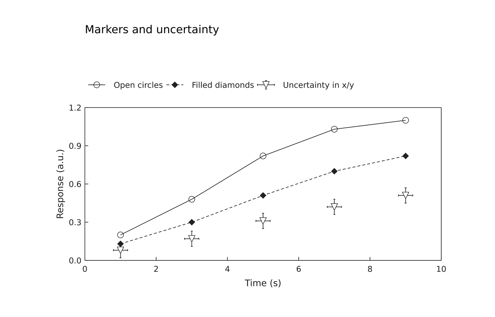
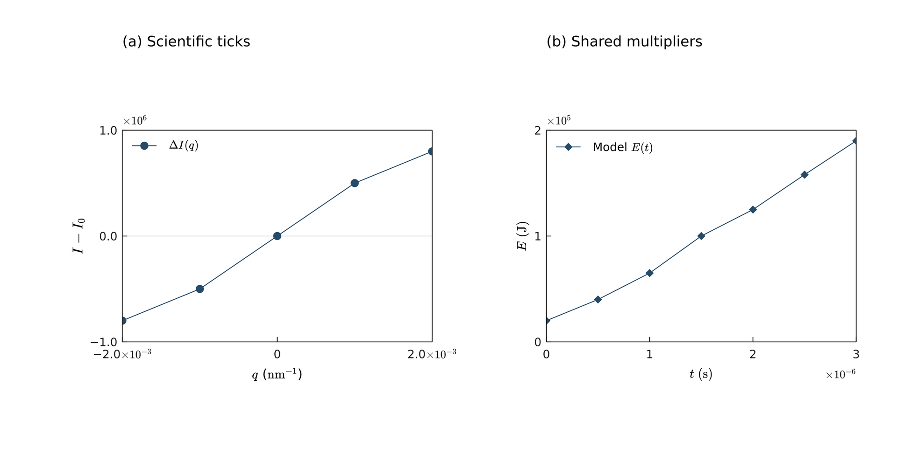
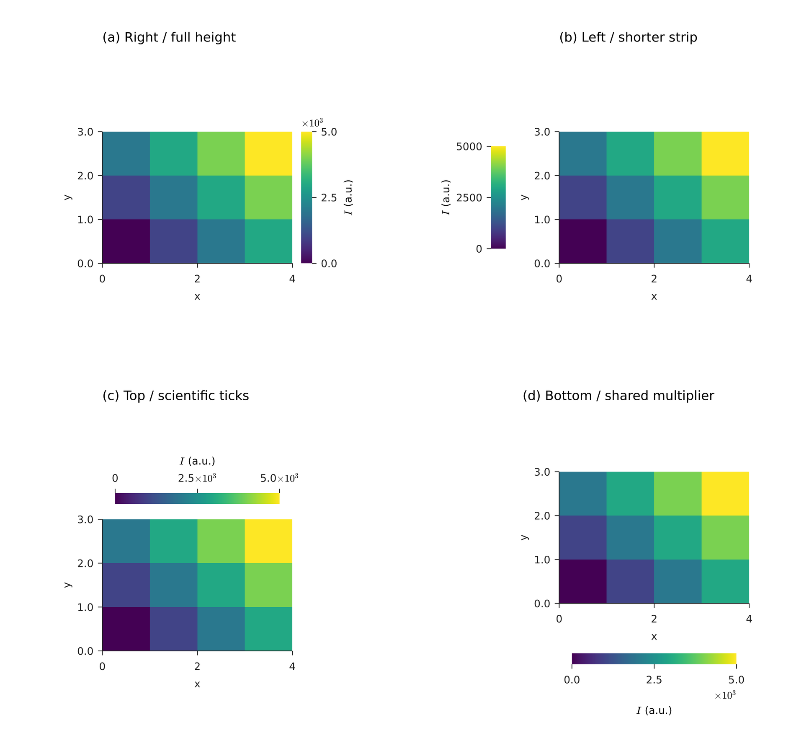
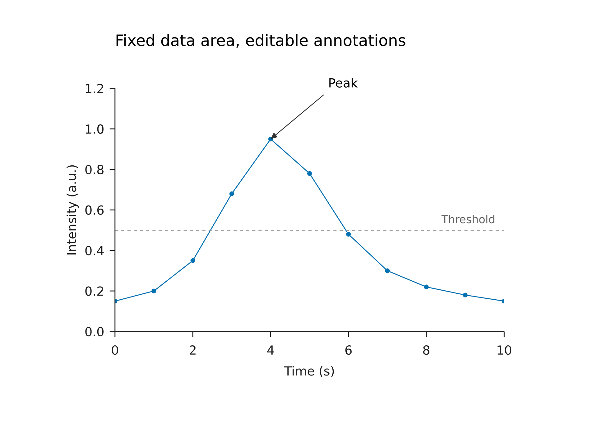
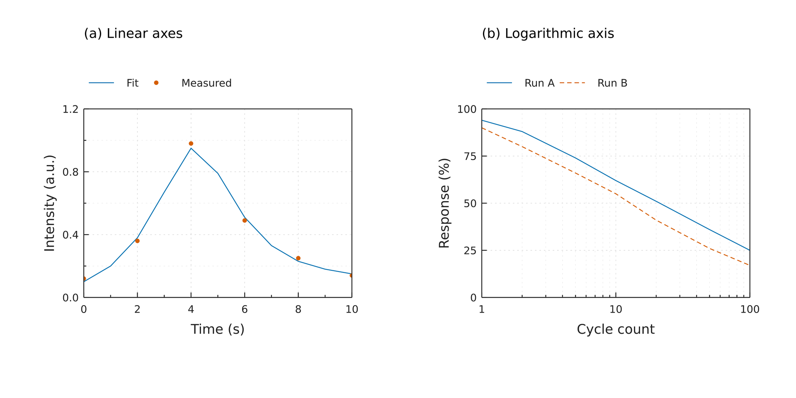

# Plot objects and methods

## Workflow

There are three levels of physical sizing. Content never expands the page or outer plot frame automatically:

| Level | Control | Meaning |
| --- | --- | --- |
| Page | `canvas(size=(width,height))` | Fixed exported page dimensions |
| Outer plot frame | `plot(size=(width,height))` | Data rectangle, ticks, axis titles, multipliers and colorbar |
| Data rectangle | `margins` or `plot_area` | Region onto which data values are mapped |

Internal padding is named `margins=(left,top,right,bottom)`: data width equals frame width minus left and right margins, and height works the same way. `margins` and `plot_area` are mutually exclusive; omitting both enables automatic margins.

`plot(size=(width,height), x=axis(...), y=axis(...), style=plot_style(...), margins=(left,top,right,bottom))` creates a reusable definition. Size includes axes, labels and any colorbar. Omit margins for measured automatic padding. Insufficient fixed margins produce a located `W_PLOT_LAYOUT` warning while retaining the settings and continuing output. For precise multi-panel placement, specify each `plot_area` and its data-area anchor explicitly. There is no automatic alignment, equalization of widths, or adjustment across panels.

`axis` accepts `label=""`, `scale="linear"|"log"|"symlog"`, an increasing numeric `range=(min,max)`, increasing `ticks=[...]`, and D3 number `format`, such as `.2f`, `.1e`, or `.0%`. Log coordinates and error endpoints must be positive. Automatic ranges pad ordinary data by 5%; heatmaps use outer cell bounds; constant data is expanded.

`axis(label_offset=(dx,dy))` shifts only that axis title. Both values are finite physical lengths, including negatives; the default is `(0 mm,0 mm)`. It works with every notation mode.

`plot_style` accepts `font_family` (family or file), `font_size=8 pt`, `line_width=0.6 pt`, axis/text `color="#222222"`, and a nonempty `colors=[...]` cycle. Data values are unitless numbers; scientific units belong in labels. Lengths use existing `mm/cm/in/pt/px` syntax.

`page.add(p,size=(..., auto))` recomputes plot layout while preserving physical font, stroke and marker sizes. An omitted height retains its definition value. First placement seals the definition; later placements can have other sizes, but layers and decorations can no longer be changed. Scaling a containing group still scales all of its contents. New constructor names can be shadowed; existing `plot = image(...)` remains valid.

Long labels, unresolved tick overlaps and oversized legends or colorbars produce `W_PLOT_LAYOUT` warnings and retain their complete content. Automatic ticks still try a lower count; explicit ticks, fonts and fixed data rectangles remain unchanged. Warnings identify the placement location and, for insufficient margins, the approximate additional space needed on each side in mm. CLI validation and rendering print warnings to stderr and can still exit successfully; Rust exposes `scene.warnings` and Notebook displays Python warnings. Content may extend beyond a plot frame, but anything outside the page is clipped on export. Nonpositive data rectangles, invalid domains and invalid data remain errors.

Common options: hexadecimal `color`, physical `line_width`, `opacity`, and legend `label`. Band opacity defaults to 0.2; other layers to 1.

| Method | Arguments |
| --- | --- |
| `p.line(x=...,y=...)` | Equal-length vectors; retains input order. Optional paired positive-length `dash=[2 pt,2 pt]`. |
| `p.scatter(x=...,y=...)` | `circle/square/triangle/triangle_down/diamond`; `marker_size=3 pt` is the final bounding-box size, including the outline. Overlapping points accumulate opacity. |
| `p.errorbar(x=...,y=...,yerr=...)` | At least `xerr` or `yerr`. Each is a nonnegative scalar, vector, or `[lower_errors,upper_errors]`; `cap_size=3 pt` is the full cap width. |
| `p.band(x=...,lower=...,upper=...)` | Equal lengths; lower must not exceed upper. No statistical inference is performed. |
| `p.hline(y=...)`, `p.vline(x=...)` | Reference lines across the data rectangle, with optional `dash`. |
| `p.legend(position="top_right")` | Labeled non-heatmap layers. Positions: `top_right/top_left/bottom_right/bottom_left` or physical coordinates relative to the data rectangle. Supports columns and independent font size as detailed above. No automatic overlap avoidance. |

Grids draw first, followed by layers in order; both are separately clipped to the data rectangle. Axes and labels are outside that clip; legends draw last. Input arrays are snapshotted when adding layers. Paths are generated in batches, without the DSL's 10,000-command limit, simplification or sampling.

`line`, `scatter`, and `errorbar` share the options below. Lines and error bars default to `marker="none"`; scatter defaults to `circle`. Omitting the new options retains solid markers.

| Option | Behavior and default |
| --- | --- |
| `marker` | `circle/square/triangle/triangle_down/diamond/none`; `triangle` points up |
| `marker_size=3 pt` | Positive physical length of the final bounding box, including the outline; not area. Space for the stroke is reserved inside it |
| `marker_fill` | Defaults to the layer's `color`; hex color or `none`. `none` leaves a transparent interior; white fill covers the background |
| `marker_border_color="none"` | Independent outline color or `none` |
| `marker_border_width` | Defaults to `plot_style.line_width`; nonnegative physical length, smaller than `marker_size` when an outline is enabled |

Data and legend symbols share geometry, paint, and per-point opacity. A marked line combines its line and marker in the legend. Error bars show the stems and caps for the actual `xerr/yerr` directions, plus any marker. Legend entries retain layer order; matching labels are never merged.

```text
p.line(x=[0,1,2], y=[1,3,2], marker="diamond", marker_size=2 mm,
       marker_fill="none", marker_border_color="#222222", marker_border_width=0.5 pt,
       label="Measured")
```



[Editable source](../../examples/plot/markers.lay) · [SVG](../../examples/plot/markers.svg) · [PDF](../../examples/plot/markers.pdf). Edit each series' symbol, fill, line style, and uncertainty direction independently.

Axis, layer legend, and colorbar `label` values accept strings, `text(...)`, or `formula(...)`. Strings inherit the plot color and the relevant font size. Text/formula materials retain their own styling, explicit sizes, widths, and wrapping, without automatic scaling. Use existing `text(spans=[...])` for mixed content. Relative font paths still resolve against the material's defining `.lay` file.

```text
label = text(spans=[span("Energy "), formula(source=r"E_f", font_size=9 pt), span(" (eV)")],
             font_family="DejaVu Sans", font_size=9 pt)
p = plot(size=(100 mm,80 mm), x=axis(label=label),
         y=axis(label=formula(source=r"I-I_0", font_size=10 pt), notation="offset"))
```

Axes and `colorbar(...)` share these options:

| Option | Display rule |
| --- | --- |
| `notation="plain"` | Default, retaining existing number formatting. `format=".2e"` still produces ordinary `1.00e+6` text |
| `notation="scientific"` | Each nonzero tick becomes `a×10ⁿ` with a mathematical superscript. Default precision is `.2e`; explicit `format` must have exponential type `e`. Zero displays as `0`; rounding carries into the exponent |
| `notation="offset"` | One shared `×10ⁿ` multiplier. The default exponent is the decimal order of the maximum absolute domain endpoint. A zero exponent omits the multiplier |
| `exponent=6` | Explicit integer exponent, only for `offset`. Representable multipliers support `-323…308`; overflowing scaled ticks raise an error |
| `format=".1f"` | In `offset` mode formats the value divided by the multiplier; `1500000` with exponent `6` becomes `1.5` |
| `exponent_offset=(dx,dy)` | Only for `offset`; physical displacement, default `(0 mm,0 mm)`. Positive x goes right, positive y goes down; negatives are allowed |

The x-axis multiplier sits below the ticks at the right; the y-axis multiplier sits above the axis at the left. `tick_labels=false` hides the multiplier too. Measured labels and multipliers contribute to surrounding space requirements. Notation changes only display: data and `chart.data(...)` use original values, with unchanged linear/log mappings. Insufficient fixed margins or `plot_area` space produce warnings while retaining the data rectangle and all manually placed neighboring panels.

The centered x-axis title normally shares the row below the ticks with the right-aligned multiplier. Only an overlap between their measured default bounds places the title below the multiplier, separated by **1.2 mm**. Formula superscripts/subscripts, text widths and line breaks participate in measurement. Without an x-axis multiplier, the previous default title placement is retained.

`axis(label_offset=(dx,dy))` shifts the title independently; `exponent_offset` shifts the multiplier independently. Offsets are applied after default placement and collision handling, so moving either decoration does not reposition the other. Both use **chart-local physical coordinates**, with x right and y down, followed by chart rotation or containing-group scaling. Even the rotated y-axis title translates along those two local directions. Offset-induced title/multiplier overlaps and insufficient space produce `W_PLOT_LAYOUT` while retaining the requested settings. Automatic margins measure required space; a legacy title positioned at the frame edge can still be shifted outside that frame, in which case its position is retained with a warning. Use `plot_area` to reserve explicit surrounding space. Colorbars also accept independent `label_offset`, retaining their existing layout rules.

```text
x = axis(label="Time (s)", notation="offset", exponent=-6,
         exponent_offset=(0 mm, -0.5 mm),
         label_offset=(0 mm, 0.5 mm))
```

For more complex title layouts, use independent `page.add(text(...))` or `group.add(text(...))` placements targeting data-rectangle anchors.



[Editable source](../../examples/plot/scientific-labels.lay) · [SVG](../../examples/plot/scientific-labels.svg) · [PDF](../../examples/plot/scientific-labels.pdf). Both data rectangles are explicitly **76 × 52 mm**, with page top-left positions **(30,32) mm** and **(134,32) mm**. The right panel shifts its x-axis title down 0.5 mm and its multiplier up 0.5 mm while preserving the data rectangle.

```text
h = plot(size=(80 mm,65 mm))
heat = h.heatmap(z=[[1,2,3],[4,5,6]], extent=(0,3,0,2),
                origin="lower", cmap="viridis", vmin=0, vmax=6)
h.colorbar(heat, label="Intensity", format=".1f")
page.add(h)
```

Rectangular matrices support uniform or explicit nonuniform x_edges/y_edges, named axes and independent breaks. `extent=(xmin,xmax,ymin,ymax)` gives outer cell edges; the default is `(0,columns,0,rows)`. `origin="lower"` places row zero at the bottom; `"upper"` places it at the top. Palettes: `viridis/magma/inferno/plasma/cividis/rdbu/gray`. `vmin/vmax` default to finite extrema and expand constant data; values outside the range clamp to endpoint colors.

Default `mode="raster"` stores one source pixel per cell and displays it without interpolation. Nonuniform cells and advanced spatial axes use vector geometry to preserve mapping. Axes and text stay vector. `mode="vector"` emits one rectangle per valid cell, useful for small matrices. Each plot accepts one colorbar bound to one of its own heatmap or color-mapped layer handles; right is the default position. Legacy normalization is linear; color_scale enables shared nonlinear mappings. Export DPI does not change the underlying values or color normalization.

`p.colorbar(heat, ...)` binds a heatmap or color-mapped layer from the same plot, with at most one colorbar per plot. Omitting the new options retains the default right-hand appearance.

| Option | Behavior and default |
| --- | --- |
| `position="right"` | `right/left/top/bottom`; left/right are vertical, top/bottom horizontal |
| `position=(x,y)` | Physical strip top-left relative to the data rectangle's top-left; negative coordinates allowed. Does not reserve automatic margins |
| `orientation` | Manual coordinates accept `vertical/horizontal`, default vertical. Side positions determine orientation; explicit conflicts raise an error |
| `length` | Positive physical length; defaults to data-rectangle height for vertical strips or width for horizontal strips. Side strips are centered along the relevant edge |
| `thickness=3 mm` | Positive physical strip thickness |
| `gap=2.4 mm` | Nonnegative side spacing. Left/top/bottom sit beyond measured axis decorations; right retains its original spacing. Manual coordinates cannot also specify `gap` |
| `ticks=[...]` | Explicit finite, strictly increasing values within the heatmap's `[vmin,vmax]`. Empty hides ticks; omitted generates automatic ticks |
| `label`, `format`, `notation`, `exponent`, `exponent_offset` | The same rich-label and notation rules described above |

```text
p.colorbar(heat, position="bottom", length=45 mm, thickness=3 mm,
           ticks=[0,2500,5000], notation="offset", exponent=3, format=".1f",
           label=formula(source=r"I", font_size=9 pt))
# Manual alternative (only one colorbar call per plot):
# p.colorbar(heat, position=(3.5 mm,51 mm), orientation="horizontal", length=45 mm)
```

Vertical values increase from bottom to top; horizontal values increase from left to right. Colors share the layer's normalization. Side ticks face outward; manual vertical ticks face right and manual horizontal ticks face down. Colorbar multipliers sit above vertical strips at the left, or beyond horizontal ticks at the right; adjust with `exponent_offset`.

Automatic margins measure side colorbars. Fixed margins and fixed data rectangles retain the requested geometry. Manual colorbars never change margins. Out-of-frame content, long labels, and overlapping ticks produce `W_PLOT_LAYOUT` while preserving length, thickness, fonts, positions, and explicit ticks. A local `p.colorbar(...)` binds a layer in its own plot. To share one across plots, give those layers the same `color_scale` and place a standalone `colorbar(scale=..., length=...)` asset; see [Cartesian plots](../cartesian-plots.en.md). Neither form automatically avoids other panels or manual decorations.



[Editable source](../../examples/plot/colorbars.lay) · [SVG](../../examples/plot/colorbars.svg) · [PDF](../../examples/plot/colorbars.pdf). All four independently placed heatmaps have **52 × 36 mm** data rectangles; the source also includes alternative manual horizontal coordinates.

`table(src="results.csv")` reads a CSV with unique nonempty headers, or column-oriented JSON such as `{"x":[0,1],"y":[2,3],"sample":["A","B"]}`. Columns must be nonempty and equally long. String columns are retained, but plotting requires numeric columns. Use `d["column"]` to select a column. CSV quoting and UTF-8 BOM are supported; empty cells are missing, literal `NaN` strings are not.

`array(src="matrix.json")` reads a nonempty numeric vector or rectangular matrix. JSON `null` represents missing values. Booleans, non-finite values and integers outside the JavaScript safe-integer range are rejected. Paths resolve against the defining `.lay` file, including modules. Data is cached within one compilation and read again on the next compilation.

Missing rows break lines/bands, skip scatter/error bars, or become transparent heatmap cells, with a counted `W_PLOT_MISSING`. Length mismatches, empty valid data, negative uncertainty, invalid log values, ragged matrices and impossible layouts are located errors. Ordinary layers preserve data order without imputation or sampling; statistical methods explicitly calculate the documented summaries.

## Limits and related topics

[dsl-reference](../language-reference.en.md) · [Rust/WASM API](node-reference.en.md) · [Python API](python-reference.en.md) · [CLI options](cli-reference.en.md)

## Fixed layout and scientific style


Use `plot_area=box(offset=(left,top), size=(width,height))` to lock the data rectangle relative to the outer plot frame. All four values are physical lengths: left/top must be nonnegative, width/height positive, and boundaries finite. Extending beyond `size` produces a warning and retains the rectangle. This option is mutually exclusive with `margins`. Placement width/height overrides change the surrounding space while preserving the data rectangle. Changes to fonts, ticks, labels, legends or colorbars also preserve it; insufficient space produces a located `W_PLOT_LAYOUT` warning and output continues. In this mode axis and colorbar labels stay next to their respective axes when the outer frame grows.

```text
page = canvas(size=(120 mm, 90 mm), background="#ffffff")
p = plot(size=(100 mm, 70 mm), plot_area=box(offset=(20 mm, 10 mm), size=(60 mm, 40 mm)),
         x=axis(label="Time (s)", range=(0, 2)),
         y=axis(label="Signal", range=(0, 4)))
p.line(x=[0, 1, 2], y=[0, 3, 1])
chart = page.add(p, anchor="plot_top_left", offset=(30 mm, 20 mm))
peak = chart.data(x=1, y=3)
pointer = page.add(line(end_head=head(), dx=-10 mm, dy=8 mm, line_width=0.5 pt),
                   anchor="end", target=peak)
page.add(text(content="Peak", font_size=8 pt), anchor=bottom_left,
         target=pointer.start, offset=(1 mm, -1 mm))
```

- `chart.data(x=...,y=...)` returns an anchor on a placed plot instance. Values must be finite, unitless numbers within the resolved domains, including endpoints; log coordinates must be positive. It uses that instance's final layout and does not change the domains. Recompiling after an axis-range change keeps the annotation at the same data value. Out-of-range anchors raise an error.
- Annotation `offset` values are physical displacements in the shared container. Text and arrows remain independent elements: they may extend outside the data clip, have no automatic collision avoidance, and do not expand the plot's outer frame.
- Nine data-rectangle anchors are available: `plot_top_left/plot_top_center/plot_top_right`, `plot_middle_left/plot_center/plot_middle_right`, and `plot_bottom_left/plot_bottom_center/plot_bottom_right`. Use `target=chart.plot_top_left` or the quoted placement option `anchor="plot_top_left"` to position the data rectangle directly on the page.
- Lines and arrows support `anchor="start"/"end"` as well as `pointer.start/end` targets. Plot and endpoint anchors rotate with their instances; the original nine outer anchors still use the rotated axis-aligned bounding box. New placement anchor names require quotes and add no reserved words.
- An annotation and its target must belong to the same canvas or group. Place both inside a group to scale or rotate the whole annotated figure together; the usual group rules scale physical dimensions too. Each plot remains independently positionable and editable.

Data coordinates, data-rectangle anchors and physical offsets can be combined directly. `anchor` selects the placed element's own alignment point; `target` supplies its destination. The following offsets follow the page coordinates, rather than the rotated chart's local coordinates:

```text
page.add(text(content="Peak", font_size=8 pt), anchor=bottom_left,
         target=chart.data(x=1, y=3), offset=(2 mm, -2 mm))
page.add(text(content="(a)", font_size=9 pt),
         target=chart.plot_top_left, offset=(2 mm, 2 mm))
```



[Editable source](../../examples/plot/annotations.lay) · [SVG](../../examples/plot/annotations.svg) · [PDF](../../examples/plot/annotations.pdf). The example fixes an **88 × 55 mm** data area with its top-left at **(26, 20) mm** on the page. The peak arrow, threshold label and title are separate placements.


These options are opt-in and retain the previous appearance when omitted. They do not change `plot_area`, data domains, placement anchors, or other panels. Automatic margins still respond to measured axis text; use `plot_area` when the data rectangle must remain fixed. Insufficient fixed margins or space around a fixed rectangle produce `W_PLOT_LAYOUT` without reducing font sizes, moving, or compressing the data rectangle.

| Option | Behavior and defaults |
| --- | --- |
| `axis(minor_ticks=[...])` | Explicit minor ticks, empty by default. Finite, strictly increasing, within the domain, and positive for log axes. A coincident major tick takes precedence. No labels or domain extension; use `minor_ticks="auto"` to request subdivision. `ticks=[]` disables major ticks. |
| `axis(tick_direction="out")` | `in/out/inout`; default outward. `inout` splits the total length equally across the axis. |
| `axis(tick_length=1.2 mm, minor_tick_length=0.6 mm)` | Physical total lengths; zero is allowed, negatives are rejected. |
| `axis(tick_labels=false)` | Hide tick text while retaining ticks, grids, and the axis label. Default `true`. |
| `axis(grid="none")` | `none/major/both`; major grids follow final major ticks; `both` adds explicit minor grids at 50% opacity. |
| `plot(frame="box")` | Add top/right frame edges without adding top/right ticks. Default `axes` draws left/bottom axes. |
| `plot_style(tick_font_size=7 pt, label_font_size=9 pt)` | Separate axis/colorbar tick and label sizes; both inherit `font_size` when omitted. |
| `plot_style(grid_color="#dddddd", grid_line_width=0.3 pt, grid_line_dash=[])` | Grid color, positive width, and paired positive-length dashes; an empty array means solid. |
| `p.legend(columns=2, font_size=7 pt)` | Row-major ordering follows layer order; positive integer columns default to 1. Font size inherits `font_size`. |
| `p.legend(position=(0 mm, -9 mm))` | Physical legend top-left relative to the data rectangle's top-left. Positive x goes right, positive y goes down; negatives are allowed. The existing four corner strings remain supported. |
| `p.legend(background="none", frame=true)` | Background is `none` or a hex color, default white. The optional border uses the plot axis color and width; disabled by default. |

Manual legends may sit outside the data rectangle. They never reserve margins or resize the outer frame. Extending beyond the outer frame produces a warning and retains the specified coordinates. Legends do not detect collisions with labels or data; leave the required space explicitly. Grids draw behind data and may be hidden by opaque heatmaps. Scaling a containing group still scales its text, ticks, and legends under the existing group rules.



[Editable source](../../examples/plot/publication.lay) · [SVG](../../examples/plot/publication.svg) · [PDF](../../examples/plot/publication.pdf). Both data rectangles are explicitly **64 × 45 mm**, with top-left positions set by the author to **(20, 26) mm** and **(115, 26) mm** on the page. This example does not use automatic alignment.


## Extended layers and projections

[Multiple axes and breaks](multi-axes.en.md) · [Bars and steps](bars.en.md) · [Histograms and ECDF](hist-ecdf.en.md) · [Boxplots and violins](box-violin.en.md) · [Heatmaps and contours](heatmaps.en.md) · [Polar projection](polar-projection.en.md) · [Polar layers](polar-layers.en.md) · [Radar charts](radar.en.md)
